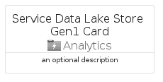
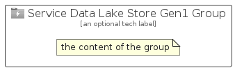

# ServiceDataLakeStoreGen1


```text
azure-11/Item/Analytics/ServiceDataLakeStoreGen1
```

```text
include('azure-11/Item/Analytics/ServiceDataLakeStoreGen1')
```


| Illustration | ServiceDataLakeStoreGen1 | ServiceDataLakeStoreGen1Card | ServiceDataLakeStoreGen1Group |
| :---: | :---: | :---: | :---: |
|  |  |  |  |


## Sprites
The item provides the following sriptes:

- `<$ServiceDataLakeStoreGen1Xs>`
- `<$ServiceDataLakeStoreGen1Sm>`
- `<$ServiceDataLakeStoreGen1Md>`
- `<$ServiceDataLakeStoreGen1Lg>`


## ServiceDataLakeStoreGen1

### Load remotely
```plantuml
@startuml
' configures the library
!global $LIB_BASE_LOCATION="https://raw.githubusercontent.com/tmorin/plantuml-libs/master/distribution"

' loads the library's bootstrap
!include $LIB_BASE_LOCATION/bootstrap.puml

' loads the package bootstrap
include('azure-11/bootstrap')

' loads the Item which embeds the element ServiceDataLakeStoreGen1
include('azure-11/Item/Analytics/ServiceDataLakeStoreGen1')

' renders the element
ServiceDataLakeStoreGen1('ServiceDataLakeStoreGen1', 'Service Data Lake Store Gen1', 'an optional tech label', 'an optional description')
@enduml
```

### Load locally
```plantuml
@startuml
' configures the library
!global $INCLUSION_MODE="local"
!global $LIB_BASE_LOCATION="../../.."

' loads the library's bootstrap
!include $LIB_BASE_LOCATION/bootstrap.puml

' loads the package bootstrap
include('azure-11/bootstrap')

' loads the Item which embeds the element ServiceDataLakeStoreGen1
include('azure-11/Item/Analytics/ServiceDataLakeStoreGen1')

' renders the element
ServiceDataLakeStoreGen1('ServiceDataLakeStoreGen1', 'Service Data Lake Store Gen1', 'an optional tech label', 'an optional description')
@enduml
```

## ServiceDataLakeStoreGen1Card

### Load remotely
```plantuml
@startuml
' configures the library
!global $LIB_BASE_LOCATION="https://raw.githubusercontent.com/tmorin/plantuml-libs/master/distribution"

' loads the library's bootstrap
!include $LIB_BASE_LOCATION/bootstrap.puml

' loads the package bootstrap
include('azure-11/bootstrap')

' loads the Item which embeds the element ServiceDataLakeStoreGen1Card
include('azure-11/Item/Analytics/ServiceDataLakeStoreGen1')

' renders the element
ServiceDataLakeStoreGen1Card('ServiceDataLakeStoreGen1Card', 'Service Data Lake Store Gen1 Card', 'an optional description')
@enduml
```

### Load locally
```plantuml
@startuml
' configures the library
!global $INCLUSION_MODE="local"
!global $LIB_BASE_LOCATION="../../.."

' loads the library's bootstrap
!include $LIB_BASE_LOCATION/bootstrap.puml

' loads the package bootstrap
include('azure-11/bootstrap')

' loads the Item which embeds the element ServiceDataLakeStoreGen1Card
include('azure-11/Item/Analytics/ServiceDataLakeStoreGen1')

' renders the element
ServiceDataLakeStoreGen1Card('ServiceDataLakeStoreGen1Card', 'Service Data Lake Store Gen1 Card', 'an optional description')
@enduml
```

## ServiceDataLakeStoreGen1Group

### Load remotely
```plantuml
@startuml
' configures the library
!global $LIB_BASE_LOCATION="https://raw.githubusercontent.com/tmorin/plantuml-libs/master/distribution"

' loads the library's bootstrap
!include $LIB_BASE_LOCATION/bootstrap.puml

' loads the package bootstrap
include('azure-11/bootstrap')

' loads the Item which embeds the element ServiceDataLakeStoreGen1Group
include('azure-11/Item/Analytics/ServiceDataLakeStoreGen1')

' renders the element
ServiceDataLakeStoreGen1Group('ServiceDataLakeStoreGen1Group', 'Service Data Lake Store Gen1 Group', 'an optional tech label') {
    note as note
        the content of the group
    end note
}
@enduml
```

### Load locally
```plantuml
@startuml
' configures the library
!global $INCLUSION_MODE="local"
!global $LIB_BASE_LOCATION="../../.."

' loads the library's bootstrap
!include $LIB_BASE_LOCATION/bootstrap.puml

' loads the package bootstrap
include('azure-11/bootstrap')

' loads the Item which embeds the element ServiceDataLakeStoreGen1Group
include('azure-11/Item/Analytics/ServiceDataLakeStoreGen1')

' renders the element
ServiceDataLakeStoreGen1Group('ServiceDataLakeStoreGen1Group', 'Service Data Lake Store Gen1 Group', 'an optional tech label') {
    note as note
        the content of the group
    end note
}
@enduml
```

