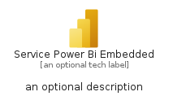
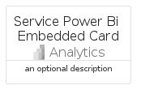
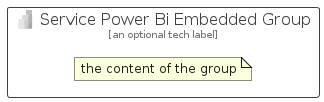

# ServicePowerBiEmbedded


```text
azure-11/Item/Analytics/ServicePowerBiEmbedded
```

```text
include('azure-11/Item/Analytics/ServicePowerBiEmbedded')
```


| Illustration | ServicePowerBiEmbedded | ServicePowerBiEmbeddedCard | ServicePowerBiEmbeddedGroup |
| :---: | :---: | :---: | :---: |
|  |  |  |  |


## ServicePowerBiEmbedded

### Load remotely
```plantuml
@startuml
' configures the library
!global $LIB_BASE_LOCATION="https://raw.githubusercontent.com/tmorin/plantuml-libs/master/distribution"

' loads the library's bootstrap
!include $LIB_BASE_LOCATION/bootstrap.puml

' loads the package bootstrap
include('azure-11/bootstrap')

' loads the Item which embeds the element ServicePowerBiEmbedded
include('azure-11/Item/Analytics/ServicePowerBiEmbedded')

' renders the element
ServicePowerBiEmbedded('ServicePowerBiEmbedded', 'Service Power Bi Embedded', 'an optional tech label', 'an optional description')
@enduml
```

### Load locally
```plantuml
@startuml
' configures the library
!global $INCLUSION_MODE="local"
!global $LIB_BASE_LOCATION="../../.."

' loads the library's bootstrap
!include $LIB_BASE_LOCATION/bootstrap.puml

' loads the package bootstrap
include('azure-11/bootstrap')

' loads the Item which embeds the element ServicePowerBiEmbedded
include('azure-11/Item/Analytics/ServicePowerBiEmbedded')

' renders the element
ServicePowerBiEmbedded('ServicePowerBiEmbedded', 'Service Power Bi Embedded', 'an optional tech label', 'an optional description')
@enduml
```

## ServicePowerBiEmbeddedCard

### Load remotely
```plantuml
@startuml
' configures the library
!global $LIB_BASE_LOCATION="https://raw.githubusercontent.com/tmorin/plantuml-libs/master/distribution"

' loads the library's bootstrap
!include $LIB_BASE_LOCATION/bootstrap.puml

' loads the package bootstrap
include('azure-11/bootstrap')

' loads the Item which embeds the element ServicePowerBiEmbeddedCard
include('azure-11/Item/Analytics/ServicePowerBiEmbedded')

' renders the element
ServicePowerBiEmbeddedCard('ServicePowerBiEmbeddedCard', 'Service Power Bi Embedded Card', 'an optional description')
@enduml
```

### Load locally
```plantuml
@startuml
' configures the library
!global $INCLUSION_MODE="local"
!global $LIB_BASE_LOCATION="../../.."

' loads the library's bootstrap
!include $LIB_BASE_LOCATION/bootstrap.puml

' loads the package bootstrap
include('azure-11/bootstrap')

' loads the Item which embeds the element ServicePowerBiEmbeddedCard
include('azure-11/Item/Analytics/ServicePowerBiEmbedded')

' renders the element
ServicePowerBiEmbeddedCard('ServicePowerBiEmbeddedCard', 'Service Power Bi Embedded Card', 'an optional description')
@enduml
```

## ServicePowerBiEmbeddedGroup

### Load remotely
```plantuml
@startuml
' configures the library
!global $LIB_BASE_LOCATION="https://raw.githubusercontent.com/tmorin/plantuml-libs/master/distribution"

' loads the library's bootstrap
!include $LIB_BASE_LOCATION/bootstrap.puml

' loads the package bootstrap
include('azure-11/bootstrap')

' loads the Item which embeds the element ServicePowerBiEmbeddedGroup
include('azure-11/Item/Analytics/ServicePowerBiEmbedded')

' renders the element
ServicePowerBiEmbeddedGroup('ServicePowerBiEmbeddedGroup', 'Service Power Bi Embedded Group', 'an optional tech label') {
    note as note
        the content of the group
    end note
}
@enduml
```

### Load locally
```plantuml
@startuml
' configures the library
!global $INCLUSION_MODE="local"
!global $LIB_BASE_LOCATION="../../.."

' loads the library's bootstrap
!include $LIB_BASE_LOCATION/bootstrap.puml

' loads the package bootstrap
include('azure-11/bootstrap')

' loads the Item which embeds the element ServicePowerBiEmbeddedGroup
include('azure-11/Item/Analytics/ServicePowerBiEmbedded')

' renders the element
ServicePowerBiEmbeddedGroup('ServicePowerBiEmbeddedGroup', 'Service Power Bi Embedded Group', 'an optional tech label') {
    note as note
        the content of the group
    end note
}
@enduml
```

