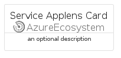
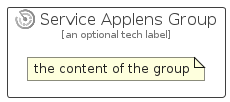

# ServiceApplens


```text
azure-11/Item/AzureEcosystem/ServiceApplens
```

```text
include('azure-11/Item/AzureEcosystem/ServiceApplens')
```


| Illustration | ServiceApplens | ServiceApplensCard | ServiceApplensGroup |
| :---: | :---: | :---: | :---: |
|  |  |  |  |


## ServiceApplens

### Load remotely
```plantuml
@startuml
' configures the library
!global $LIB_BASE_LOCATION="https://raw.githubusercontent.com/tmorin/plantuml-libs/master/distribution"

' loads the library's bootstrap
!include $LIB_BASE_LOCATION/bootstrap.puml

' loads the package bootstrap
include('azure-11/bootstrap')

' loads the Item which embeds the element ServiceApplens
include('azure-11/Item/AzureEcosystem/ServiceApplens')

' renders the element
ServiceApplens('ServiceApplens', 'Service Applens', 'an optional tech label', 'an optional description')
@enduml
```

### Load locally
```plantuml
@startuml
' configures the library
!global $INCLUSION_MODE="local"
!global $LIB_BASE_LOCATION="../../.."

' loads the library's bootstrap
!include $LIB_BASE_LOCATION/bootstrap.puml

' loads the package bootstrap
include('azure-11/bootstrap')

' loads the Item which embeds the element ServiceApplens
include('azure-11/Item/AzureEcosystem/ServiceApplens')

' renders the element
ServiceApplens('ServiceApplens', 'Service Applens', 'an optional tech label', 'an optional description')
@enduml
```

## ServiceApplensCard

### Load remotely
```plantuml
@startuml
' configures the library
!global $LIB_BASE_LOCATION="https://raw.githubusercontent.com/tmorin/plantuml-libs/master/distribution"

' loads the library's bootstrap
!include $LIB_BASE_LOCATION/bootstrap.puml

' loads the package bootstrap
include('azure-11/bootstrap')

' loads the Item which embeds the element ServiceApplensCard
include('azure-11/Item/AzureEcosystem/ServiceApplens')

' renders the element
ServiceApplensCard('ServiceApplensCard', 'Service Applens Card', 'an optional description')
@enduml
```

### Load locally
```plantuml
@startuml
' configures the library
!global $INCLUSION_MODE="local"
!global $LIB_BASE_LOCATION="../../.."

' loads the library's bootstrap
!include $LIB_BASE_LOCATION/bootstrap.puml

' loads the package bootstrap
include('azure-11/bootstrap')

' loads the Item which embeds the element ServiceApplensCard
include('azure-11/Item/AzureEcosystem/ServiceApplens')

' renders the element
ServiceApplensCard('ServiceApplensCard', 'Service Applens Card', 'an optional description')
@enduml
```

## ServiceApplensGroup

### Load remotely
```plantuml
@startuml
' configures the library
!global $LIB_BASE_LOCATION="https://raw.githubusercontent.com/tmorin/plantuml-libs/master/distribution"

' loads the library's bootstrap
!include $LIB_BASE_LOCATION/bootstrap.puml

' loads the package bootstrap
include('azure-11/bootstrap')

' loads the Item which embeds the element ServiceApplensGroup
include('azure-11/Item/AzureEcosystem/ServiceApplens')

' renders the element
ServiceApplensGroup('ServiceApplensGroup', 'Service Applens Group', 'an optional tech label') {
    note as note
        the content of the group
    end note
}
@enduml
```

### Load locally
```plantuml
@startuml
' configures the library
!global $INCLUSION_MODE="local"
!global $LIB_BASE_LOCATION="../../.."

' loads the library's bootstrap
!include $LIB_BASE_LOCATION/bootstrap.puml

' loads the package bootstrap
include('azure-11/bootstrap')

' loads the Item which embeds the element ServiceApplensGroup
include('azure-11/Item/AzureEcosystem/ServiceApplens')

' renders the element
ServiceApplensGroup('ServiceApplensGroup', 'Service Applens Group', 'an optional tech label') {
    note as note
        the content of the group
    end note
}
@enduml
```

