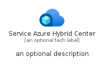

# ServiceAzureHybridCenter


```text
azure-11/Item/AzureEcosystem/ServiceAzureHybridCenter
```

```text
include('azure-11/Item/AzureEcosystem/ServiceAzureHybridCenter')
```


| Illustration | ServiceAzureHybridCenter | ServiceAzureHybridCenterCard | ServiceAzureHybridCenterGroup |
| :---: | :---: | :---: | :---: |
|  |  |  |  |


## Sprites
The item provides the following sriptes:

- `<$ServiceAzureHybridCenterXs>`
- `<$ServiceAzureHybridCenterSm>`
- `<$ServiceAzureHybridCenterMd>`
- `<$ServiceAzureHybridCenterLg>`


## ServiceAzureHybridCenter

### Load remotely
```plantuml
@startuml
' configures the library
!global $LIB_BASE_LOCATION="https://raw.githubusercontent.com/tmorin/plantuml-libs/master/distribution"

' loads the library's bootstrap
!include $LIB_BASE_LOCATION/bootstrap.puml

' loads the package bootstrap
include('azure-11/bootstrap')

' loads the Item which embeds the element ServiceAzureHybridCenter
include('azure-11/Item/AzureEcosystem/ServiceAzureHybridCenter')

' renders the element
ServiceAzureHybridCenter('ServiceAzureHybridCenter', 'Service Azure Hybrid Center', 'an optional tech label', 'an optional description')
@enduml
```

### Load locally
```plantuml
@startuml
' configures the library
!global $INCLUSION_MODE="local"
!global $LIB_BASE_LOCATION="../../.."

' loads the library's bootstrap
!include $LIB_BASE_LOCATION/bootstrap.puml

' loads the package bootstrap
include('azure-11/bootstrap')

' loads the Item which embeds the element ServiceAzureHybridCenter
include('azure-11/Item/AzureEcosystem/ServiceAzureHybridCenter')

' renders the element
ServiceAzureHybridCenter('ServiceAzureHybridCenter', 'Service Azure Hybrid Center', 'an optional tech label', 'an optional description')
@enduml
```

## ServiceAzureHybridCenterCard

### Load remotely
```plantuml
@startuml
' configures the library
!global $LIB_BASE_LOCATION="https://raw.githubusercontent.com/tmorin/plantuml-libs/master/distribution"

' loads the library's bootstrap
!include $LIB_BASE_LOCATION/bootstrap.puml

' loads the package bootstrap
include('azure-11/bootstrap')

' loads the Item which embeds the element ServiceAzureHybridCenterCard
include('azure-11/Item/AzureEcosystem/ServiceAzureHybridCenter')

' renders the element
ServiceAzureHybridCenterCard('ServiceAzureHybridCenterCard', 'Service Azure Hybrid Center Card', 'an optional description')
@enduml
```

### Load locally
```plantuml
@startuml
' configures the library
!global $INCLUSION_MODE="local"
!global $LIB_BASE_LOCATION="../../.."

' loads the library's bootstrap
!include $LIB_BASE_LOCATION/bootstrap.puml

' loads the package bootstrap
include('azure-11/bootstrap')

' loads the Item which embeds the element ServiceAzureHybridCenterCard
include('azure-11/Item/AzureEcosystem/ServiceAzureHybridCenter')

' renders the element
ServiceAzureHybridCenterCard('ServiceAzureHybridCenterCard', 'Service Azure Hybrid Center Card', 'an optional description')
@enduml
```

## ServiceAzureHybridCenterGroup

### Load remotely
```plantuml
@startuml
' configures the library
!global $LIB_BASE_LOCATION="https://raw.githubusercontent.com/tmorin/plantuml-libs/master/distribution"

' loads the library's bootstrap
!include $LIB_BASE_LOCATION/bootstrap.puml

' loads the package bootstrap
include('azure-11/bootstrap')

' loads the Item which embeds the element ServiceAzureHybridCenterGroup
include('azure-11/Item/AzureEcosystem/ServiceAzureHybridCenter')

' renders the element
ServiceAzureHybridCenterGroup('ServiceAzureHybridCenterGroup', 'Service Azure Hybrid Center Group', 'an optional tech label') {
    note as note
        the content of the group
    end note
}
@enduml
```

### Load locally
```plantuml
@startuml
' configures the library
!global $INCLUSION_MODE="local"
!global $LIB_BASE_LOCATION="../../.."

' loads the library's bootstrap
!include $LIB_BASE_LOCATION/bootstrap.puml

' loads the package bootstrap
include('azure-11/bootstrap')

' loads the Item which embeds the element ServiceAzureHybridCenterGroup
include('azure-11/Item/AzureEcosystem/ServiceAzureHybridCenter')

' renders the element
ServiceAzureHybridCenterGroup('ServiceAzureHybridCenterGroup', 'Service Azure Hybrid Center Group', 'an optional tech label') {
    note as note
        the content of the group
    end note
}
@enduml
```

