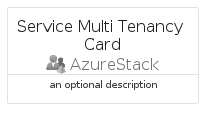

# ServiceMultiTenancy


```text
azure-11/Item/AzureStack/ServiceMultiTenancy
```

```text
include('azure-11/Item/AzureStack/ServiceMultiTenancy')
```


| Illustration | ServiceMultiTenancy | ServiceMultiTenancyCard | ServiceMultiTenancyGroup |
| :---: | :---: | :---: | :---: |
|  |  |  |  |


## Sprites
The item provides the following sriptes:

- `<$ServiceMultiTenancyXs>`
- `<$ServiceMultiTenancySm>`
- `<$ServiceMultiTenancyMd>`
- `<$ServiceMultiTenancyLg>`


## ServiceMultiTenancy

### Load remotely
```plantuml
@startuml
' configures the library
!global $LIB_BASE_LOCATION="https://raw.githubusercontent.com/tmorin/plantuml-libs/master/distribution"

' loads the library's bootstrap
!include $LIB_BASE_LOCATION/bootstrap.puml

' loads the package bootstrap
include('azure-11/bootstrap')

' loads the Item which embeds the element ServiceMultiTenancy
include('azure-11/Item/AzureStack/ServiceMultiTenancy')

' renders the element
ServiceMultiTenancy('ServiceMultiTenancy', 'Service Multi Tenancy', 'an optional tech label', 'an optional description')
@enduml
```

### Load locally
```plantuml
@startuml
' configures the library
!global $INCLUSION_MODE="local"
!global $LIB_BASE_LOCATION="../../.."

' loads the library's bootstrap
!include $LIB_BASE_LOCATION/bootstrap.puml

' loads the package bootstrap
include('azure-11/bootstrap')

' loads the Item which embeds the element ServiceMultiTenancy
include('azure-11/Item/AzureStack/ServiceMultiTenancy')

' renders the element
ServiceMultiTenancy('ServiceMultiTenancy', 'Service Multi Tenancy', 'an optional tech label', 'an optional description')
@enduml
```

## ServiceMultiTenancyCard

### Load remotely
```plantuml
@startuml
' configures the library
!global $LIB_BASE_LOCATION="https://raw.githubusercontent.com/tmorin/plantuml-libs/master/distribution"

' loads the library's bootstrap
!include $LIB_BASE_LOCATION/bootstrap.puml

' loads the package bootstrap
include('azure-11/bootstrap')

' loads the Item which embeds the element ServiceMultiTenancyCard
include('azure-11/Item/AzureStack/ServiceMultiTenancy')

' renders the element
ServiceMultiTenancyCard('ServiceMultiTenancyCard', 'Service Multi Tenancy Card', 'an optional description')
@enduml
```

### Load locally
```plantuml
@startuml
' configures the library
!global $INCLUSION_MODE="local"
!global $LIB_BASE_LOCATION="../../.."

' loads the library's bootstrap
!include $LIB_BASE_LOCATION/bootstrap.puml

' loads the package bootstrap
include('azure-11/bootstrap')

' loads the Item which embeds the element ServiceMultiTenancyCard
include('azure-11/Item/AzureStack/ServiceMultiTenancy')

' renders the element
ServiceMultiTenancyCard('ServiceMultiTenancyCard', 'Service Multi Tenancy Card', 'an optional description')
@enduml
```

## ServiceMultiTenancyGroup

### Load remotely
```plantuml
@startuml
' configures the library
!global $LIB_BASE_LOCATION="https://raw.githubusercontent.com/tmorin/plantuml-libs/master/distribution"

' loads the library's bootstrap
!include $LIB_BASE_LOCATION/bootstrap.puml

' loads the package bootstrap
include('azure-11/bootstrap')

' loads the Item which embeds the element ServiceMultiTenancyGroup
include('azure-11/Item/AzureStack/ServiceMultiTenancy')

' renders the element
ServiceMultiTenancyGroup('ServiceMultiTenancyGroup', 'Service Multi Tenancy Group', 'an optional tech label') {
    note as note
        the content of the group
    end note
}
@enduml
```

### Load locally
```plantuml
@startuml
' configures the library
!global $INCLUSION_MODE="local"
!global $LIB_BASE_LOCATION="../../.."

' loads the library's bootstrap
!include $LIB_BASE_LOCATION/bootstrap.puml

' loads the package bootstrap
include('azure-11/bootstrap')

' loads the Item which embeds the element ServiceMultiTenancyGroup
include('azure-11/Item/AzureStack/ServiceMultiTenancy')

' renders the element
ServiceMultiTenancyGroup('ServiceMultiTenancyGroup', 'Service Multi Tenancy Group', 'an optional tech label') {
    note as note
        the content of the group
    end note
}
@enduml
```

