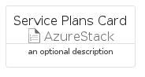
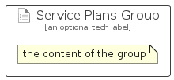

# ServicePlans


```text
azure-11/Item/AzureStack/ServicePlans
```

```text
include('azure-11/Item/AzureStack/ServicePlans')
```


| Illustration | ServicePlans | ServicePlansCard | ServicePlansGroup |
| :---: | :---: | :---: | :---: |
|  |  |  |  |


## Sprites
The item provides the following sriptes:

- `<$ServicePlansXs>`
- `<$ServicePlansSm>`
- `<$ServicePlansMd>`
- `<$ServicePlansLg>`


## ServicePlans

### Load remotely
```plantuml
@startuml
' configures the library
!global $LIB_BASE_LOCATION="https://raw.githubusercontent.com/tmorin/plantuml-libs/master/distribution"

' loads the library's bootstrap
!include $LIB_BASE_LOCATION/bootstrap.puml

' loads the package bootstrap
include('azure-11/bootstrap')

' loads the Item which embeds the element ServicePlans
include('azure-11/Item/AzureStack/ServicePlans')

' renders the element
ServicePlans('ServicePlans', 'Service Plans', 'an optional tech label', 'an optional description')
@enduml
```

### Load locally
```plantuml
@startuml
' configures the library
!global $INCLUSION_MODE="local"
!global $LIB_BASE_LOCATION="../../.."

' loads the library's bootstrap
!include $LIB_BASE_LOCATION/bootstrap.puml

' loads the package bootstrap
include('azure-11/bootstrap')

' loads the Item which embeds the element ServicePlans
include('azure-11/Item/AzureStack/ServicePlans')

' renders the element
ServicePlans('ServicePlans', 'Service Plans', 'an optional tech label', 'an optional description')
@enduml
```

## ServicePlansCard

### Load remotely
```plantuml
@startuml
' configures the library
!global $LIB_BASE_LOCATION="https://raw.githubusercontent.com/tmorin/plantuml-libs/master/distribution"

' loads the library's bootstrap
!include $LIB_BASE_LOCATION/bootstrap.puml

' loads the package bootstrap
include('azure-11/bootstrap')

' loads the Item which embeds the element ServicePlansCard
include('azure-11/Item/AzureStack/ServicePlans')

' renders the element
ServicePlansCard('ServicePlansCard', 'Service Plans Card', 'an optional description')
@enduml
```

### Load locally
```plantuml
@startuml
' configures the library
!global $INCLUSION_MODE="local"
!global $LIB_BASE_LOCATION="../../.."

' loads the library's bootstrap
!include $LIB_BASE_LOCATION/bootstrap.puml

' loads the package bootstrap
include('azure-11/bootstrap')

' loads the Item which embeds the element ServicePlansCard
include('azure-11/Item/AzureStack/ServicePlans')

' renders the element
ServicePlansCard('ServicePlansCard', 'Service Plans Card', 'an optional description')
@enduml
```

## ServicePlansGroup

### Load remotely
```plantuml
@startuml
' configures the library
!global $LIB_BASE_LOCATION="https://raw.githubusercontent.com/tmorin/plantuml-libs/master/distribution"

' loads the library's bootstrap
!include $LIB_BASE_LOCATION/bootstrap.puml

' loads the package bootstrap
include('azure-11/bootstrap')

' loads the Item which embeds the element ServicePlansGroup
include('azure-11/Item/AzureStack/ServicePlans')

' renders the element
ServicePlansGroup('ServicePlansGroup', 'Service Plans Group', 'an optional tech label') {
    note as note
        the content of the group
    end note
}
@enduml
```

### Load locally
```plantuml
@startuml
' configures the library
!global $INCLUSION_MODE="local"
!global $LIB_BASE_LOCATION="../../.."

' loads the library's bootstrap
!include $LIB_BASE_LOCATION/bootstrap.puml

' loads the package bootstrap
include('azure-11/bootstrap')

' loads the Item which embeds the element ServicePlansGroup
include('azure-11/Item/AzureStack/ServicePlans')

' renders the element
ServicePlansGroup('ServicePlansGroup', 'Service Plans Group', 'an optional tech label') {
    note as note
        the content of the group
    end note
}
@enduml
```

