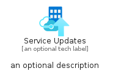
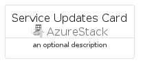

# ServiceUpdates


```text
azure-11/Item/AzureStack/ServiceUpdates
```

```text
include('azure-11/Item/AzureStack/ServiceUpdates')
```


| Illustration | ServiceUpdates | ServiceUpdatesCard | ServiceUpdatesGroup |
| :---: | :---: | :---: | :---: |
|  |  |  |  |


## ServiceUpdates

### Load remotely
```plantuml
@startuml
' configures the library
!global $LIB_BASE_LOCATION="https://raw.githubusercontent.com/tmorin/plantuml-libs/master/distribution"

' loads the library's bootstrap
!include $LIB_BASE_LOCATION/bootstrap.puml

' loads the package bootstrap
include('azure-11/bootstrap')

' loads the Item which embeds the element ServiceUpdates
include('azure-11/Item/AzureStack/ServiceUpdates')

' renders the element
ServiceUpdates('ServiceUpdates', 'Service Updates', 'an optional tech label', 'an optional description')
@enduml
```

### Load locally
```plantuml
@startuml
' configures the library
!global $INCLUSION_MODE="local"
!global $LIB_BASE_LOCATION="../../.."

' loads the library's bootstrap
!include $LIB_BASE_LOCATION/bootstrap.puml

' loads the package bootstrap
include('azure-11/bootstrap')

' loads the Item which embeds the element ServiceUpdates
include('azure-11/Item/AzureStack/ServiceUpdates')

' renders the element
ServiceUpdates('ServiceUpdates', 'Service Updates', 'an optional tech label', 'an optional description')
@enduml
```

## ServiceUpdatesCard

### Load remotely
```plantuml
@startuml
' configures the library
!global $LIB_BASE_LOCATION="https://raw.githubusercontent.com/tmorin/plantuml-libs/master/distribution"

' loads the library's bootstrap
!include $LIB_BASE_LOCATION/bootstrap.puml

' loads the package bootstrap
include('azure-11/bootstrap')

' loads the Item which embeds the element ServiceUpdatesCard
include('azure-11/Item/AzureStack/ServiceUpdates')

' renders the element
ServiceUpdatesCard('ServiceUpdatesCard', 'Service Updates Card', 'an optional description')
@enduml
```

### Load locally
```plantuml
@startuml
' configures the library
!global $INCLUSION_MODE="local"
!global $LIB_BASE_LOCATION="../../.."

' loads the library's bootstrap
!include $LIB_BASE_LOCATION/bootstrap.puml

' loads the package bootstrap
include('azure-11/bootstrap')

' loads the Item which embeds the element ServiceUpdatesCard
include('azure-11/Item/AzureStack/ServiceUpdates')

' renders the element
ServiceUpdatesCard('ServiceUpdatesCard', 'Service Updates Card', 'an optional description')
@enduml
```

## ServiceUpdatesGroup

### Load remotely
```plantuml
@startuml
' configures the library
!global $LIB_BASE_LOCATION="https://raw.githubusercontent.com/tmorin/plantuml-libs/master/distribution"

' loads the library's bootstrap
!include $LIB_BASE_LOCATION/bootstrap.puml

' loads the package bootstrap
include('azure-11/bootstrap')

' loads the Item which embeds the element ServiceUpdatesGroup
include('azure-11/Item/AzureStack/ServiceUpdates')

' renders the element
ServiceUpdatesGroup('ServiceUpdatesGroup', 'Service Updates Group', 'an optional tech label') {
    note as note
        the content of the group
    end note
}
@enduml
```

### Load locally
```plantuml
@startuml
' configures the library
!global $INCLUSION_MODE="local"
!global $LIB_BASE_LOCATION="../../.."

' loads the library's bootstrap
!include $LIB_BASE_LOCATION/bootstrap.puml

' loads the package bootstrap
include('azure-11/bootstrap')

' loads the Item which embeds the element ServiceUpdatesGroup
include('azure-11/Item/AzureStack/ServiceUpdates')

' renders the element
ServiceUpdatesGroup('ServiceUpdatesGroup', 'Service Updates Group', 'an optional tech label') {
    note as note
        the content of the group
    end note
}
@enduml
```

