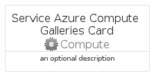
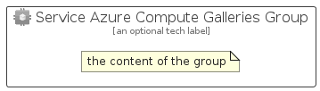

# ServiceAzureComputeGalleries


```text
azure-11/Item/Compute/ServiceAzureComputeGalleries
```

```text
include('azure-11/Item/Compute/ServiceAzureComputeGalleries')
```


| Illustration | ServiceAzureComputeGalleries | ServiceAzureComputeGalleriesCard | ServiceAzureComputeGalleriesGroup |
| :---: | :---: | :---: | :---: |
|  |  |  |  |


## Sprites
The item provides the following sriptes:

- `<$ServiceAzureComputeGalleriesXs>`
- `<$ServiceAzureComputeGalleriesSm>`
- `<$ServiceAzureComputeGalleriesMd>`
- `<$ServiceAzureComputeGalleriesLg>`


## ServiceAzureComputeGalleries

### Load remotely
```plantuml
@startuml
' configures the library
!global $LIB_BASE_LOCATION="https://raw.githubusercontent.com/tmorin/plantuml-libs/master/distribution"

' loads the library's bootstrap
!include $LIB_BASE_LOCATION/bootstrap.puml

' loads the package bootstrap
include('azure-11/bootstrap')

' loads the Item which embeds the element ServiceAzureComputeGalleries
include('azure-11/Item/Compute/ServiceAzureComputeGalleries')

' renders the element
ServiceAzureComputeGalleries('ServiceAzureComputeGalleries', 'Service Azure Compute Galleries', 'an optional tech label', 'an optional description')
@enduml
```

### Load locally
```plantuml
@startuml
' configures the library
!global $INCLUSION_MODE="local"
!global $LIB_BASE_LOCATION="../../.."

' loads the library's bootstrap
!include $LIB_BASE_LOCATION/bootstrap.puml

' loads the package bootstrap
include('azure-11/bootstrap')

' loads the Item which embeds the element ServiceAzureComputeGalleries
include('azure-11/Item/Compute/ServiceAzureComputeGalleries')

' renders the element
ServiceAzureComputeGalleries('ServiceAzureComputeGalleries', 'Service Azure Compute Galleries', 'an optional tech label', 'an optional description')
@enduml
```

## ServiceAzureComputeGalleriesCard

### Load remotely
```plantuml
@startuml
' configures the library
!global $LIB_BASE_LOCATION="https://raw.githubusercontent.com/tmorin/plantuml-libs/master/distribution"

' loads the library's bootstrap
!include $LIB_BASE_LOCATION/bootstrap.puml

' loads the package bootstrap
include('azure-11/bootstrap')

' loads the Item which embeds the element ServiceAzureComputeGalleriesCard
include('azure-11/Item/Compute/ServiceAzureComputeGalleries')

' renders the element
ServiceAzureComputeGalleriesCard('ServiceAzureComputeGalleriesCard', 'Service Azure Compute Galleries Card', 'an optional description')
@enduml
```

### Load locally
```plantuml
@startuml
' configures the library
!global $INCLUSION_MODE="local"
!global $LIB_BASE_LOCATION="../../.."

' loads the library's bootstrap
!include $LIB_BASE_LOCATION/bootstrap.puml

' loads the package bootstrap
include('azure-11/bootstrap')

' loads the Item which embeds the element ServiceAzureComputeGalleriesCard
include('azure-11/Item/Compute/ServiceAzureComputeGalleries')

' renders the element
ServiceAzureComputeGalleriesCard('ServiceAzureComputeGalleriesCard', 'Service Azure Compute Galleries Card', 'an optional description')
@enduml
```

## ServiceAzureComputeGalleriesGroup

### Load remotely
```plantuml
@startuml
' configures the library
!global $LIB_BASE_LOCATION="https://raw.githubusercontent.com/tmorin/plantuml-libs/master/distribution"

' loads the library's bootstrap
!include $LIB_BASE_LOCATION/bootstrap.puml

' loads the package bootstrap
include('azure-11/bootstrap')

' loads the Item which embeds the element ServiceAzureComputeGalleriesGroup
include('azure-11/Item/Compute/ServiceAzureComputeGalleries')

' renders the element
ServiceAzureComputeGalleriesGroup('ServiceAzureComputeGalleriesGroup', 'Service Azure Compute Galleries Group', 'an optional tech label') {
    note as note
        the content of the group
    end note
}
@enduml
```

### Load locally
```plantuml
@startuml
' configures the library
!global $INCLUSION_MODE="local"
!global $LIB_BASE_LOCATION="../../.."

' loads the library's bootstrap
!include $LIB_BASE_LOCATION/bootstrap.puml

' loads the package bootstrap
include('azure-11/bootstrap')

' loads the Item which embeds the element ServiceAzureComputeGalleriesGroup
include('azure-11/Item/Compute/ServiceAzureComputeGalleries')

' renders the element
ServiceAzureComputeGalleriesGroup('ServiceAzureComputeGalleriesGroup', 'Service Azure Compute Galleries Group', 'an optional tech label') {
    note as note
        the content of the group
    end note
}
@enduml
```

