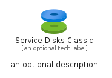
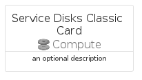

# ServiceDisksClassic


```text
azure-11/Item/Compute/ServiceDisksClassic
```

```text
include('azure-11/Item/Compute/ServiceDisksClassic')
```


| Illustration | ServiceDisksClassic | ServiceDisksClassicCard | ServiceDisksClassicGroup |
| :---: | :---: | :---: | :---: |
|  |  |  |  |


## Sprites
The item provides the following sriptes:

- `<$ServiceDisksClassicXs>`
- `<$ServiceDisksClassicSm>`
- `<$ServiceDisksClassicMd>`
- `<$ServiceDisksClassicLg>`


## ServiceDisksClassic

### Load remotely
```plantuml
@startuml
' configures the library
!global $LIB_BASE_LOCATION="https://raw.githubusercontent.com/tmorin/plantuml-libs/master/distribution"

' loads the library's bootstrap
!include $LIB_BASE_LOCATION/bootstrap.puml

' loads the package bootstrap
include('azure-11/bootstrap')

' loads the Item which embeds the element ServiceDisksClassic
include('azure-11/Item/Compute/ServiceDisksClassic')

' renders the element
ServiceDisksClassic('ServiceDisksClassic', 'Service Disks Classic', 'an optional tech label', 'an optional description')
@enduml
```

### Load locally
```plantuml
@startuml
' configures the library
!global $INCLUSION_MODE="local"
!global $LIB_BASE_LOCATION="../../.."

' loads the library's bootstrap
!include $LIB_BASE_LOCATION/bootstrap.puml

' loads the package bootstrap
include('azure-11/bootstrap')

' loads the Item which embeds the element ServiceDisksClassic
include('azure-11/Item/Compute/ServiceDisksClassic')

' renders the element
ServiceDisksClassic('ServiceDisksClassic', 'Service Disks Classic', 'an optional tech label', 'an optional description')
@enduml
```

## ServiceDisksClassicCard

### Load remotely
```plantuml
@startuml
' configures the library
!global $LIB_BASE_LOCATION="https://raw.githubusercontent.com/tmorin/plantuml-libs/master/distribution"

' loads the library's bootstrap
!include $LIB_BASE_LOCATION/bootstrap.puml

' loads the package bootstrap
include('azure-11/bootstrap')

' loads the Item which embeds the element ServiceDisksClassicCard
include('azure-11/Item/Compute/ServiceDisksClassic')

' renders the element
ServiceDisksClassicCard('ServiceDisksClassicCard', 'Service Disks Classic Card', 'an optional description')
@enduml
```

### Load locally
```plantuml
@startuml
' configures the library
!global $INCLUSION_MODE="local"
!global $LIB_BASE_LOCATION="../../.."

' loads the library's bootstrap
!include $LIB_BASE_LOCATION/bootstrap.puml

' loads the package bootstrap
include('azure-11/bootstrap')

' loads the Item which embeds the element ServiceDisksClassicCard
include('azure-11/Item/Compute/ServiceDisksClassic')

' renders the element
ServiceDisksClassicCard('ServiceDisksClassicCard', 'Service Disks Classic Card', 'an optional description')
@enduml
```

## ServiceDisksClassicGroup

### Load remotely
```plantuml
@startuml
' configures the library
!global $LIB_BASE_LOCATION="https://raw.githubusercontent.com/tmorin/plantuml-libs/master/distribution"

' loads the library's bootstrap
!include $LIB_BASE_LOCATION/bootstrap.puml

' loads the package bootstrap
include('azure-11/bootstrap')

' loads the Item which embeds the element ServiceDisksClassicGroup
include('azure-11/Item/Compute/ServiceDisksClassic')

' renders the element
ServiceDisksClassicGroup('ServiceDisksClassicGroup', 'Service Disks Classic Group', 'an optional tech label') {
    note as note
        the content of the group
    end note
}
@enduml
```

### Load locally
```plantuml
@startuml
' configures the library
!global $INCLUSION_MODE="local"
!global $LIB_BASE_LOCATION="../../.."

' loads the library's bootstrap
!include $LIB_BASE_LOCATION/bootstrap.puml

' loads the package bootstrap
include('azure-11/bootstrap')

' loads the Item which embeds the element ServiceDisksClassicGroup
include('azure-11/Item/Compute/ServiceDisksClassic')

' renders the element
ServiceDisksClassicGroup('ServiceDisksClassicGroup', 'Service Disks Classic Group', 'an optional tech label') {
    note as note
        the content of the group
    end note
}
@enduml
```

