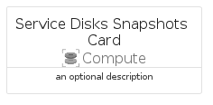

# ServiceDisksSnapshots


```text
azure-11/Item/Compute/ServiceDisksSnapshots
```

```text
include('azure-11/Item/Compute/ServiceDisksSnapshots')
```


| Illustration | ServiceDisksSnapshots | ServiceDisksSnapshotsCard | ServiceDisksSnapshotsGroup |
| :---: | :---: | :---: | :---: |
|  |  |  |  |


## ServiceDisksSnapshots

### Load remotely
```plantuml
@startuml
' configures the library
!global $LIB_BASE_LOCATION="https://raw.githubusercontent.com/tmorin/plantuml-libs/master/distribution"

' loads the library's bootstrap
!include $LIB_BASE_LOCATION/bootstrap.puml

' loads the package bootstrap
include('azure-11/bootstrap')

' loads the Item which embeds the element ServiceDisksSnapshots
include('azure-11/Item/Compute/ServiceDisksSnapshots')

' renders the element
ServiceDisksSnapshots('ServiceDisksSnapshots', 'Service Disks Snapshots', 'an optional tech label', 'an optional description')
@enduml
```

### Load locally
```plantuml
@startuml
' configures the library
!global $INCLUSION_MODE="local"
!global $LIB_BASE_LOCATION="../../.."

' loads the library's bootstrap
!include $LIB_BASE_LOCATION/bootstrap.puml

' loads the package bootstrap
include('azure-11/bootstrap')

' loads the Item which embeds the element ServiceDisksSnapshots
include('azure-11/Item/Compute/ServiceDisksSnapshots')

' renders the element
ServiceDisksSnapshots('ServiceDisksSnapshots', 'Service Disks Snapshots', 'an optional tech label', 'an optional description')
@enduml
```

## ServiceDisksSnapshotsCard

### Load remotely
```plantuml
@startuml
' configures the library
!global $LIB_BASE_LOCATION="https://raw.githubusercontent.com/tmorin/plantuml-libs/master/distribution"

' loads the library's bootstrap
!include $LIB_BASE_LOCATION/bootstrap.puml

' loads the package bootstrap
include('azure-11/bootstrap')

' loads the Item which embeds the element ServiceDisksSnapshotsCard
include('azure-11/Item/Compute/ServiceDisksSnapshots')

' renders the element
ServiceDisksSnapshotsCard('ServiceDisksSnapshotsCard', 'Service Disks Snapshots Card', 'an optional description')
@enduml
```

### Load locally
```plantuml
@startuml
' configures the library
!global $INCLUSION_MODE="local"
!global $LIB_BASE_LOCATION="../../.."

' loads the library's bootstrap
!include $LIB_BASE_LOCATION/bootstrap.puml

' loads the package bootstrap
include('azure-11/bootstrap')

' loads the Item which embeds the element ServiceDisksSnapshotsCard
include('azure-11/Item/Compute/ServiceDisksSnapshots')

' renders the element
ServiceDisksSnapshotsCard('ServiceDisksSnapshotsCard', 'Service Disks Snapshots Card', 'an optional description')
@enduml
```

## ServiceDisksSnapshotsGroup

### Load remotely
```plantuml
@startuml
' configures the library
!global $LIB_BASE_LOCATION="https://raw.githubusercontent.com/tmorin/plantuml-libs/master/distribution"

' loads the library's bootstrap
!include $LIB_BASE_LOCATION/bootstrap.puml

' loads the package bootstrap
include('azure-11/bootstrap')

' loads the Item which embeds the element ServiceDisksSnapshotsGroup
include('azure-11/Item/Compute/ServiceDisksSnapshots')

' renders the element
ServiceDisksSnapshotsGroup('ServiceDisksSnapshotsGroup', 'Service Disks Snapshots Group', 'an optional tech label') {
    note as note
        the content of the group
    end note
}
@enduml
```

### Load locally
```plantuml
@startuml
' configures the library
!global $INCLUSION_MODE="local"
!global $LIB_BASE_LOCATION="../../.."

' loads the library's bootstrap
!include $LIB_BASE_LOCATION/bootstrap.puml

' loads the package bootstrap
include('azure-11/bootstrap')

' loads the Item which embeds the element ServiceDisksSnapshotsGroup
include('azure-11/Item/Compute/ServiceDisksSnapshots')

' renders the element
ServiceDisksSnapshotsGroup('ServiceDisksSnapshotsGroup', 'Service Disks Snapshots Group', 'an optional tech label') {
    note as note
        the content of the group
    end note
}
@enduml
```

