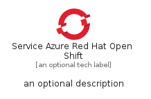
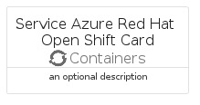

# ServiceAzureRedHatOpenShift


```text
azure-11/Item/Containers/ServiceAzureRedHatOpenShift
```

```text
include('azure-11/Item/Containers/ServiceAzureRedHatOpenShift')
```


| Illustration | ServiceAzureRedHatOpenShift | ServiceAzureRedHatOpenShiftCard | ServiceAzureRedHatOpenShiftGroup |
| :---: | :---: | :---: | :---: |
|  |  |  |  |


## Sprites
The item provides the following sriptes:

- `<$ServiceAzureRedHatOpenShiftXs>`
- `<$ServiceAzureRedHatOpenShiftSm>`
- `<$ServiceAzureRedHatOpenShiftMd>`
- `<$ServiceAzureRedHatOpenShiftLg>`


## ServiceAzureRedHatOpenShift

### Load remotely
```plantuml
@startuml
' configures the library
!global $LIB_BASE_LOCATION="https://raw.githubusercontent.com/tmorin/plantuml-libs/master/distribution"

' loads the library's bootstrap
!include $LIB_BASE_LOCATION/bootstrap.puml

' loads the package bootstrap
include('azure-11/bootstrap')

' loads the Item which embeds the element ServiceAzureRedHatOpenShift
include('azure-11/Item/Containers/ServiceAzureRedHatOpenShift')

' renders the element
ServiceAzureRedHatOpenShift('ServiceAzureRedHatOpenShift', 'Service Azure Red Hat Open Shift', 'an optional tech label', 'an optional description')
@enduml
```

### Load locally
```plantuml
@startuml
' configures the library
!global $INCLUSION_MODE="local"
!global $LIB_BASE_LOCATION="../../.."

' loads the library's bootstrap
!include $LIB_BASE_LOCATION/bootstrap.puml

' loads the package bootstrap
include('azure-11/bootstrap')

' loads the Item which embeds the element ServiceAzureRedHatOpenShift
include('azure-11/Item/Containers/ServiceAzureRedHatOpenShift')

' renders the element
ServiceAzureRedHatOpenShift('ServiceAzureRedHatOpenShift', 'Service Azure Red Hat Open Shift', 'an optional tech label', 'an optional description')
@enduml
```

## ServiceAzureRedHatOpenShiftCard

### Load remotely
```plantuml
@startuml
' configures the library
!global $LIB_BASE_LOCATION="https://raw.githubusercontent.com/tmorin/plantuml-libs/master/distribution"

' loads the library's bootstrap
!include $LIB_BASE_LOCATION/bootstrap.puml

' loads the package bootstrap
include('azure-11/bootstrap')

' loads the Item which embeds the element ServiceAzureRedHatOpenShiftCard
include('azure-11/Item/Containers/ServiceAzureRedHatOpenShift')

' renders the element
ServiceAzureRedHatOpenShiftCard('ServiceAzureRedHatOpenShiftCard', 'Service Azure Red Hat Open Shift Card', 'an optional description')
@enduml
```

### Load locally
```plantuml
@startuml
' configures the library
!global $INCLUSION_MODE="local"
!global $LIB_BASE_LOCATION="../../.."

' loads the library's bootstrap
!include $LIB_BASE_LOCATION/bootstrap.puml

' loads the package bootstrap
include('azure-11/bootstrap')

' loads the Item which embeds the element ServiceAzureRedHatOpenShiftCard
include('azure-11/Item/Containers/ServiceAzureRedHatOpenShift')

' renders the element
ServiceAzureRedHatOpenShiftCard('ServiceAzureRedHatOpenShiftCard', 'Service Azure Red Hat Open Shift Card', 'an optional description')
@enduml
```

## ServiceAzureRedHatOpenShiftGroup

### Load remotely
```plantuml
@startuml
' configures the library
!global $LIB_BASE_LOCATION="https://raw.githubusercontent.com/tmorin/plantuml-libs/master/distribution"

' loads the library's bootstrap
!include $LIB_BASE_LOCATION/bootstrap.puml

' loads the package bootstrap
include('azure-11/bootstrap')

' loads the Item which embeds the element ServiceAzureRedHatOpenShiftGroup
include('azure-11/Item/Containers/ServiceAzureRedHatOpenShift')

' renders the element
ServiceAzureRedHatOpenShiftGroup('ServiceAzureRedHatOpenShiftGroup', 'Service Azure Red Hat Open Shift Group', 'an optional tech label') {
    note as note
        the content of the group
    end note
}
@enduml
```

### Load locally
```plantuml
@startuml
' configures the library
!global $INCLUSION_MODE="local"
!global $LIB_BASE_LOCATION="../../.."

' loads the library's bootstrap
!include $LIB_BASE_LOCATION/bootstrap.puml

' loads the package bootstrap
include('azure-11/bootstrap')

' loads the Item which embeds the element ServiceAzureRedHatOpenShiftGroup
include('azure-11/Item/Containers/ServiceAzureRedHatOpenShift')

' renders the element
ServiceAzureRedHatOpenShiftGroup('ServiceAzureRedHatOpenShiftGroup', 'Service Azure Red Hat Open Shift Group', 'an optional tech label') {
    note as note
        the content of the group
    end note
}
@enduml
```

