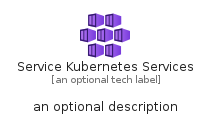
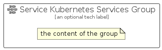

# ServiceKubernetesServices


```text
azure-11/Item/Containers/ServiceKubernetesServices
```

```text
include('azure-11/Item/Containers/ServiceKubernetesServices')
```


| Illustration | ServiceKubernetesServices | ServiceKubernetesServicesCard | ServiceKubernetesServicesGroup |
| :---: | :---: | :---: | :---: |
|  |  |  |  |


## ServiceKubernetesServices

### Load remotely
```plantuml
@startuml
' configures the library
!global $LIB_BASE_LOCATION="https://raw.githubusercontent.com/tmorin/plantuml-libs/master/distribution"

' loads the library's bootstrap
!include $LIB_BASE_LOCATION/bootstrap.puml

' loads the package bootstrap
include('azure-11/bootstrap')

' loads the Item which embeds the element ServiceKubernetesServices
include('azure-11/Item/Containers/ServiceKubernetesServices')

' renders the element
ServiceKubernetesServices('ServiceKubernetesServices', 'Service Kubernetes Services', 'an optional tech label', 'an optional description')
@enduml
```

### Load locally
```plantuml
@startuml
' configures the library
!global $INCLUSION_MODE="local"
!global $LIB_BASE_LOCATION="../../.."

' loads the library's bootstrap
!include $LIB_BASE_LOCATION/bootstrap.puml

' loads the package bootstrap
include('azure-11/bootstrap')

' loads the Item which embeds the element ServiceKubernetesServices
include('azure-11/Item/Containers/ServiceKubernetesServices')

' renders the element
ServiceKubernetesServices('ServiceKubernetesServices', 'Service Kubernetes Services', 'an optional tech label', 'an optional description')
@enduml
```

## ServiceKubernetesServicesCard

### Load remotely
```plantuml
@startuml
' configures the library
!global $LIB_BASE_LOCATION="https://raw.githubusercontent.com/tmorin/plantuml-libs/master/distribution"

' loads the library's bootstrap
!include $LIB_BASE_LOCATION/bootstrap.puml

' loads the package bootstrap
include('azure-11/bootstrap')

' loads the Item which embeds the element ServiceKubernetesServicesCard
include('azure-11/Item/Containers/ServiceKubernetesServices')

' renders the element
ServiceKubernetesServicesCard('ServiceKubernetesServicesCard', 'Service Kubernetes Services Card', 'an optional description')
@enduml
```

### Load locally
```plantuml
@startuml
' configures the library
!global $INCLUSION_MODE="local"
!global $LIB_BASE_LOCATION="../../.."

' loads the library's bootstrap
!include $LIB_BASE_LOCATION/bootstrap.puml

' loads the package bootstrap
include('azure-11/bootstrap')

' loads the Item which embeds the element ServiceKubernetesServicesCard
include('azure-11/Item/Containers/ServiceKubernetesServices')

' renders the element
ServiceKubernetesServicesCard('ServiceKubernetesServicesCard', 'Service Kubernetes Services Card', 'an optional description')
@enduml
```

## ServiceKubernetesServicesGroup

### Load remotely
```plantuml
@startuml
' configures the library
!global $LIB_BASE_LOCATION="https://raw.githubusercontent.com/tmorin/plantuml-libs/master/distribution"

' loads the library's bootstrap
!include $LIB_BASE_LOCATION/bootstrap.puml

' loads the package bootstrap
include('azure-11/bootstrap')

' loads the Item which embeds the element ServiceKubernetesServicesGroup
include('azure-11/Item/Containers/ServiceKubernetesServices')

' renders the element
ServiceKubernetesServicesGroup('ServiceKubernetesServicesGroup', 'Service Kubernetes Services Group', 'an optional tech label') {
    note as note
        the content of the group
    end note
}
@enduml
```

### Load locally
```plantuml
@startuml
' configures the library
!global $INCLUSION_MODE="local"
!global $LIB_BASE_LOCATION="../../.."

' loads the library's bootstrap
!include $LIB_BASE_LOCATION/bootstrap.puml

' loads the package bootstrap
include('azure-11/bootstrap')

' loads the Item which embeds the element ServiceKubernetesServicesGroup
include('azure-11/Item/Containers/ServiceKubernetesServices')

' renders the element
ServiceKubernetesServicesGroup('ServiceKubernetesServicesGroup', 'Service Kubernetes Services Group', 'an optional tech label') {
    note as note
        the content of the group
    end note
}
@enduml
```

