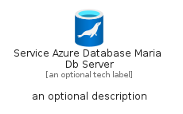
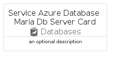

# ServiceAzureDatabaseMariaDbServer


```text
azure-11/Item/Databases/ServiceAzureDatabaseMariaDbServer
```

```text
include('azure-11/Item/Databases/ServiceAzureDatabaseMariaDbServer')
```


| Illustration | ServiceAzureDatabaseMariaDbServer | ServiceAzureDatabaseMariaDbServerCard | ServiceAzureDatabaseMariaDbServerGroup |
| :---: | :---: | :---: | :---: |
|  |  |  |  |


## ServiceAzureDatabaseMariaDbServer

### Load remotely
```plantuml
@startuml
' configures the library
!global $LIB_BASE_LOCATION="https://raw.githubusercontent.com/tmorin/plantuml-libs/master/distribution"

' loads the library's bootstrap
!include $LIB_BASE_LOCATION/bootstrap.puml

' loads the package bootstrap
include('azure-11/bootstrap')

' loads the Item which embeds the element ServiceAzureDatabaseMariaDbServer
include('azure-11/Item/Databases/ServiceAzureDatabaseMariaDbServer')

' renders the element
ServiceAzureDatabaseMariaDbServer('ServiceAzureDatabaseMariaDbServer', 'Service Azure Database Maria Db Server', 'an optional tech label', 'an optional description')
@enduml
```

### Load locally
```plantuml
@startuml
' configures the library
!global $INCLUSION_MODE="local"
!global $LIB_BASE_LOCATION="../../.."

' loads the library's bootstrap
!include $LIB_BASE_LOCATION/bootstrap.puml

' loads the package bootstrap
include('azure-11/bootstrap')

' loads the Item which embeds the element ServiceAzureDatabaseMariaDbServer
include('azure-11/Item/Databases/ServiceAzureDatabaseMariaDbServer')

' renders the element
ServiceAzureDatabaseMariaDbServer('ServiceAzureDatabaseMariaDbServer', 'Service Azure Database Maria Db Server', 'an optional tech label', 'an optional description')
@enduml
```

## ServiceAzureDatabaseMariaDbServerCard

### Load remotely
```plantuml
@startuml
' configures the library
!global $LIB_BASE_LOCATION="https://raw.githubusercontent.com/tmorin/plantuml-libs/master/distribution"

' loads the library's bootstrap
!include $LIB_BASE_LOCATION/bootstrap.puml

' loads the package bootstrap
include('azure-11/bootstrap')

' loads the Item which embeds the element ServiceAzureDatabaseMariaDbServerCard
include('azure-11/Item/Databases/ServiceAzureDatabaseMariaDbServer')

' renders the element
ServiceAzureDatabaseMariaDbServerCard('ServiceAzureDatabaseMariaDbServerCard', 'Service Azure Database Maria Db Server Card', 'an optional description')
@enduml
```

### Load locally
```plantuml
@startuml
' configures the library
!global $INCLUSION_MODE="local"
!global $LIB_BASE_LOCATION="../../.."

' loads the library's bootstrap
!include $LIB_BASE_LOCATION/bootstrap.puml

' loads the package bootstrap
include('azure-11/bootstrap')

' loads the Item which embeds the element ServiceAzureDatabaseMariaDbServerCard
include('azure-11/Item/Databases/ServiceAzureDatabaseMariaDbServer')

' renders the element
ServiceAzureDatabaseMariaDbServerCard('ServiceAzureDatabaseMariaDbServerCard', 'Service Azure Database Maria Db Server Card', 'an optional description')
@enduml
```

## ServiceAzureDatabaseMariaDbServerGroup

### Load remotely
```plantuml
@startuml
' configures the library
!global $LIB_BASE_LOCATION="https://raw.githubusercontent.com/tmorin/plantuml-libs/master/distribution"

' loads the library's bootstrap
!include $LIB_BASE_LOCATION/bootstrap.puml

' loads the package bootstrap
include('azure-11/bootstrap')

' loads the Item which embeds the element ServiceAzureDatabaseMariaDbServerGroup
include('azure-11/Item/Databases/ServiceAzureDatabaseMariaDbServer')

' renders the element
ServiceAzureDatabaseMariaDbServerGroup('ServiceAzureDatabaseMariaDbServerGroup', 'Service Azure Database Maria Db Server Group', 'an optional tech label') {
    note as note
        the content of the group
    end note
}
@enduml
```

### Load locally
```plantuml
@startuml
' configures the library
!global $INCLUSION_MODE="local"
!global $LIB_BASE_LOCATION="../../.."

' loads the library's bootstrap
!include $LIB_BASE_LOCATION/bootstrap.puml

' loads the package bootstrap
include('azure-11/bootstrap')

' loads the Item which embeds the element ServiceAzureDatabaseMariaDbServerGroup
include('azure-11/Item/Databases/ServiceAzureDatabaseMariaDbServer')

' renders the element
ServiceAzureDatabaseMariaDbServerGroup('ServiceAzureDatabaseMariaDbServerGroup', 'Service Azure Database Maria Db Server Group', 'an optional tech label') {
    note as note
        the content of the group
    end note
}
@enduml
```

