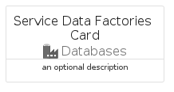
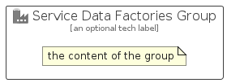

# ServiceDataFactories


```text
azure-11/Item/Databases/ServiceDataFactories
```

```text
include('azure-11/Item/Databases/ServiceDataFactories')
```


| Illustration | ServiceDataFactories | ServiceDataFactoriesCard | ServiceDataFactoriesGroup |
| :---: | :---: | :---: | :---: |
|  |  |  |  |


## Sprites
The item provides the following sriptes:

- `<$ServiceDataFactoriesXs>`
- `<$ServiceDataFactoriesSm>`
- `<$ServiceDataFactoriesMd>`
- `<$ServiceDataFactoriesLg>`


## ServiceDataFactories

### Load remotely
```plantuml
@startuml
' configures the library
!global $LIB_BASE_LOCATION="https://raw.githubusercontent.com/tmorin/plantuml-libs/master/distribution"

' loads the library's bootstrap
!include $LIB_BASE_LOCATION/bootstrap.puml

' loads the package bootstrap
include('azure-11/bootstrap')

' loads the Item which embeds the element ServiceDataFactories
include('azure-11/Item/Databases/ServiceDataFactories')

' renders the element
ServiceDataFactories('ServiceDataFactories', 'Service Data Factories', 'an optional tech label', 'an optional description')
@enduml
```

### Load locally
```plantuml
@startuml
' configures the library
!global $INCLUSION_MODE="local"
!global $LIB_BASE_LOCATION="../../.."

' loads the library's bootstrap
!include $LIB_BASE_LOCATION/bootstrap.puml

' loads the package bootstrap
include('azure-11/bootstrap')

' loads the Item which embeds the element ServiceDataFactories
include('azure-11/Item/Databases/ServiceDataFactories')

' renders the element
ServiceDataFactories('ServiceDataFactories', 'Service Data Factories', 'an optional tech label', 'an optional description')
@enduml
```

## ServiceDataFactoriesCard

### Load remotely
```plantuml
@startuml
' configures the library
!global $LIB_BASE_LOCATION="https://raw.githubusercontent.com/tmorin/plantuml-libs/master/distribution"

' loads the library's bootstrap
!include $LIB_BASE_LOCATION/bootstrap.puml

' loads the package bootstrap
include('azure-11/bootstrap')

' loads the Item which embeds the element ServiceDataFactoriesCard
include('azure-11/Item/Databases/ServiceDataFactories')

' renders the element
ServiceDataFactoriesCard('ServiceDataFactoriesCard', 'Service Data Factories Card', 'an optional description')
@enduml
```

### Load locally
```plantuml
@startuml
' configures the library
!global $INCLUSION_MODE="local"
!global $LIB_BASE_LOCATION="../../.."

' loads the library's bootstrap
!include $LIB_BASE_LOCATION/bootstrap.puml

' loads the package bootstrap
include('azure-11/bootstrap')

' loads the Item which embeds the element ServiceDataFactoriesCard
include('azure-11/Item/Databases/ServiceDataFactories')

' renders the element
ServiceDataFactoriesCard('ServiceDataFactoriesCard', 'Service Data Factories Card', 'an optional description')
@enduml
```

## ServiceDataFactoriesGroup

### Load remotely
```plantuml
@startuml
' configures the library
!global $LIB_BASE_LOCATION="https://raw.githubusercontent.com/tmorin/plantuml-libs/master/distribution"

' loads the library's bootstrap
!include $LIB_BASE_LOCATION/bootstrap.puml

' loads the package bootstrap
include('azure-11/bootstrap')

' loads the Item which embeds the element ServiceDataFactoriesGroup
include('azure-11/Item/Databases/ServiceDataFactories')

' renders the element
ServiceDataFactoriesGroup('ServiceDataFactoriesGroup', 'Service Data Factories Group', 'an optional tech label') {
    note as note
        the content of the group
    end note
}
@enduml
```

### Load locally
```plantuml
@startuml
' configures the library
!global $INCLUSION_MODE="local"
!global $LIB_BASE_LOCATION="../../.."

' loads the library's bootstrap
!include $LIB_BASE_LOCATION/bootstrap.puml

' loads the package bootstrap
include('azure-11/bootstrap')

' loads the Item which embeds the element ServiceDataFactoriesGroup
include('azure-11/Item/Databases/ServiceDataFactories')

' renders the element
ServiceDataFactoriesGroup('ServiceDataFactoriesGroup', 'Service Data Factories Group', 'an optional tech label') {
    note as note
        the content of the group
    end note
}
@enduml
```

