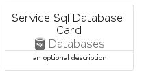

# ServiceSqlDatabase


```text
azure-11/Item/Databases/ServiceSqlDatabase
```

```text
include('azure-11/Item/Databases/ServiceSqlDatabase')
```


| Illustration | ServiceSqlDatabase | ServiceSqlDatabaseCard | ServiceSqlDatabaseGroup |
| :---: | :---: | :---: | :---: |
|  |  |  |  |


## ServiceSqlDatabase

### Load remotely
```plantuml
@startuml
' configures the library
!global $LIB_BASE_LOCATION="https://raw.githubusercontent.com/tmorin/plantuml-libs/master/distribution"

' loads the library's bootstrap
!include $LIB_BASE_LOCATION/bootstrap.puml

' loads the package bootstrap
include('azure-11/bootstrap')

' loads the Item which embeds the element ServiceSqlDatabase
include('azure-11/Item/Databases/ServiceSqlDatabase')

' renders the element
ServiceSqlDatabase('ServiceSqlDatabase', 'Service Sql Database', 'an optional tech label', 'an optional description')
@enduml
```

### Load locally
```plantuml
@startuml
' configures the library
!global $INCLUSION_MODE="local"
!global $LIB_BASE_LOCATION="../../.."

' loads the library's bootstrap
!include $LIB_BASE_LOCATION/bootstrap.puml

' loads the package bootstrap
include('azure-11/bootstrap')

' loads the Item which embeds the element ServiceSqlDatabase
include('azure-11/Item/Databases/ServiceSqlDatabase')

' renders the element
ServiceSqlDatabase('ServiceSqlDatabase', 'Service Sql Database', 'an optional tech label', 'an optional description')
@enduml
```

## ServiceSqlDatabaseCard

### Load remotely
```plantuml
@startuml
' configures the library
!global $LIB_BASE_LOCATION="https://raw.githubusercontent.com/tmorin/plantuml-libs/master/distribution"

' loads the library's bootstrap
!include $LIB_BASE_LOCATION/bootstrap.puml

' loads the package bootstrap
include('azure-11/bootstrap')

' loads the Item which embeds the element ServiceSqlDatabaseCard
include('azure-11/Item/Databases/ServiceSqlDatabase')

' renders the element
ServiceSqlDatabaseCard('ServiceSqlDatabaseCard', 'Service Sql Database Card', 'an optional description')
@enduml
```

### Load locally
```plantuml
@startuml
' configures the library
!global $INCLUSION_MODE="local"
!global $LIB_BASE_LOCATION="../../.."

' loads the library's bootstrap
!include $LIB_BASE_LOCATION/bootstrap.puml

' loads the package bootstrap
include('azure-11/bootstrap')

' loads the Item which embeds the element ServiceSqlDatabaseCard
include('azure-11/Item/Databases/ServiceSqlDatabase')

' renders the element
ServiceSqlDatabaseCard('ServiceSqlDatabaseCard', 'Service Sql Database Card', 'an optional description')
@enduml
```

## ServiceSqlDatabaseGroup

### Load remotely
```plantuml
@startuml
' configures the library
!global $LIB_BASE_LOCATION="https://raw.githubusercontent.com/tmorin/plantuml-libs/master/distribution"

' loads the library's bootstrap
!include $LIB_BASE_LOCATION/bootstrap.puml

' loads the package bootstrap
include('azure-11/bootstrap')

' loads the Item which embeds the element ServiceSqlDatabaseGroup
include('azure-11/Item/Databases/ServiceSqlDatabase')

' renders the element
ServiceSqlDatabaseGroup('ServiceSqlDatabaseGroup', 'Service Sql Database Group', 'an optional tech label') {
    note as note
        the content of the group
    end note
}
@enduml
```

### Load locally
```plantuml
@startuml
' configures the library
!global $INCLUSION_MODE="local"
!global $LIB_BASE_LOCATION="../../.."

' loads the library's bootstrap
!include $LIB_BASE_LOCATION/bootstrap.puml

' loads the package bootstrap
include('azure-11/bootstrap')

' loads the Item which embeds the element ServiceSqlDatabaseGroup
include('azure-11/Item/Databases/ServiceSqlDatabase')

' renders the element
ServiceSqlDatabaseGroup('ServiceSqlDatabaseGroup', 'Service Sql Database Group', 'an optional tech label') {
    note as note
        the content of the group
    end note
}
@enduml
```

