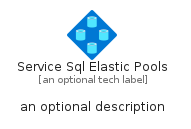
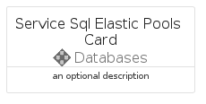
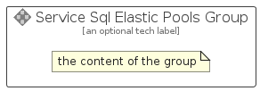

# ServiceSqlElasticPools


```text
azure-11/Item/Databases/ServiceSqlElasticPools
```

```text
include('azure-11/Item/Databases/ServiceSqlElasticPools')
```


| Illustration | ServiceSqlElasticPools | ServiceSqlElasticPoolsCard | ServiceSqlElasticPoolsGroup |
| :---: | :---: | :---: | :---: |
|  |  |  |  |


## Sprites
The item provides the following sriptes:

- `<$ServiceSqlElasticPoolsXs>`
- `<$ServiceSqlElasticPoolsSm>`
- `<$ServiceSqlElasticPoolsMd>`
- `<$ServiceSqlElasticPoolsLg>`


## ServiceSqlElasticPools

### Load remotely
```plantuml
@startuml
' configures the library
!global $LIB_BASE_LOCATION="https://raw.githubusercontent.com/tmorin/plantuml-libs/master/distribution"

' loads the library's bootstrap
!include $LIB_BASE_LOCATION/bootstrap.puml

' loads the package bootstrap
include('azure-11/bootstrap')

' loads the Item which embeds the element ServiceSqlElasticPools
include('azure-11/Item/Databases/ServiceSqlElasticPools')

' renders the element
ServiceSqlElasticPools('ServiceSqlElasticPools', 'Service Sql Elastic Pools', 'an optional tech label', 'an optional description')
@enduml
```

### Load locally
```plantuml
@startuml
' configures the library
!global $INCLUSION_MODE="local"
!global $LIB_BASE_LOCATION="../../.."

' loads the library's bootstrap
!include $LIB_BASE_LOCATION/bootstrap.puml

' loads the package bootstrap
include('azure-11/bootstrap')

' loads the Item which embeds the element ServiceSqlElasticPools
include('azure-11/Item/Databases/ServiceSqlElasticPools')

' renders the element
ServiceSqlElasticPools('ServiceSqlElasticPools', 'Service Sql Elastic Pools', 'an optional tech label', 'an optional description')
@enduml
```

## ServiceSqlElasticPoolsCard

### Load remotely
```plantuml
@startuml
' configures the library
!global $LIB_BASE_LOCATION="https://raw.githubusercontent.com/tmorin/plantuml-libs/master/distribution"

' loads the library's bootstrap
!include $LIB_BASE_LOCATION/bootstrap.puml

' loads the package bootstrap
include('azure-11/bootstrap')

' loads the Item which embeds the element ServiceSqlElasticPoolsCard
include('azure-11/Item/Databases/ServiceSqlElasticPools')

' renders the element
ServiceSqlElasticPoolsCard('ServiceSqlElasticPoolsCard', 'Service Sql Elastic Pools Card', 'an optional description')
@enduml
```

### Load locally
```plantuml
@startuml
' configures the library
!global $INCLUSION_MODE="local"
!global $LIB_BASE_LOCATION="../../.."

' loads the library's bootstrap
!include $LIB_BASE_LOCATION/bootstrap.puml

' loads the package bootstrap
include('azure-11/bootstrap')

' loads the Item which embeds the element ServiceSqlElasticPoolsCard
include('azure-11/Item/Databases/ServiceSqlElasticPools')

' renders the element
ServiceSqlElasticPoolsCard('ServiceSqlElasticPoolsCard', 'Service Sql Elastic Pools Card', 'an optional description')
@enduml
```

## ServiceSqlElasticPoolsGroup

### Load remotely
```plantuml
@startuml
' configures the library
!global $LIB_BASE_LOCATION="https://raw.githubusercontent.com/tmorin/plantuml-libs/master/distribution"

' loads the library's bootstrap
!include $LIB_BASE_LOCATION/bootstrap.puml

' loads the package bootstrap
include('azure-11/bootstrap')

' loads the Item which embeds the element ServiceSqlElasticPoolsGroup
include('azure-11/Item/Databases/ServiceSqlElasticPools')

' renders the element
ServiceSqlElasticPoolsGroup('ServiceSqlElasticPoolsGroup', 'Service Sql Elastic Pools Group', 'an optional tech label') {
    note as note
        the content of the group
    end note
}
@enduml
```

### Load locally
```plantuml
@startuml
' configures the library
!global $INCLUSION_MODE="local"
!global $LIB_BASE_LOCATION="../../.."

' loads the library's bootstrap
!include $LIB_BASE_LOCATION/bootstrap.puml

' loads the package bootstrap
include('azure-11/bootstrap')

' loads the Item which embeds the element ServiceSqlElasticPoolsGroup
include('azure-11/Item/Databases/ServiceSqlElasticPools')

' renders the element
ServiceSqlElasticPoolsGroup('ServiceSqlElasticPoolsGroup', 'Service Sql Elastic Pools Group', 'an optional tech label') {
    note as note
        the content of the group
    end note
}
@enduml
```

