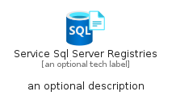
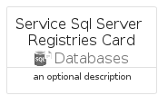
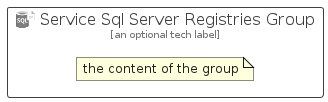

# ServiceSqlServerRegistries


```text
azure-11/Item/Databases/ServiceSqlServerRegistries
```

```text
include('azure-11/Item/Databases/ServiceSqlServerRegistries')
```


| Illustration | ServiceSqlServerRegistries | ServiceSqlServerRegistriesCard | ServiceSqlServerRegistriesGroup |
| :---: | :---: | :---: | :---: |
|  |  |  |  |


## Sprites
The item provides the following sriptes:

- `<$ServiceSqlServerRegistriesXs>`
- `<$ServiceSqlServerRegistriesSm>`
- `<$ServiceSqlServerRegistriesMd>`
- `<$ServiceSqlServerRegistriesLg>`


## ServiceSqlServerRegistries

### Load remotely
```plantuml
@startuml
' configures the library
!global $LIB_BASE_LOCATION="https://raw.githubusercontent.com/tmorin/plantuml-libs/master/distribution"

' loads the library's bootstrap
!include $LIB_BASE_LOCATION/bootstrap.puml

' loads the package bootstrap
include('azure-11/bootstrap')

' loads the Item which embeds the element ServiceSqlServerRegistries
include('azure-11/Item/Databases/ServiceSqlServerRegistries')

' renders the element
ServiceSqlServerRegistries('ServiceSqlServerRegistries', 'Service Sql Server Registries', 'an optional tech label', 'an optional description')
@enduml
```

### Load locally
```plantuml
@startuml
' configures the library
!global $INCLUSION_MODE="local"
!global $LIB_BASE_LOCATION="../../.."

' loads the library's bootstrap
!include $LIB_BASE_LOCATION/bootstrap.puml

' loads the package bootstrap
include('azure-11/bootstrap')

' loads the Item which embeds the element ServiceSqlServerRegistries
include('azure-11/Item/Databases/ServiceSqlServerRegistries')

' renders the element
ServiceSqlServerRegistries('ServiceSqlServerRegistries', 'Service Sql Server Registries', 'an optional tech label', 'an optional description')
@enduml
```

## ServiceSqlServerRegistriesCard

### Load remotely
```plantuml
@startuml
' configures the library
!global $LIB_BASE_LOCATION="https://raw.githubusercontent.com/tmorin/plantuml-libs/master/distribution"

' loads the library's bootstrap
!include $LIB_BASE_LOCATION/bootstrap.puml

' loads the package bootstrap
include('azure-11/bootstrap')

' loads the Item which embeds the element ServiceSqlServerRegistriesCard
include('azure-11/Item/Databases/ServiceSqlServerRegistries')

' renders the element
ServiceSqlServerRegistriesCard('ServiceSqlServerRegistriesCard', 'Service Sql Server Registries Card', 'an optional description')
@enduml
```

### Load locally
```plantuml
@startuml
' configures the library
!global $INCLUSION_MODE="local"
!global $LIB_BASE_LOCATION="../../.."

' loads the library's bootstrap
!include $LIB_BASE_LOCATION/bootstrap.puml

' loads the package bootstrap
include('azure-11/bootstrap')

' loads the Item which embeds the element ServiceSqlServerRegistriesCard
include('azure-11/Item/Databases/ServiceSqlServerRegistries')

' renders the element
ServiceSqlServerRegistriesCard('ServiceSqlServerRegistriesCard', 'Service Sql Server Registries Card', 'an optional description')
@enduml
```

## ServiceSqlServerRegistriesGroup

### Load remotely
```plantuml
@startuml
' configures the library
!global $LIB_BASE_LOCATION="https://raw.githubusercontent.com/tmorin/plantuml-libs/master/distribution"

' loads the library's bootstrap
!include $LIB_BASE_LOCATION/bootstrap.puml

' loads the package bootstrap
include('azure-11/bootstrap')

' loads the Item which embeds the element ServiceSqlServerRegistriesGroup
include('azure-11/Item/Databases/ServiceSqlServerRegistries')

' renders the element
ServiceSqlServerRegistriesGroup('ServiceSqlServerRegistriesGroup', 'Service Sql Server Registries Group', 'an optional tech label') {
    note as note
        the content of the group
    end note
}
@enduml
```

### Load locally
```plantuml
@startuml
' configures the library
!global $INCLUSION_MODE="local"
!global $LIB_BASE_LOCATION="../../.."

' loads the library's bootstrap
!include $LIB_BASE_LOCATION/bootstrap.puml

' loads the package bootstrap
include('azure-11/bootstrap')

' loads the Item which embeds the element ServiceSqlServerRegistriesGroup
include('azure-11/Item/Databases/ServiceSqlServerRegistries')

' renders the element
ServiceSqlServerRegistriesGroup('ServiceSqlServerRegistriesGroup', 'Service Sql Server Registries Group', 'an optional tech label') {
    note as note
        the content of the group
    end note
}
@enduml
```

