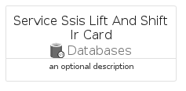
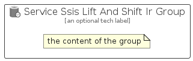

# ServiceSsisLiftAndShiftIr


```text
azure-11/Item/Databases/ServiceSsisLiftAndShiftIr
```

```text
include('azure-11/Item/Databases/ServiceSsisLiftAndShiftIr')
```


| Illustration | ServiceSsisLiftAndShiftIr | ServiceSsisLiftAndShiftIrCard | ServiceSsisLiftAndShiftIrGroup |
| :---: | :---: | :---: | :---: |
|  |  |  |  |


## ServiceSsisLiftAndShiftIr

### Load remotely
```plantuml
@startuml
' configures the library
!global $LIB_BASE_LOCATION="https://raw.githubusercontent.com/tmorin/plantuml-libs/master/distribution"

' loads the library's bootstrap
!include $LIB_BASE_LOCATION/bootstrap.puml

' loads the package bootstrap
include('azure-11/bootstrap')

' loads the Item which embeds the element ServiceSsisLiftAndShiftIr
include('azure-11/Item/Databases/ServiceSsisLiftAndShiftIr')

' renders the element
ServiceSsisLiftAndShiftIr('ServiceSsisLiftAndShiftIr', 'Service Ssis Lift And Shift Ir', 'an optional tech label', 'an optional description')
@enduml
```

### Load locally
```plantuml
@startuml
' configures the library
!global $INCLUSION_MODE="local"
!global $LIB_BASE_LOCATION="../../.."

' loads the library's bootstrap
!include $LIB_BASE_LOCATION/bootstrap.puml

' loads the package bootstrap
include('azure-11/bootstrap')

' loads the Item which embeds the element ServiceSsisLiftAndShiftIr
include('azure-11/Item/Databases/ServiceSsisLiftAndShiftIr')

' renders the element
ServiceSsisLiftAndShiftIr('ServiceSsisLiftAndShiftIr', 'Service Ssis Lift And Shift Ir', 'an optional tech label', 'an optional description')
@enduml
```

## ServiceSsisLiftAndShiftIrCard

### Load remotely
```plantuml
@startuml
' configures the library
!global $LIB_BASE_LOCATION="https://raw.githubusercontent.com/tmorin/plantuml-libs/master/distribution"

' loads the library's bootstrap
!include $LIB_BASE_LOCATION/bootstrap.puml

' loads the package bootstrap
include('azure-11/bootstrap')

' loads the Item which embeds the element ServiceSsisLiftAndShiftIrCard
include('azure-11/Item/Databases/ServiceSsisLiftAndShiftIr')

' renders the element
ServiceSsisLiftAndShiftIrCard('ServiceSsisLiftAndShiftIrCard', 'Service Ssis Lift And Shift Ir Card', 'an optional description')
@enduml
```

### Load locally
```plantuml
@startuml
' configures the library
!global $INCLUSION_MODE="local"
!global $LIB_BASE_LOCATION="../../.."

' loads the library's bootstrap
!include $LIB_BASE_LOCATION/bootstrap.puml

' loads the package bootstrap
include('azure-11/bootstrap')

' loads the Item which embeds the element ServiceSsisLiftAndShiftIrCard
include('azure-11/Item/Databases/ServiceSsisLiftAndShiftIr')

' renders the element
ServiceSsisLiftAndShiftIrCard('ServiceSsisLiftAndShiftIrCard', 'Service Ssis Lift And Shift Ir Card', 'an optional description')
@enduml
```

## ServiceSsisLiftAndShiftIrGroup

### Load remotely
```plantuml
@startuml
' configures the library
!global $LIB_BASE_LOCATION="https://raw.githubusercontent.com/tmorin/plantuml-libs/master/distribution"

' loads the library's bootstrap
!include $LIB_BASE_LOCATION/bootstrap.puml

' loads the package bootstrap
include('azure-11/bootstrap')

' loads the Item which embeds the element ServiceSsisLiftAndShiftIrGroup
include('azure-11/Item/Databases/ServiceSsisLiftAndShiftIr')

' renders the element
ServiceSsisLiftAndShiftIrGroup('ServiceSsisLiftAndShiftIrGroup', 'Service Ssis Lift And Shift Ir Group', 'an optional tech label') {
    note as note
        the content of the group
    end note
}
@enduml
```

### Load locally
```plantuml
@startuml
' configures the library
!global $INCLUSION_MODE="local"
!global $LIB_BASE_LOCATION="../../.."

' loads the library's bootstrap
!include $LIB_BASE_LOCATION/bootstrap.puml

' loads the package bootstrap
include('azure-11/bootstrap')

' loads the Item which embeds the element ServiceSsisLiftAndShiftIrGroup
include('azure-11/Item/Databases/ServiceSsisLiftAndShiftIr')

' renders the element
ServiceSsisLiftAndShiftIrGroup('ServiceSsisLiftAndShiftIrGroup', 'Service Ssis Lift And Shift Ir Group', 'an optional tech label') {
    note as note
        the content of the group
    end note
}
@enduml
```

