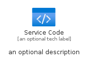

# ServiceCode


```text
azure-11/Item/General/ServiceCode
```

```text
include('azure-11/Item/General/ServiceCode')
```


| Illustration | ServiceCode | ServiceCodeCard | ServiceCodeGroup |
| :---: | :---: | :---: | :---: |
|  |  |  |  |


## ServiceCode

### Load remotely
```plantuml
@startuml
' configures the library
!global $LIB_BASE_LOCATION="https://raw.githubusercontent.com/tmorin/plantuml-libs/master/distribution"

' loads the library's bootstrap
!include $LIB_BASE_LOCATION/bootstrap.puml

' loads the package bootstrap
include('azure-11/bootstrap')

' loads the Item which embeds the element ServiceCode
include('azure-11/Item/General/ServiceCode')

' renders the element
ServiceCode('ServiceCode', 'Service Code', 'an optional tech label', 'an optional description')
@enduml
```

### Load locally
```plantuml
@startuml
' configures the library
!global $INCLUSION_MODE="local"
!global $LIB_BASE_LOCATION="../../.."

' loads the library's bootstrap
!include $LIB_BASE_LOCATION/bootstrap.puml

' loads the package bootstrap
include('azure-11/bootstrap')

' loads the Item which embeds the element ServiceCode
include('azure-11/Item/General/ServiceCode')

' renders the element
ServiceCode('ServiceCode', 'Service Code', 'an optional tech label', 'an optional description')
@enduml
```

## ServiceCodeCard

### Load remotely
```plantuml
@startuml
' configures the library
!global $LIB_BASE_LOCATION="https://raw.githubusercontent.com/tmorin/plantuml-libs/master/distribution"

' loads the library's bootstrap
!include $LIB_BASE_LOCATION/bootstrap.puml

' loads the package bootstrap
include('azure-11/bootstrap')

' loads the Item which embeds the element ServiceCodeCard
include('azure-11/Item/General/ServiceCode')

' renders the element
ServiceCodeCard('ServiceCodeCard', 'Service Code Card', 'an optional description')
@enduml
```

### Load locally
```plantuml
@startuml
' configures the library
!global $INCLUSION_MODE="local"
!global $LIB_BASE_LOCATION="../../.."

' loads the library's bootstrap
!include $LIB_BASE_LOCATION/bootstrap.puml

' loads the package bootstrap
include('azure-11/bootstrap')

' loads the Item which embeds the element ServiceCodeCard
include('azure-11/Item/General/ServiceCode')

' renders the element
ServiceCodeCard('ServiceCodeCard', 'Service Code Card', 'an optional description')
@enduml
```

## ServiceCodeGroup

### Load remotely
```plantuml
@startuml
' configures the library
!global $LIB_BASE_LOCATION="https://raw.githubusercontent.com/tmorin/plantuml-libs/master/distribution"

' loads the library's bootstrap
!include $LIB_BASE_LOCATION/bootstrap.puml

' loads the package bootstrap
include('azure-11/bootstrap')

' loads the Item which embeds the element ServiceCodeGroup
include('azure-11/Item/General/ServiceCode')

' renders the element
ServiceCodeGroup('ServiceCodeGroup', 'Service Code Group', 'an optional tech label') {
    note as note
        the content of the group
    end note
}
@enduml
```

### Load locally
```plantuml
@startuml
' configures the library
!global $INCLUSION_MODE="local"
!global $LIB_BASE_LOCATION="../../.."

' loads the library's bootstrap
!include $LIB_BASE_LOCATION/bootstrap.puml

' loads the package bootstrap
include('azure-11/bootstrap')

' loads the Item which embeds the element ServiceCodeGroup
include('azure-11/Item/General/ServiceCode')

' renders the element
ServiceCodeGroup('ServiceCodeGroup', 'Service Code Group', 'an optional tech label') {
    note as note
        the content of the group
    end note
}
@enduml
```

