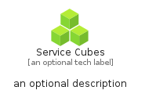

# ServiceCubes


```text
azure-11/Item/General/ServiceCubes
```

```text
include('azure-11/Item/General/ServiceCubes')
```


| Illustration | ServiceCubes | ServiceCubesCard | ServiceCubesGroup |
| :---: | :---: | :---: | :---: |
|  |  |  |  |


## ServiceCubes

### Load remotely
```plantuml
@startuml
' configures the library
!global $LIB_BASE_LOCATION="https://raw.githubusercontent.com/tmorin/plantuml-libs/master/distribution"

' loads the library's bootstrap
!include $LIB_BASE_LOCATION/bootstrap.puml

' loads the package bootstrap
include('azure-11/bootstrap')

' loads the Item which embeds the element ServiceCubes
include('azure-11/Item/General/ServiceCubes')

' renders the element
ServiceCubes('ServiceCubes', 'Service Cubes', 'an optional tech label', 'an optional description')
@enduml
```

### Load locally
```plantuml
@startuml
' configures the library
!global $INCLUSION_MODE="local"
!global $LIB_BASE_LOCATION="../../.."

' loads the library's bootstrap
!include $LIB_BASE_LOCATION/bootstrap.puml

' loads the package bootstrap
include('azure-11/bootstrap')

' loads the Item which embeds the element ServiceCubes
include('azure-11/Item/General/ServiceCubes')

' renders the element
ServiceCubes('ServiceCubes', 'Service Cubes', 'an optional tech label', 'an optional description')
@enduml
```

## ServiceCubesCard

### Load remotely
```plantuml
@startuml
' configures the library
!global $LIB_BASE_LOCATION="https://raw.githubusercontent.com/tmorin/plantuml-libs/master/distribution"

' loads the library's bootstrap
!include $LIB_BASE_LOCATION/bootstrap.puml

' loads the package bootstrap
include('azure-11/bootstrap')

' loads the Item which embeds the element ServiceCubesCard
include('azure-11/Item/General/ServiceCubes')

' renders the element
ServiceCubesCard('ServiceCubesCard', 'Service Cubes Card', 'an optional description')
@enduml
```

### Load locally
```plantuml
@startuml
' configures the library
!global $INCLUSION_MODE="local"
!global $LIB_BASE_LOCATION="../../.."

' loads the library's bootstrap
!include $LIB_BASE_LOCATION/bootstrap.puml

' loads the package bootstrap
include('azure-11/bootstrap')

' loads the Item which embeds the element ServiceCubesCard
include('azure-11/Item/General/ServiceCubes')

' renders the element
ServiceCubesCard('ServiceCubesCard', 'Service Cubes Card', 'an optional description')
@enduml
```

## ServiceCubesGroup

### Load remotely
```plantuml
@startuml
' configures the library
!global $LIB_BASE_LOCATION="https://raw.githubusercontent.com/tmorin/plantuml-libs/master/distribution"

' loads the library's bootstrap
!include $LIB_BASE_LOCATION/bootstrap.puml

' loads the package bootstrap
include('azure-11/bootstrap')

' loads the Item which embeds the element ServiceCubesGroup
include('azure-11/Item/General/ServiceCubes')

' renders the element
ServiceCubesGroup('ServiceCubesGroup', 'Service Cubes Group', 'an optional tech label') {
    note as note
        the content of the group
    end note
}
@enduml
```

### Load locally
```plantuml
@startuml
' configures the library
!global $INCLUSION_MODE="local"
!global $LIB_BASE_LOCATION="../../.."

' loads the library's bootstrap
!include $LIB_BASE_LOCATION/bootstrap.puml

' loads the package bootstrap
include('azure-11/bootstrap')

' loads the Item which embeds the element ServiceCubesGroup
include('azure-11/Item/General/ServiceCubes')

' renders the element
ServiceCubesGroup('ServiceCubesGroup', 'Service Cubes Group', 'an optional tech label') {
    note as note
        the content of the group
    end note
}
@enduml
```

