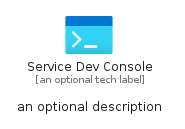
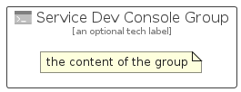

# ServiceDevConsole


```text
azure-11/Item/General/ServiceDevConsole
```

```text
include('azure-11/Item/General/ServiceDevConsole')
```


| Illustration | ServiceDevConsole | ServiceDevConsoleCard | ServiceDevConsoleGroup |
| :---: | :---: | :---: | :---: |
|  |  |  |  |


## Sprites
The item provides the following sriptes:

- `<$ServiceDevConsoleXs>`
- `<$ServiceDevConsoleSm>`
- `<$ServiceDevConsoleMd>`
- `<$ServiceDevConsoleLg>`


## ServiceDevConsole

### Load remotely
```plantuml
@startuml
' configures the library
!global $LIB_BASE_LOCATION="https://raw.githubusercontent.com/tmorin/plantuml-libs/master/distribution"

' loads the library's bootstrap
!include $LIB_BASE_LOCATION/bootstrap.puml

' loads the package bootstrap
include('azure-11/bootstrap')

' loads the Item which embeds the element ServiceDevConsole
include('azure-11/Item/General/ServiceDevConsole')

' renders the element
ServiceDevConsole('ServiceDevConsole', 'Service Dev Console', 'an optional tech label', 'an optional description')
@enduml
```

### Load locally
```plantuml
@startuml
' configures the library
!global $INCLUSION_MODE="local"
!global $LIB_BASE_LOCATION="../../.."

' loads the library's bootstrap
!include $LIB_BASE_LOCATION/bootstrap.puml

' loads the package bootstrap
include('azure-11/bootstrap')

' loads the Item which embeds the element ServiceDevConsole
include('azure-11/Item/General/ServiceDevConsole')

' renders the element
ServiceDevConsole('ServiceDevConsole', 'Service Dev Console', 'an optional tech label', 'an optional description')
@enduml
```

## ServiceDevConsoleCard

### Load remotely
```plantuml
@startuml
' configures the library
!global $LIB_BASE_LOCATION="https://raw.githubusercontent.com/tmorin/plantuml-libs/master/distribution"

' loads the library's bootstrap
!include $LIB_BASE_LOCATION/bootstrap.puml

' loads the package bootstrap
include('azure-11/bootstrap')

' loads the Item which embeds the element ServiceDevConsoleCard
include('azure-11/Item/General/ServiceDevConsole')

' renders the element
ServiceDevConsoleCard('ServiceDevConsoleCard', 'Service Dev Console Card', 'an optional description')
@enduml
```

### Load locally
```plantuml
@startuml
' configures the library
!global $INCLUSION_MODE="local"
!global $LIB_BASE_LOCATION="../../.."

' loads the library's bootstrap
!include $LIB_BASE_LOCATION/bootstrap.puml

' loads the package bootstrap
include('azure-11/bootstrap')

' loads the Item which embeds the element ServiceDevConsoleCard
include('azure-11/Item/General/ServiceDevConsole')

' renders the element
ServiceDevConsoleCard('ServiceDevConsoleCard', 'Service Dev Console Card', 'an optional description')
@enduml
```

## ServiceDevConsoleGroup

### Load remotely
```plantuml
@startuml
' configures the library
!global $LIB_BASE_LOCATION="https://raw.githubusercontent.com/tmorin/plantuml-libs/master/distribution"

' loads the library's bootstrap
!include $LIB_BASE_LOCATION/bootstrap.puml

' loads the package bootstrap
include('azure-11/bootstrap')

' loads the Item which embeds the element ServiceDevConsoleGroup
include('azure-11/Item/General/ServiceDevConsole')

' renders the element
ServiceDevConsoleGroup('ServiceDevConsoleGroup', 'Service Dev Console Group', 'an optional tech label') {
    note as note
        the content of the group
    end note
}
@enduml
```

### Load locally
```plantuml
@startuml
' configures the library
!global $INCLUSION_MODE="local"
!global $LIB_BASE_LOCATION="../../.."

' loads the library's bootstrap
!include $LIB_BASE_LOCATION/bootstrap.puml

' loads the package bootstrap
include('azure-11/bootstrap')

' loads the Item which embeds the element ServiceDevConsoleGroup
include('azure-11/Item/General/ServiceDevConsole')

' renders the element
ServiceDevConsoleGroup('ServiceDevConsoleGroup', 'Service Dev Console Group', 'an optional tech label') {
    note as note
        the content of the group
    end note
}
@enduml
```

