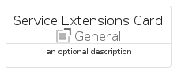
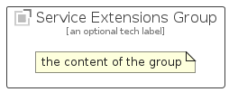

# ServiceExtensions


```text
azure-11/Item/General/ServiceExtensions
```

```text
include('azure-11/Item/General/ServiceExtensions')
```


| Illustration | ServiceExtensions | ServiceExtensionsCard | ServiceExtensionsGroup |
| :---: | :---: | :---: | :---: |
|  |  |  |  |


## ServiceExtensions

### Load remotely
```plantuml
@startuml
' configures the library
!global $LIB_BASE_LOCATION="https://raw.githubusercontent.com/tmorin/plantuml-libs/master/distribution"

' loads the library's bootstrap
!include $LIB_BASE_LOCATION/bootstrap.puml

' loads the package bootstrap
include('azure-11/bootstrap')

' loads the Item which embeds the element ServiceExtensions
include('azure-11/Item/General/ServiceExtensions')

' renders the element
ServiceExtensions('ServiceExtensions', 'Service Extensions', 'an optional tech label', 'an optional description')
@enduml
```

### Load locally
```plantuml
@startuml
' configures the library
!global $INCLUSION_MODE="local"
!global $LIB_BASE_LOCATION="../../.."

' loads the library's bootstrap
!include $LIB_BASE_LOCATION/bootstrap.puml

' loads the package bootstrap
include('azure-11/bootstrap')

' loads the Item which embeds the element ServiceExtensions
include('azure-11/Item/General/ServiceExtensions')

' renders the element
ServiceExtensions('ServiceExtensions', 'Service Extensions', 'an optional tech label', 'an optional description')
@enduml
```

## ServiceExtensionsCard

### Load remotely
```plantuml
@startuml
' configures the library
!global $LIB_BASE_LOCATION="https://raw.githubusercontent.com/tmorin/plantuml-libs/master/distribution"

' loads the library's bootstrap
!include $LIB_BASE_LOCATION/bootstrap.puml

' loads the package bootstrap
include('azure-11/bootstrap')

' loads the Item which embeds the element ServiceExtensionsCard
include('azure-11/Item/General/ServiceExtensions')

' renders the element
ServiceExtensionsCard('ServiceExtensionsCard', 'Service Extensions Card', 'an optional description')
@enduml
```

### Load locally
```plantuml
@startuml
' configures the library
!global $INCLUSION_MODE="local"
!global $LIB_BASE_LOCATION="../../.."

' loads the library's bootstrap
!include $LIB_BASE_LOCATION/bootstrap.puml

' loads the package bootstrap
include('azure-11/bootstrap')

' loads the Item which embeds the element ServiceExtensionsCard
include('azure-11/Item/General/ServiceExtensions')

' renders the element
ServiceExtensionsCard('ServiceExtensionsCard', 'Service Extensions Card', 'an optional description')
@enduml
```

## ServiceExtensionsGroup

### Load remotely
```plantuml
@startuml
' configures the library
!global $LIB_BASE_LOCATION="https://raw.githubusercontent.com/tmorin/plantuml-libs/master/distribution"

' loads the library's bootstrap
!include $LIB_BASE_LOCATION/bootstrap.puml

' loads the package bootstrap
include('azure-11/bootstrap')

' loads the Item which embeds the element ServiceExtensionsGroup
include('azure-11/Item/General/ServiceExtensions')

' renders the element
ServiceExtensionsGroup('ServiceExtensionsGroup', 'Service Extensions Group', 'an optional tech label') {
    note as note
        the content of the group
    end note
}
@enduml
```

### Load locally
```plantuml
@startuml
' configures the library
!global $INCLUSION_MODE="local"
!global $LIB_BASE_LOCATION="../../.."

' loads the library's bootstrap
!include $LIB_BASE_LOCATION/bootstrap.puml

' loads the package bootstrap
include('azure-11/bootstrap')

' loads the Item which embeds the element ServiceExtensionsGroup
include('azure-11/Item/General/ServiceExtensions')

' renders the element
ServiceExtensionsGroup('ServiceExtensionsGroup', 'Service Extensions Group', 'an optional tech label') {
    note as note
        the content of the group
    end note
}
@enduml
```

