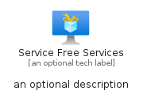

# ServiceFreeServices


```text
azure-11/Item/General/ServiceFreeServices
```

```text
include('azure-11/Item/General/ServiceFreeServices')
```


| Illustration | ServiceFreeServices | ServiceFreeServicesCard | ServiceFreeServicesGroup |
| :---: | :---: | :---: | :---: |
|  |  |  |  |


## ServiceFreeServices

### Load remotely
```plantuml
@startuml
' configures the library
!global $LIB_BASE_LOCATION="https://raw.githubusercontent.com/tmorin/plantuml-libs/master/distribution"

' loads the library's bootstrap
!include $LIB_BASE_LOCATION/bootstrap.puml

' loads the package bootstrap
include('azure-11/bootstrap')

' loads the Item which embeds the element ServiceFreeServices
include('azure-11/Item/General/ServiceFreeServices')

' renders the element
ServiceFreeServices('ServiceFreeServices', 'Service Free Services', 'an optional tech label', 'an optional description')
@enduml
```

### Load locally
```plantuml
@startuml
' configures the library
!global $INCLUSION_MODE="local"
!global $LIB_BASE_LOCATION="../../.."

' loads the library's bootstrap
!include $LIB_BASE_LOCATION/bootstrap.puml

' loads the package bootstrap
include('azure-11/bootstrap')

' loads the Item which embeds the element ServiceFreeServices
include('azure-11/Item/General/ServiceFreeServices')

' renders the element
ServiceFreeServices('ServiceFreeServices', 'Service Free Services', 'an optional tech label', 'an optional description')
@enduml
```

## ServiceFreeServicesCard

### Load remotely
```plantuml
@startuml
' configures the library
!global $LIB_BASE_LOCATION="https://raw.githubusercontent.com/tmorin/plantuml-libs/master/distribution"

' loads the library's bootstrap
!include $LIB_BASE_LOCATION/bootstrap.puml

' loads the package bootstrap
include('azure-11/bootstrap')

' loads the Item which embeds the element ServiceFreeServicesCard
include('azure-11/Item/General/ServiceFreeServices')

' renders the element
ServiceFreeServicesCard('ServiceFreeServicesCard', 'Service Free Services Card', 'an optional description')
@enduml
```

### Load locally
```plantuml
@startuml
' configures the library
!global $INCLUSION_MODE="local"
!global $LIB_BASE_LOCATION="../../.."

' loads the library's bootstrap
!include $LIB_BASE_LOCATION/bootstrap.puml

' loads the package bootstrap
include('azure-11/bootstrap')

' loads the Item which embeds the element ServiceFreeServicesCard
include('azure-11/Item/General/ServiceFreeServices')

' renders the element
ServiceFreeServicesCard('ServiceFreeServicesCard', 'Service Free Services Card', 'an optional description')
@enduml
```

## ServiceFreeServicesGroup

### Load remotely
```plantuml
@startuml
' configures the library
!global $LIB_BASE_LOCATION="https://raw.githubusercontent.com/tmorin/plantuml-libs/master/distribution"

' loads the library's bootstrap
!include $LIB_BASE_LOCATION/bootstrap.puml

' loads the package bootstrap
include('azure-11/bootstrap')

' loads the Item which embeds the element ServiceFreeServicesGroup
include('azure-11/Item/General/ServiceFreeServices')

' renders the element
ServiceFreeServicesGroup('ServiceFreeServicesGroup', 'Service Free Services Group', 'an optional tech label') {
    note as note
        the content of the group
    end note
}
@enduml
```

### Load locally
```plantuml
@startuml
' configures the library
!global $INCLUSION_MODE="local"
!global $LIB_BASE_LOCATION="../../.."

' loads the library's bootstrap
!include $LIB_BASE_LOCATION/bootstrap.puml

' loads the package bootstrap
include('azure-11/bootstrap')

' loads the Item which embeds the element ServiceFreeServicesGroup
include('azure-11/Item/General/ServiceFreeServices')

' renders the element
ServiceFreeServicesGroup('ServiceFreeServicesGroup', 'Service Free Services Group', 'an optional tech label') {
    note as note
        the content of the group
    end note
}
@enduml
```

