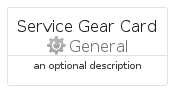
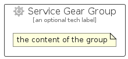

# ServiceGear


```text
azure-11/Item/General/ServiceGear
```

```text
include('azure-11/Item/General/ServiceGear')
```


| Illustration | ServiceGear | ServiceGearCard | ServiceGearGroup |
| :---: | :---: | :---: | :---: |
|  |  |  |  |


## Sprites
The item provides the following sriptes:

- `<$ServiceGearXs>`
- `<$ServiceGearSm>`
- `<$ServiceGearMd>`
- `<$ServiceGearLg>`


## ServiceGear

### Load remotely
```plantuml
@startuml
' configures the library
!global $LIB_BASE_LOCATION="https://raw.githubusercontent.com/tmorin/plantuml-libs/master/distribution"

' loads the library's bootstrap
!include $LIB_BASE_LOCATION/bootstrap.puml

' loads the package bootstrap
include('azure-11/bootstrap')

' loads the Item which embeds the element ServiceGear
include('azure-11/Item/General/ServiceGear')

' renders the element
ServiceGear('ServiceGear', 'Service Gear', 'an optional tech label', 'an optional description')
@enduml
```

### Load locally
```plantuml
@startuml
' configures the library
!global $INCLUSION_MODE="local"
!global $LIB_BASE_LOCATION="../../.."

' loads the library's bootstrap
!include $LIB_BASE_LOCATION/bootstrap.puml

' loads the package bootstrap
include('azure-11/bootstrap')

' loads the Item which embeds the element ServiceGear
include('azure-11/Item/General/ServiceGear')

' renders the element
ServiceGear('ServiceGear', 'Service Gear', 'an optional tech label', 'an optional description')
@enduml
```

## ServiceGearCard

### Load remotely
```plantuml
@startuml
' configures the library
!global $LIB_BASE_LOCATION="https://raw.githubusercontent.com/tmorin/plantuml-libs/master/distribution"

' loads the library's bootstrap
!include $LIB_BASE_LOCATION/bootstrap.puml

' loads the package bootstrap
include('azure-11/bootstrap')

' loads the Item which embeds the element ServiceGearCard
include('azure-11/Item/General/ServiceGear')

' renders the element
ServiceGearCard('ServiceGearCard', 'Service Gear Card', 'an optional description')
@enduml
```

### Load locally
```plantuml
@startuml
' configures the library
!global $INCLUSION_MODE="local"
!global $LIB_BASE_LOCATION="../../.."

' loads the library's bootstrap
!include $LIB_BASE_LOCATION/bootstrap.puml

' loads the package bootstrap
include('azure-11/bootstrap')

' loads the Item which embeds the element ServiceGearCard
include('azure-11/Item/General/ServiceGear')

' renders the element
ServiceGearCard('ServiceGearCard', 'Service Gear Card', 'an optional description')
@enduml
```

## ServiceGearGroup

### Load remotely
```plantuml
@startuml
' configures the library
!global $LIB_BASE_LOCATION="https://raw.githubusercontent.com/tmorin/plantuml-libs/master/distribution"

' loads the library's bootstrap
!include $LIB_BASE_LOCATION/bootstrap.puml

' loads the package bootstrap
include('azure-11/bootstrap')

' loads the Item which embeds the element ServiceGearGroup
include('azure-11/Item/General/ServiceGear')

' renders the element
ServiceGearGroup('ServiceGearGroup', 'Service Gear Group', 'an optional tech label') {
    note as note
        the content of the group
    end note
}
@enduml
```

### Load locally
```plantuml
@startuml
' configures the library
!global $INCLUSION_MODE="local"
!global $LIB_BASE_LOCATION="../../.."

' loads the library's bootstrap
!include $LIB_BASE_LOCATION/bootstrap.puml

' loads the package bootstrap
include('azure-11/bootstrap')

' loads the Item which embeds the element ServiceGearGroup
include('azure-11/Item/General/ServiceGear')

' renders the element
ServiceGearGroup('ServiceGearGroup', 'Service Gear Group', 'an optional tech label') {
    note as note
        the content of the group
    end note
}
@enduml
```

