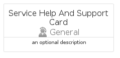
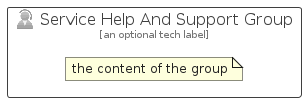

# ServiceHelpAndSupport


```text
azure-11/Item/General/ServiceHelpAndSupport
```

```text
include('azure-11/Item/General/ServiceHelpAndSupport')
```


| Illustration | ServiceHelpAndSupport | ServiceHelpAndSupportCard | ServiceHelpAndSupportGroup |
| :---: | :---: | :---: | :---: |
|  |  |  |  |


## Sprites
The item provides the following sriptes:

- `<$ServiceHelpAndSupportXs>`
- `<$ServiceHelpAndSupportSm>`
- `<$ServiceHelpAndSupportMd>`
- `<$ServiceHelpAndSupportLg>`


## ServiceHelpAndSupport

### Load remotely
```plantuml
@startuml
' configures the library
!global $LIB_BASE_LOCATION="https://raw.githubusercontent.com/tmorin/plantuml-libs/master/distribution"

' loads the library's bootstrap
!include $LIB_BASE_LOCATION/bootstrap.puml

' loads the package bootstrap
include('azure-11/bootstrap')

' loads the Item which embeds the element ServiceHelpAndSupport
include('azure-11/Item/General/ServiceHelpAndSupport')

' renders the element
ServiceHelpAndSupport('ServiceHelpAndSupport', 'Service Help And Support', 'an optional tech label', 'an optional description')
@enduml
```

### Load locally
```plantuml
@startuml
' configures the library
!global $INCLUSION_MODE="local"
!global $LIB_BASE_LOCATION="../../.."

' loads the library's bootstrap
!include $LIB_BASE_LOCATION/bootstrap.puml

' loads the package bootstrap
include('azure-11/bootstrap')

' loads the Item which embeds the element ServiceHelpAndSupport
include('azure-11/Item/General/ServiceHelpAndSupport')

' renders the element
ServiceHelpAndSupport('ServiceHelpAndSupport', 'Service Help And Support', 'an optional tech label', 'an optional description')
@enduml
```

## ServiceHelpAndSupportCard

### Load remotely
```plantuml
@startuml
' configures the library
!global $LIB_BASE_LOCATION="https://raw.githubusercontent.com/tmorin/plantuml-libs/master/distribution"

' loads the library's bootstrap
!include $LIB_BASE_LOCATION/bootstrap.puml

' loads the package bootstrap
include('azure-11/bootstrap')

' loads the Item which embeds the element ServiceHelpAndSupportCard
include('azure-11/Item/General/ServiceHelpAndSupport')

' renders the element
ServiceHelpAndSupportCard('ServiceHelpAndSupportCard', 'Service Help And Support Card', 'an optional description')
@enduml
```

### Load locally
```plantuml
@startuml
' configures the library
!global $INCLUSION_MODE="local"
!global $LIB_BASE_LOCATION="../../.."

' loads the library's bootstrap
!include $LIB_BASE_LOCATION/bootstrap.puml

' loads the package bootstrap
include('azure-11/bootstrap')

' loads the Item which embeds the element ServiceHelpAndSupportCard
include('azure-11/Item/General/ServiceHelpAndSupport')

' renders the element
ServiceHelpAndSupportCard('ServiceHelpAndSupportCard', 'Service Help And Support Card', 'an optional description')
@enduml
```

## ServiceHelpAndSupportGroup

### Load remotely
```plantuml
@startuml
' configures the library
!global $LIB_BASE_LOCATION="https://raw.githubusercontent.com/tmorin/plantuml-libs/master/distribution"

' loads the library's bootstrap
!include $LIB_BASE_LOCATION/bootstrap.puml

' loads the package bootstrap
include('azure-11/bootstrap')

' loads the Item which embeds the element ServiceHelpAndSupportGroup
include('azure-11/Item/General/ServiceHelpAndSupport')

' renders the element
ServiceHelpAndSupportGroup('ServiceHelpAndSupportGroup', 'Service Help And Support Group', 'an optional tech label') {
    note as note
        the content of the group
    end note
}
@enduml
```

### Load locally
```plantuml
@startuml
' configures the library
!global $INCLUSION_MODE="local"
!global $LIB_BASE_LOCATION="../../.."

' loads the library's bootstrap
!include $LIB_BASE_LOCATION/bootstrap.puml

' loads the package bootstrap
include('azure-11/bootstrap')

' loads the Item which embeds the element ServiceHelpAndSupportGroup
include('azure-11/Item/General/ServiceHelpAndSupport')

' renders the element
ServiceHelpAndSupportGroup('ServiceHelpAndSupportGroup', 'Service Help And Support Group', 'an optional tech label') {
    note as note
        the content of the group
    end note
}
@enduml
```

