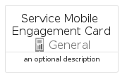

# ServiceMobileEngagement


```text
azure-11/Item/General/ServiceMobileEngagement
```

```text
include('azure-11/Item/General/ServiceMobileEngagement')
```


| Illustration | ServiceMobileEngagement | ServiceMobileEngagementCard | ServiceMobileEngagementGroup |
| :---: | :---: | :---: | :---: |
|  |  |  |  |


## ServiceMobileEngagement

### Load remotely
```plantuml
@startuml
' configures the library
!global $LIB_BASE_LOCATION="https://raw.githubusercontent.com/tmorin/plantuml-libs/master/distribution"

' loads the library's bootstrap
!include $LIB_BASE_LOCATION/bootstrap.puml

' loads the package bootstrap
include('azure-11/bootstrap')

' loads the Item which embeds the element ServiceMobileEngagement
include('azure-11/Item/General/ServiceMobileEngagement')

' renders the element
ServiceMobileEngagement('ServiceMobileEngagement', 'Service Mobile Engagement', 'an optional tech label', 'an optional description')
@enduml
```

### Load locally
```plantuml
@startuml
' configures the library
!global $INCLUSION_MODE="local"
!global $LIB_BASE_LOCATION="../../.."

' loads the library's bootstrap
!include $LIB_BASE_LOCATION/bootstrap.puml

' loads the package bootstrap
include('azure-11/bootstrap')

' loads the Item which embeds the element ServiceMobileEngagement
include('azure-11/Item/General/ServiceMobileEngagement')

' renders the element
ServiceMobileEngagement('ServiceMobileEngagement', 'Service Mobile Engagement', 'an optional tech label', 'an optional description')
@enduml
```

## ServiceMobileEngagementCard

### Load remotely
```plantuml
@startuml
' configures the library
!global $LIB_BASE_LOCATION="https://raw.githubusercontent.com/tmorin/plantuml-libs/master/distribution"

' loads the library's bootstrap
!include $LIB_BASE_LOCATION/bootstrap.puml

' loads the package bootstrap
include('azure-11/bootstrap')

' loads the Item which embeds the element ServiceMobileEngagementCard
include('azure-11/Item/General/ServiceMobileEngagement')

' renders the element
ServiceMobileEngagementCard('ServiceMobileEngagementCard', 'Service Mobile Engagement Card', 'an optional description')
@enduml
```

### Load locally
```plantuml
@startuml
' configures the library
!global $INCLUSION_MODE="local"
!global $LIB_BASE_LOCATION="../../.."

' loads the library's bootstrap
!include $LIB_BASE_LOCATION/bootstrap.puml

' loads the package bootstrap
include('azure-11/bootstrap')

' loads the Item which embeds the element ServiceMobileEngagementCard
include('azure-11/Item/General/ServiceMobileEngagement')

' renders the element
ServiceMobileEngagementCard('ServiceMobileEngagementCard', 'Service Mobile Engagement Card', 'an optional description')
@enduml
```

## ServiceMobileEngagementGroup

### Load remotely
```plantuml
@startuml
' configures the library
!global $LIB_BASE_LOCATION="https://raw.githubusercontent.com/tmorin/plantuml-libs/master/distribution"

' loads the library's bootstrap
!include $LIB_BASE_LOCATION/bootstrap.puml

' loads the package bootstrap
include('azure-11/bootstrap')

' loads the Item which embeds the element ServiceMobileEngagementGroup
include('azure-11/Item/General/ServiceMobileEngagement')

' renders the element
ServiceMobileEngagementGroup('ServiceMobileEngagementGroup', 'Service Mobile Engagement Group', 'an optional tech label') {
    note as note
        the content of the group
    end note
}
@enduml
```

### Load locally
```plantuml
@startuml
' configures the library
!global $INCLUSION_MODE="local"
!global $LIB_BASE_LOCATION="../../.."

' loads the library's bootstrap
!include $LIB_BASE_LOCATION/bootstrap.puml

' loads the package bootstrap
include('azure-11/bootstrap')

' loads the Item which embeds the element ServiceMobileEngagementGroup
include('azure-11/Item/General/ServiceMobileEngagement')

' renders the element
ServiceMobileEngagementGroup('ServiceMobileEngagementGroup', 'Service Mobile Engagement Group', 'an optional tech label') {
    note as note
        the content of the group
    end note
}
@enduml
```

