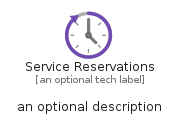
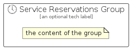

# ServiceReservations


```text
azure-11/Item/General/ServiceReservations
```

```text
include('azure-11/Item/General/ServiceReservations')
```


| Illustration | ServiceReservations | ServiceReservationsCard | ServiceReservationsGroup |
| :---: | :---: | :---: | :---: |
|  |  |  |  |


## Sprites
The item provides the following sriptes:

- `<$ServiceReservationsXs>`
- `<$ServiceReservationsSm>`
- `<$ServiceReservationsMd>`
- `<$ServiceReservationsLg>`


## ServiceReservations

### Load remotely
```plantuml
@startuml
' configures the library
!global $LIB_BASE_LOCATION="https://raw.githubusercontent.com/tmorin/plantuml-libs/master/distribution"

' loads the library's bootstrap
!include $LIB_BASE_LOCATION/bootstrap.puml

' loads the package bootstrap
include('azure-11/bootstrap')

' loads the Item which embeds the element ServiceReservations
include('azure-11/Item/General/ServiceReservations')

' renders the element
ServiceReservations('ServiceReservations', 'Service Reservations', 'an optional tech label', 'an optional description')
@enduml
```

### Load locally
```plantuml
@startuml
' configures the library
!global $INCLUSION_MODE="local"
!global $LIB_BASE_LOCATION="../../.."

' loads the library's bootstrap
!include $LIB_BASE_LOCATION/bootstrap.puml

' loads the package bootstrap
include('azure-11/bootstrap')

' loads the Item which embeds the element ServiceReservations
include('azure-11/Item/General/ServiceReservations')

' renders the element
ServiceReservations('ServiceReservations', 'Service Reservations', 'an optional tech label', 'an optional description')
@enduml
```

## ServiceReservationsCard

### Load remotely
```plantuml
@startuml
' configures the library
!global $LIB_BASE_LOCATION="https://raw.githubusercontent.com/tmorin/plantuml-libs/master/distribution"

' loads the library's bootstrap
!include $LIB_BASE_LOCATION/bootstrap.puml

' loads the package bootstrap
include('azure-11/bootstrap')

' loads the Item which embeds the element ServiceReservationsCard
include('azure-11/Item/General/ServiceReservations')

' renders the element
ServiceReservationsCard('ServiceReservationsCard', 'Service Reservations Card', 'an optional description')
@enduml
```

### Load locally
```plantuml
@startuml
' configures the library
!global $INCLUSION_MODE="local"
!global $LIB_BASE_LOCATION="../../.."

' loads the library's bootstrap
!include $LIB_BASE_LOCATION/bootstrap.puml

' loads the package bootstrap
include('azure-11/bootstrap')

' loads the Item which embeds the element ServiceReservationsCard
include('azure-11/Item/General/ServiceReservations')

' renders the element
ServiceReservationsCard('ServiceReservationsCard', 'Service Reservations Card', 'an optional description')
@enduml
```

## ServiceReservationsGroup

### Load remotely
```plantuml
@startuml
' configures the library
!global $LIB_BASE_LOCATION="https://raw.githubusercontent.com/tmorin/plantuml-libs/master/distribution"

' loads the library's bootstrap
!include $LIB_BASE_LOCATION/bootstrap.puml

' loads the package bootstrap
include('azure-11/bootstrap')

' loads the Item which embeds the element ServiceReservationsGroup
include('azure-11/Item/General/ServiceReservations')

' renders the element
ServiceReservationsGroup('ServiceReservationsGroup', 'Service Reservations Group', 'an optional tech label') {
    note as note
        the content of the group
    end note
}
@enduml
```

### Load locally
```plantuml
@startuml
' configures the library
!global $INCLUSION_MODE="local"
!global $LIB_BASE_LOCATION="../../.."

' loads the library's bootstrap
!include $LIB_BASE_LOCATION/bootstrap.puml

' loads the package bootstrap
include('azure-11/bootstrap')

' loads the Item which embeds the element ServiceReservationsGroup
include('azure-11/Item/General/ServiceReservations')

' renders the element
ServiceReservationsGroup('ServiceReservationsGroup', 'Service Reservations Group', 'an optional tech label') {
    note as note
        the content of the group
    end note
}
@enduml
```

