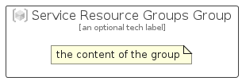

# ServiceResourceGroups


```text
azure-11/Item/General/ServiceResourceGroups
```

```text
include('azure-11/Item/General/ServiceResourceGroups')
```


| Illustration | ServiceResourceGroups | ServiceResourceGroupsCard | ServiceResourceGroupsGroup |
| :---: | :---: | :---: | :---: |
|  |  |  |  |


## Sprites
The item provides the following sriptes:

- `<$ServiceResourceGroupsXs>`
- `<$ServiceResourceGroupsSm>`
- `<$ServiceResourceGroupsMd>`
- `<$ServiceResourceGroupsLg>`


## ServiceResourceGroups

### Load remotely
```plantuml
@startuml
' configures the library
!global $LIB_BASE_LOCATION="https://raw.githubusercontent.com/tmorin/plantuml-libs/master/distribution"

' loads the library's bootstrap
!include $LIB_BASE_LOCATION/bootstrap.puml

' loads the package bootstrap
include('azure-11/bootstrap')

' loads the Item which embeds the element ServiceResourceGroups
include('azure-11/Item/General/ServiceResourceGroups')

' renders the element
ServiceResourceGroups('ServiceResourceGroups', 'Service Resource Groups', 'an optional tech label', 'an optional description')
@enduml
```

### Load locally
```plantuml
@startuml
' configures the library
!global $INCLUSION_MODE="local"
!global $LIB_BASE_LOCATION="../../.."

' loads the library's bootstrap
!include $LIB_BASE_LOCATION/bootstrap.puml

' loads the package bootstrap
include('azure-11/bootstrap')

' loads the Item which embeds the element ServiceResourceGroups
include('azure-11/Item/General/ServiceResourceGroups')

' renders the element
ServiceResourceGroups('ServiceResourceGroups', 'Service Resource Groups', 'an optional tech label', 'an optional description')
@enduml
```

## ServiceResourceGroupsCard

### Load remotely
```plantuml
@startuml
' configures the library
!global $LIB_BASE_LOCATION="https://raw.githubusercontent.com/tmorin/plantuml-libs/master/distribution"

' loads the library's bootstrap
!include $LIB_BASE_LOCATION/bootstrap.puml

' loads the package bootstrap
include('azure-11/bootstrap')

' loads the Item which embeds the element ServiceResourceGroupsCard
include('azure-11/Item/General/ServiceResourceGroups')

' renders the element
ServiceResourceGroupsCard('ServiceResourceGroupsCard', 'Service Resource Groups Card', 'an optional description')
@enduml
```

### Load locally
```plantuml
@startuml
' configures the library
!global $INCLUSION_MODE="local"
!global $LIB_BASE_LOCATION="../../.."

' loads the library's bootstrap
!include $LIB_BASE_LOCATION/bootstrap.puml

' loads the package bootstrap
include('azure-11/bootstrap')

' loads the Item which embeds the element ServiceResourceGroupsCard
include('azure-11/Item/General/ServiceResourceGroups')

' renders the element
ServiceResourceGroupsCard('ServiceResourceGroupsCard', 'Service Resource Groups Card', 'an optional description')
@enduml
```

## ServiceResourceGroupsGroup

### Load remotely
```plantuml
@startuml
' configures the library
!global $LIB_BASE_LOCATION="https://raw.githubusercontent.com/tmorin/plantuml-libs/master/distribution"

' loads the library's bootstrap
!include $LIB_BASE_LOCATION/bootstrap.puml

' loads the package bootstrap
include('azure-11/bootstrap')

' loads the Item which embeds the element ServiceResourceGroupsGroup
include('azure-11/Item/General/ServiceResourceGroups')

' renders the element
ServiceResourceGroupsGroup('ServiceResourceGroupsGroup', 'Service Resource Groups Group', 'an optional tech label') {
    note as note
        the content of the group
    end note
}
@enduml
```

### Load locally
```plantuml
@startuml
' configures the library
!global $INCLUSION_MODE="local"
!global $LIB_BASE_LOCATION="../../.."

' loads the library's bootstrap
!include $LIB_BASE_LOCATION/bootstrap.puml

' loads the package bootstrap
include('azure-11/bootstrap')

' loads the Item which embeds the element ServiceResourceGroupsGroup
include('azure-11/Item/General/ServiceResourceGroups')

' renders the element
ServiceResourceGroupsGroup('ServiceResourceGroupsGroup', 'Service Resource Groups Group', 'an optional tech label') {
    note as note
        the content of the group
    end note
}
@enduml
```

