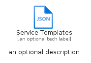
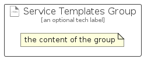

# ServiceTemplates


```text
azure-11/Item/General/ServiceTemplates
```

```text
include('azure-11/Item/General/ServiceTemplates')
```


| Illustration | ServiceTemplates | ServiceTemplatesCard | ServiceTemplatesGroup |
| :---: | :---: | :---: | :---: |
|  |  |  |  |


## Sprites
The item provides the following sriptes:

- `<$ServiceTemplatesXs>`
- `<$ServiceTemplatesSm>`
- `<$ServiceTemplatesMd>`
- `<$ServiceTemplatesLg>`


## ServiceTemplates

### Load remotely
```plantuml
@startuml
' configures the library
!global $LIB_BASE_LOCATION="https://raw.githubusercontent.com/tmorin/plantuml-libs/master/distribution"

' loads the library's bootstrap
!include $LIB_BASE_LOCATION/bootstrap.puml

' loads the package bootstrap
include('azure-11/bootstrap')

' loads the Item which embeds the element ServiceTemplates
include('azure-11/Item/General/ServiceTemplates')

' renders the element
ServiceTemplates('ServiceTemplates', 'Service Templates', 'an optional tech label', 'an optional description')
@enduml
```

### Load locally
```plantuml
@startuml
' configures the library
!global $INCLUSION_MODE="local"
!global $LIB_BASE_LOCATION="../../.."

' loads the library's bootstrap
!include $LIB_BASE_LOCATION/bootstrap.puml

' loads the package bootstrap
include('azure-11/bootstrap')

' loads the Item which embeds the element ServiceTemplates
include('azure-11/Item/General/ServiceTemplates')

' renders the element
ServiceTemplates('ServiceTemplates', 'Service Templates', 'an optional tech label', 'an optional description')
@enduml
```

## ServiceTemplatesCard

### Load remotely
```plantuml
@startuml
' configures the library
!global $LIB_BASE_LOCATION="https://raw.githubusercontent.com/tmorin/plantuml-libs/master/distribution"

' loads the library's bootstrap
!include $LIB_BASE_LOCATION/bootstrap.puml

' loads the package bootstrap
include('azure-11/bootstrap')

' loads the Item which embeds the element ServiceTemplatesCard
include('azure-11/Item/General/ServiceTemplates')

' renders the element
ServiceTemplatesCard('ServiceTemplatesCard', 'Service Templates Card', 'an optional description')
@enduml
```

### Load locally
```plantuml
@startuml
' configures the library
!global $INCLUSION_MODE="local"
!global $LIB_BASE_LOCATION="../../.."

' loads the library's bootstrap
!include $LIB_BASE_LOCATION/bootstrap.puml

' loads the package bootstrap
include('azure-11/bootstrap')

' loads the Item which embeds the element ServiceTemplatesCard
include('azure-11/Item/General/ServiceTemplates')

' renders the element
ServiceTemplatesCard('ServiceTemplatesCard', 'Service Templates Card', 'an optional description')
@enduml
```

## ServiceTemplatesGroup

### Load remotely
```plantuml
@startuml
' configures the library
!global $LIB_BASE_LOCATION="https://raw.githubusercontent.com/tmorin/plantuml-libs/master/distribution"

' loads the library's bootstrap
!include $LIB_BASE_LOCATION/bootstrap.puml

' loads the package bootstrap
include('azure-11/bootstrap')

' loads the Item which embeds the element ServiceTemplatesGroup
include('azure-11/Item/General/ServiceTemplates')

' renders the element
ServiceTemplatesGroup('ServiceTemplatesGroup', 'Service Templates Group', 'an optional tech label') {
    note as note
        the content of the group
    end note
}
@enduml
```

### Load locally
```plantuml
@startuml
' configures the library
!global $INCLUSION_MODE="local"
!global $LIB_BASE_LOCATION="../../.."

' loads the library's bootstrap
!include $LIB_BASE_LOCATION/bootstrap.puml

' loads the package bootstrap
include('azure-11/bootstrap')

' loads the Item which embeds the element ServiceTemplatesGroup
include('azure-11/Item/General/ServiceTemplates')

' renders the element
ServiceTemplatesGroup('ServiceTemplatesGroup', 'Service Templates Group', 'an optional tech label') {
    note as note
        the content of the group
    end note
}
@enduml
```

