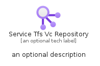
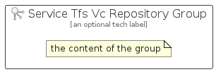

# ServiceTfsVcRepository


```text
azure-11/Item/General/ServiceTfsVcRepository
```

```text
include('azure-11/Item/General/ServiceTfsVcRepository')
```


| Illustration | ServiceTfsVcRepository | ServiceTfsVcRepositoryCard | ServiceTfsVcRepositoryGroup |
| :---: | :---: | :---: | :---: |
|  |  |  |  |


## ServiceTfsVcRepository

### Load remotely
```plantuml
@startuml
' configures the library
!global $LIB_BASE_LOCATION="https://raw.githubusercontent.com/tmorin/plantuml-libs/master/distribution"

' loads the library's bootstrap
!include $LIB_BASE_LOCATION/bootstrap.puml

' loads the package bootstrap
include('azure-11/bootstrap')

' loads the Item which embeds the element ServiceTfsVcRepository
include('azure-11/Item/General/ServiceTfsVcRepository')

' renders the element
ServiceTfsVcRepository('ServiceTfsVcRepository', 'Service Tfs Vc Repository', 'an optional tech label', 'an optional description')
@enduml
```

### Load locally
```plantuml
@startuml
' configures the library
!global $INCLUSION_MODE="local"
!global $LIB_BASE_LOCATION="../../.."

' loads the library's bootstrap
!include $LIB_BASE_LOCATION/bootstrap.puml

' loads the package bootstrap
include('azure-11/bootstrap')

' loads the Item which embeds the element ServiceTfsVcRepository
include('azure-11/Item/General/ServiceTfsVcRepository')

' renders the element
ServiceTfsVcRepository('ServiceTfsVcRepository', 'Service Tfs Vc Repository', 'an optional tech label', 'an optional description')
@enduml
```

## ServiceTfsVcRepositoryCard

### Load remotely
```plantuml
@startuml
' configures the library
!global $LIB_BASE_LOCATION="https://raw.githubusercontent.com/tmorin/plantuml-libs/master/distribution"

' loads the library's bootstrap
!include $LIB_BASE_LOCATION/bootstrap.puml

' loads the package bootstrap
include('azure-11/bootstrap')

' loads the Item which embeds the element ServiceTfsVcRepositoryCard
include('azure-11/Item/General/ServiceTfsVcRepository')

' renders the element
ServiceTfsVcRepositoryCard('ServiceTfsVcRepositoryCard', 'Service Tfs Vc Repository Card', 'an optional description')
@enduml
```

### Load locally
```plantuml
@startuml
' configures the library
!global $INCLUSION_MODE="local"
!global $LIB_BASE_LOCATION="../../.."

' loads the library's bootstrap
!include $LIB_BASE_LOCATION/bootstrap.puml

' loads the package bootstrap
include('azure-11/bootstrap')

' loads the Item which embeds the element ServiceTfsVcRepositoryCard
include('azure-11/Item/General/ServiceTfsVcRepository')

' renders the element
ServiceTfsVcRepositoryCard('ServiceTfsVcRepositoryCard', 'Service Tfs Vc Repository Card', 'an optional description')
@enduml
```

## ServiceTfsVcRepositoryGroup

### Load remotely
```plantuml
@startuml
' configures the library
!global $LIB_BASE_LOCATION="https://raw.githubusercontent.com/tmorin/plantuml-libs/master/distribution"

' loads the library's bootstrap
!include $LIB_BASE_LOCATION/bootstrap.puml

' loads the package bootstrap
include('azure-11/bootstrap')

' loads the Item which embeds the element ServiceTfsVcRepositoryGroup
include('azure-11/Item/General/ServiceTfsVcRepository')

' renders the element
ServiceTfsVcRepositoryGroup('ServiceTfsVcRepositoryGroup', 'Service Tfs Vc Repository Group', 'an optional tech label') {
    note as note
        the content of the group
    end note
}
@enduml
```

### Load locally
```plantuml
@startuml
' configures the library
!global $INCLUSION_MODE="local"
!global $LIB_BASE_LOCATION="../../.."

' loads the library's bootstrap
!include $LIB_BASE_LOCATION/bootstrap.puml

' loads the package bootstrap
include('azure-11/bootstrap')

' loads the Item which embeds the element ServiceTfsVcRepositoryGroup
include('azure-11/Item/General/ServiceTfsVcRepository')

' renders the element
ServiceTfsVcRepositoryGroup('ServiceTfsVcRepositoryGroup', 'Service Tfs Vc Repository Group', 'an optional tech label') {
    note as note
        the content of the group
    end note
}
@enduml
```

