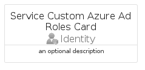

# ServiceCustomAzureAdRoles


```text
azure-11/Item/Identity/ServiceCustomAzureAdRoles
```

```text
include('azure-11/Item/Identity/ServiceCustomAzureAdRoles')
```


| Illustration | ServiceCustomAzureAdRoles | ServiceCustomAzureAdRolesCard | ServiceCustomAzureAdRolesGroup |
| :---: | :---: | :---: | :---: |
|  |  |  |  |


## ServiceCustomAzureAdRoles

### Load remotely
```plantuml
@startuml
' configures the library
!global $LIB_BASE_LOCATION="https://raw.githubusercontent.com/tmorin/plantuml-libs/master/distribution"

' loads the library's bootstrap
!include $LIB_BASE_LOCATION/bootstrap.puml

' loads the package bootstrap
include('azure-11/bootstrap')

' loads the Item which embeds the element ServiceCustomAzureAdRoles
include('azure-11/Item/Identity/ServiceCustomAzureAdRoles')

' renders the element
ServiceCustomAzureAdRoles('ServiceCustomAzureAdRoles', 'Service Custom Azure Ad Roles', 'an optional tech label', 'an optional description')
@enduml
```

### Load locally
```plantuml
@startuml
' configures the library
!global $INCLUSION_MODE="local"
!global $LIB_BASE_LOCATION="../../.."

' loads the library's bootstrap
!include $LIB_BASE_LOCATION/bootstrap.puml

' loads the package bootstrap
include('azure-11/bootstrap')

' loads the Item which embeds the element ServiceCustomAzureAdRoles
include('azure-11/Item/Identity/ServiceCustomAzureAdRoles')

' renders the element
ServiceCustomAzureAdRoles('ServiceCustomAzureAdRoles', 'Service Custom Azure Ad Roles', 'an optional tech label', 'an optional description')
@enduml
```

## ServiceCustomAzureAdRolesCard

### Load remotely
```plantuml
@startuml
' configures the library
!global $LIB_BASE_LOCATION="https://raw.githubusercontent.com/tmorin/plantuml-libs/master/distribution"

' loads the library's bootstrap
!include $LIB_BASE_LOCATION/bootstrap.puml

' loads the package bootstrap
include('azure-11/bootstrap')

' loads the Item which embeds the element ServiceCustomAzureAdRolesCard
include('azure-11/Item/Identity/ServiceCustomAzureAdRoles')

' renders the element
ServiceCustomAzureAdRolesCard('ServiceCustomAzureAdRolesCard', 'Service Custom Azure Ad Roles Card', 'an optional description')
@enduml
```

### Load locally
```plantuml
@startuml
' configures the library
!global $INCLUSION_MODE="local"
!global $LIB_BASE_LOCATION="../../.."

' loads the library's bootstrap
!include $LIB_BASE_LOCATION/bootstrap.puml

' loads the package bootstrap
include('azure-11/bootstrap')

' loads the Item which embeds the element ServiceCustomAzureAdRolesCard
include('azure-11/Item/Identity/ServiceCustomAzureAdRoles')

' renders the element
ServiceCustomAzureAdRolesCard('ServiceCustomAzureAdRolesCard', 'Service Custom Azure Ad Roles Card', 'an optional description')
@enduml
```

## ServiceCustomAzureAdRolesGroup

### Load remotely
```plantuml
@startuml
' configures the library
!global $LIB_BASE_LOCATION="https://raw.githubusercontent.com/tmorin/plantuml-libs/master/distribution"

' loads the library's bootstrap
!include $LIB_BASE_LOCATION/bootstrap.puml

' loads the package bootstrap
include('azure-11/bootstrap')

' loads the Item which embeds the element ServiceCustomAzureAdRolesGroup
include('azure-11/Item/Identity/ServiceCustomAzureAdRoles')

' renders the element
ServiceCustomAzureAdRolesGroup('ServiceCustomAzureAdRolesGroup', 'Service Custom Azure Ad Roles Group', 'an optional tech label') {
    note as note
        the content of the group
    end note
}
@enduml
```

### Load locally
```plantuml
@startuml
' configures the library
!global $INCLUSION_MODE="local"
!global $LIB_BASE_LOCATION="../../.."

' loads the library's bootstrap
!include $LIB_BASE_LOCATION/bootstrap.puml

' loads the package bootstrap
include('azure-11/bootstrap')

' loads the Item which embeds the element ServiceCustomAzureAdRolesGroup
include('azure-11/Item/Identity/ServiceCustomAzureAdRoles')

' renders the element
ServiceCustomAzureAdRolesGroup('ServiceCustomAzureAdRolesGroup', 'Service Custom Azure Ad Roles Group', 'an optional tech label') {
    note as note
        the content of the group
    end note
}
@enduml
```

