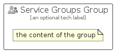

# ServiceGroups


```text
azure-11/Item/Identity/ServiceGroups
```

```text
include('azure-11/Item/Identity/ServiceGroups')
```


| Illustration | ServiceGroups | ServiceGroupsCard | ServiceGroupsGroup |
| :---: | :---: | :---: | :---: |
|  |  |  |  |


## Sprites
The item provides the following sriptes:

- `<$ServiceGroupsXs>`
- `<$ServiceGroupsSm>`
- `<$ServiceGroupsMd>`
- `<$ServiceGroupsLg>`


## ServiceGroups

### Load remotely
```plantuml
@startuml
' configures the library
!global $LIB_BASE_LOCATION="https://raw.githubusercontent.com/tmorin/plantuml-libs/master/distribution"

' loads the library's bootstrap
!include $LIB_BASE_LOCATION/bootstrap.puml

' loads the package bootstrap
include('azure-11/bootstrap')

' loads the Item which embeds the element ServiceGroups
include('azure-11/Item/Identity/ServiceGroups')

' renders the element
ServiceGroups('ServiceGroups', 'Service Groups', 'an optional tech label', 'an optional description')
@enduml
```

### Load locally
```plantuml
@startuml
' configures the library
!global $INCLUSION_MODE="local"
!global $LIB_BASE_LOCATION="../../.."

' loads the library's bootstrap
!include $LIB_BASE_LOCATION/bootstrap.puml

' loads the package bootstrap
include('azure-11/bootstrap')

' loads the Item which embeds the element ServiceGroups
include('azure-11/Item/Identity/ServiceGroups')

' renders the element
ServiceGroups('ServiceGroups', 'Service Groups', 'an optional tech label', 'an optional description')
@enduml
```

## ServiceGroupsCard

### Load remotely
```plantuml
@startuml
' configures the library
!global $LIB_BASE_LOCATION="https://raw.githubusercontent.com/tmorin/plantuml-libs/master/distribution"

' loads the library's bootstrap
!include $LIB_BASE_LOCATION/bootstrap.puml

' loads the package bootstrap
include('azure-11/bootstrap')

' loads the Item which embeds the element ServiceGroupsCard
include('azure-11/Item/Identity/ServiceGroups')

' renders the element
ServiceGroupsCard('ServiceGroupsCard', 'Service Groups Card', 'an optional description')
@enduml
```

### Load locally
```plantuml
@startuml
' configures the library
!global $INCLUSION_MODE="local"
!global $LIB_BASE_LOCATION="../../.."

' loads the library's bootstrap
!include $LIB_BASE_LOCATION/bootstrap.puml

' loads the package bootstrap
include('azure-11/bootstrap')

' loads the Item which embeds the element ServiceGroupsCard
include('azure-11/Item/Identity/ServiceGroups')

' renders the element
ServiceGroupsCard('ServiceGroupsCard', 'Service Groups Card', 'an optional description')
@enduml
```

## ServiceGroupsGroup

### Load remotely
```plantuml
@startuml
' configures the library
!global $LIB_BASE_LOCATION="https://raw.githubusercontent.com/tmorin/plantuml-libs/master/distribution"

' loads the library's bootstrap
!include $LIB_BASE_LOCATION/bootstrap.puml

' loads the package bootstrap
include('azure-11/bootstrap')

' loads the Item which embeds the element ServiceGroupsGroup
include('azure-11/Item/Identity/ServiceGroups')

' renders the element
ServiceGroupsGroup('ServiceGroupsGroup', 'Service Groups Group', 'an optional tech label') {
    note as note
        the content of the group
    end note
}
@enduml
```

### Load locally
```plantuml
@startuml
' configures the library
!global $INCLUSION_MODE="local"
!global $LIB_BASE_LOCATION="../../.."

' loads the library's bootstrap
!include $LIB_BASE_LOCATION/bootstrap.puml

' loads the package bootstrap
include('azure-11/bootstrap')

' loads the Item which embeds the element ServiceGroupsGroup
include('azure-11/Item/Identity/ServiceGroups')

' renders the element
ServiceGroupsGroup('ServiceGroupsGroup', 'Service Groups Group', 'an optional tech label') {
    note as note
        the content of the group
    end note
}
@enduml
```

