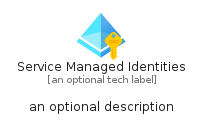

# ServiceManagedIdentities


```text
azure-11/Item/Identity/ServiceManagedIdentities
```

```text
include('azure-11/Item/Identity/ServiceManagedIdentities')
```


| Illustration | ServiceManagedIdentities | ServiceManagedIdentitiesCard | ServiceManagedIdentitiesGroup |
| :---: | :---: | :---: | :---: |
|  |  |  |  |


## Sprites
The item provides the following sriptes:

- `<$ServiceManagedIdentitiesXs>`
- `<$ServiceManagedIdentitiesSm>`
- `<$ServiceManagedIdentitiesMd>`
- `<$ServiceManagedIdentitiesLg>`


## ServiceManagedIdentities

### Load remotely
```plantuml
@startuml
' configures the library
!global $LIB_BASE_LOCATION="https://raw.githubusercontent.com/tmorin/plantuml-libs/master/distribution"

' loads the library's bootstrap
!include $LIB_BASE_LOCATION/bootstrap.puml

' loads the package bootstrap
include('azure-11/bootstrap')

' loads the Item which embeds the element ServiceManagedIdentities
include('azure-11/Item/Identity/ServiceManagedIdentities')

' renders the element
ServiceManagedIdentities('ServiceManagedIdentities', 'Service Managed Identities', 'an optional tech label', 'an optional description')
@enduml
```

### Load locally
```plantuml
@startuml
' configures the library
!global $INCLUSION_MODE="local"
!global $LIB_BASE_LOCATION="../../.."

' loads the library's bootstrap
!include $LIB_BASE_LOCATION/bootstrap.puml

' loads the package bootstrap
include('azure-11/bootstrap')

' loads the Item which embeds the element ServiceManagedIdentities
include('azure-11/Item/Identity/ServiceManagedIdentities')

' renders the element
ServiceManagedIdentities('ServiceManagedIdentities', 'Service Managed Identities', 'an optional tech label', 'an optional description')
@enduml
```

## ServiceManagedIdentitiesCard

### Load remotely
```plantuml
@startuml
' configures the library
!global $LIB_BASE_LOCATION="https://raw.githubusercontent.com/tmorin/plantuml-libs/master/distribution"

' loads the library's bootstrap
!include $LIB_BASE_LOCATION/bootstrap.puml

' loads the package bootstrap
include('azure-11/bootstrap')

' loads the Item which embeds the element ServiceManagedIdentitiesCard
include('azure-11/Item/Identity/ServiceManagedIdentities')

' renders the element
ServiceManagedIdentitiesCard('ServiceManagedIdentitiesCard', 'Service Managed Identities Card', 'an optional description')
@enduml
```

### Load locally
```plantuml
@startuml
' configures the library
!global $INCLUSION_MODE="local"
!global $LIB_BASE_LOCATION="../../.."

' loads the library's bootstrap
!include $LIB_BASE_LOCATION/bootstrap.puml

' loads the package bootstrap
include('azure-11/bootstrap')

' loads the Item which embeds the element ServiceManagedIdentitiesCard
include('azure-11/Item/Identity/ServiceManagedIdentities')

' renders the element
ServiceManagedIdentitiesCard('ServiceManagedIdentitiesCard', 'Service Managed Identities Card', 'an optional description')
@enduml
```

## ServiceManagedIdentitiesGroup

### Load remotely
```plantuml
@startuml
' configures the library
!global $LIB_BASE_LOCATION="https://raw.githubusercontent.com/tmorin/plantuml-libs/master/distribution"

' loads the library's bootstrap
!include $LIB_BASE_LOCATION/bootstrap.puml

' loads the package bootstrap
include('azure-11/bootstrap')

' loads the Item which embeds the element ServiceManagedIdentitiesGroup
include('azure-11/Item/Identity/ServiceManagedIdentities')

' renders the element
ServiceManagedIdentitiesGroup('ServiceManagedIdentitiesGroup', 'Service Managed Identities Group', 'an optional tech label') {
    note as note
        the content of the group
    end note
}
@enduml
```

### Load locally
```plantuml
@startuml
' configures the library
!global $INCLUSION_MODE="local"
!global $LIB_BASE_LOCATION="../../.."

' loads the library's bootstrap
!include $LIB_BASE_LOCATION/bootstrap.puml

' loads the package bootstrap
include('azure-11/bootstrap')

' loads the Item which embeds the element ServiceManagedIdentitiesGroup
include('azure-11/Item/Identity/ServiceManagedIdentities')

' renders the element
ServiceManagedIdentitiesGroup('ServiceManagedIdentitiesGroup', 'Service Managed Identities Group', 'an optional tech label') {
    note as note
        the content of the group
    end note
}
@enduml
```

