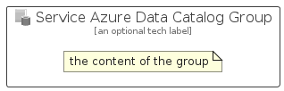

# ServiceAzureDataCatalog


```text
azure-11/Item/Integration/ServiceAzureDataCatalog
```

```text
include('azure-11/Item/Integration/ServiceAzureDataCatalog')
```


| Illustration | ServiceAzureDataCatalog | ServiceAzureDataCatalogCard | ServiceAzureDataCatalogGroup |
| :---: | :---: | :---: | :---: |
|  |  |  |  |


## ServiceAzureDataCatalog

### Load remotely
```plantuml
@startuml
' configures the library
!global $LIB_BASE_LOCATION="https://raw.githubusercontent.com/tmorin/plantuml-libs/master/distribution"

' loads the library's bootstrap
!include $LIB_BASE_LOCATION/bootstrap.puml

' loads the package bootstrap
include('azure-11/bootstrap')

' loads the Item which embeds the element ServiceAzureDataCatalog
include('azure-11/Item/Integration/ServiceAzureDataCatalog')

' renders the element
ServiceAzureDataCatalog('ServiceAzureDataCatalog', 'Service Azure Data Catalog', 'an optional tech label', 'an optional description')
@enduml
```

### Load locally
```plantuml
@startuml
' configures the library
!global $INCLUSION_MODE="local"
!global $LIB_BASE_LOCATION="../../.."

' loads the library's bootstrap
!include $LIB_BASE_LOCATION/bootstrap.puml

' loads the package bootstrap
include('azure-11/bootstrap')

' loads the Item which embeds the element ServiceAzureDataCatalog
include('azure-11/Item/Integration/ServiceAzureDataCatalog')

' renders the element
ServiceAzureDataCatalog('ServiceAzureDataCatalog', 'Service Azure Data Catalog', 'an optional tech label', 'an optional description')
@enduml
```

## ServiceAzureDataCatalogCard

### Load remotely
```plantuml
@startuml
' configures the library
!global $LIB_BASE_LOCATION="https://raw.githubusercontent.com/tmorin/plantuml-libs/master/distribution"

' loads the library's bootstrap
!include $LIB_BASE_LOCATION/bootstrap.puml

' loads the package bootstrap
include('azure-11/bootstrap')

' loads the Item which embeds the element ServiceAzureDataCatalogCard
include('azure-11/Item/Integration/ServiceAzureDataCatalog')

' renders the element
ServiceAzureDataCatalogCard('ServiceAzureDataCatalogCard', 'Service Azure Data Catalog Card', 'an optional description')
@enduml
```

### Load locally
```plantuml
@startuml
' configures the library
!global $INCLUSION_MODE="local"
!global $LIB_BASE_LOCATION="../../.."

' loads the library's bootstrap
!include $LIB_BASE_LOCATION/bootstrap.puml

' loads the package bootstrap
include('azure-11/bootstrap')

' loads the Item which embeds the element ServiceAzureDataCatalogCard
include('azure-11/Item/Integration/ServiceAzureDataCatalog')

' renders the element
ServiceAzureDataCatalogCard('ServiceAzureDataCatalogCard', 'Service Azure Data Catalog Card', 'an optional description')
@enduml
```

## ServiceAzureDataCatalogGroup

### Load remotely
```plantuml
@startuml
' configures the library
!global $LIB_BASE_LOCATION="https://raw.githubusercontent.com/tmorin/plantuml-libs/master/distribution"

' loads the library's bootstrap
!include $LIB_BASE_LOCATION/bootstrap.puml

' loads the package bootstrap
include('azure-11/bootstrap')

' loads the Item which embeds the element ServiceAzureDataCatalogGroup
include('azure-11/Item/Integration/ServiceAzureDataCatalog')

' renders the element
ServiceAzureDataCatalogGroup('ServiceAzureDataCatalogGroup', 'Service Azure Data Catalog Group', 'an optional tech label') {
    note as note
        the content of the group
    end note
}
@enduml
```

### Load locally
```plantuml
@startuml
' configures the library
!global $INCLUSION_MODE="local"
!global $LIB_BASE_LOCATION="../../.."

' loads the library's bootstrap
!include $LIB_BASE_LOCATION/bootstrap.puml

' loads the package bootstrap
include('azure-11/bootstrap')

' loads the Item which embeds the element ServiceAzureDataCatalogGroup
include('azure-11/Item/Integration/ServiceAzureDataCatalog')

' renders the element
ServiceAzureDataCatalogGroup('ServiceAzureDataCatalogGroup', 'Service Azure Data Catalog Group', 'an optional tech label') {
    note as note
        the content of the group
    end note
}
@enduml
```

