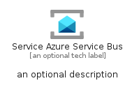
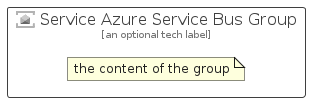

# ServiceAzureServiceBus


```text
azure-11/Item/Integration/ServiceAzureServiceBus
```

```text
include('azure-11/Item/Integration/ServiceAzureServiceBus')
```


| Illustration | ServiceAzureServiceBus | ServiceAzureServiceBusCard | ServiceAzureServiceBusGroup |
| :---: | :---: | :---: | :---: |
|  |  |  |  |


## ServiceAzureServiceBus

### Load remotely
```plantuml
@startuml
' configures the library
!global $LIB_BASE_LOCATION="https://raw.githubusercontent.com/tmorin/plantuml-libs/master/distribution"

' loads the library's bootstrap
!include $LIB_BASE_LOCATION/bootstrap.puml

' loads the package bootstrap
include('azure-11/bootstrap')

' loads the Item which embeds the element ServiceAzureServiceBus
include('azure-11/Item/Integration/ServiceAzureServiceBus')

' renders the element
ServiceAzureServiceBus('ServiceAzureServiceBus', 'Service Azure Service Bus', 'an optional tech label', 'an optional description')
@enduml
```

### Load locally
```plantuml
@startuml
' configures the library
!global $INCLUSION_MODE="local"
!global $LIB_BASE_LOCATION="../../.."

' loads the library's bootstrap
!include $LIB_BASE_LOCATION/bootstrap.puml

' loads the package bootstrap
include('azure-11/bootstrap')

' loads the Item which embeds the element ServiceAzureServiceBus
include('azure-11/Item/Integration/ServiceAzureServiceBus')

' renders the element
ServiceAzureServiceBus('ServiceAzureServiceBus', 'Service Azure Service Bus', 'an optional tech label', 'an optional description')
@enduml
```

## ServiceAzureServiceBusCard

### Load remotely
```plantuml
@startuml
' configures the library
!global $LIB_BASE_LOCATION="https://raw.githubusercontent.com/tmorin/plantuml-libs/master/distribution"

' loads the library's bootstrap
!include $LIB_BASE_LOCATION/bootstrap.puml

' loads the package bootstrap
include('azure-11/bootstrap')

' loads the Item which embeds the element ServiceAzureServiceBusCard
include('azure-11/Item/Integration/ServiceAzureServiceBus')

' renders the element
ServiceAzureServiceBusCard('ServiceAzureServiceBusCard', 'Service Azure Service Bus Card', 'an optional description')
@enduml
```

### Load locally
```plantuml
@startuml
' configures the library
!global $INCLUSION_MODE="local"
!global $LIB_BASE_LOCATION="../../.."

' loads the library's bootstrap
!include $LIB_BASE_LOCATION/bootstrap.puml

' loads the package bootstrap
include('azure-11/bootstrap')

' loads the Item which embeds the element ServiceAzureServiceBusCard
include('azure-11/Item/Integration/ServiceAzureServiceBus')

' renders the element
ServiceAzureServiceBusCard('ServiceAzureServiceBusCard', 'Service Azure Service Bus Card', 'an optional description')
@enduml
```

## ServiceAzureServiceBusGroup

### Load remotely
```plantuml
@startuml
' configures the library
!global $LIB_BASE_LOCATION="https://raw.githubusercontent.com/tmorin/plantuml-libs/master/distribution"

' loads the library's bootstrap
!include $LIB_BASE_LOCATION/bootstrap.puml

' loads the package bootstrap
include('azure-11/bootstrap')

' loads the Item which embeds the element ServiceAzureServiceBusGroup
include('azure-11/Item/Integration/ServiceAzureServiceBus')

' renders the element
ServiceAzureServiceBusGroup('ServiceAzureServiceBusGroup', 'Service Azure Service Bus Group', 'an optional tech label') {
    note as note
        the content of the group
    end note
}
@enduml
```

### Load locally
```plantuml
@startuml
' configures the library
!global $INCLUSION_MODE="local"
!global $LIB_BASE_LOCATION="../../.."

' loads the library's bootstrap
!include $LIB_BASE_LOCATION/bootstrap.puml

' loads the package bootstrap
include('azure-11/bootstrap')

' loads the Item which embeds the element ServiceAzureServiceBusGroup
include('azure-11/Item/Integration/ServiceAzureServiceBus')

' renders the element
ServiceAzureServiceBusGroup('ServiceAzureServiceBusGroup', 'Service Azure Service Bus Group', 'an optional tech label') {
    note as note
        the content of the group
    end note
}
@enduml
```

