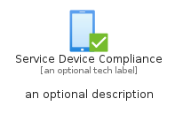
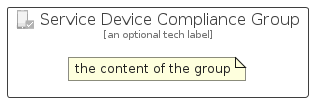

# ServiceDeviceCompliance


```text
azure-11/Item/Intune/ServiceDeviceCompliance
```

```text
include('azure-11/Item/Intune/ServiceDeviceCompliance')
```


| Illustration | ServiceDeviceCompliance | ServiceDeviceComplianceCard | ServiceDeviceComplianceGroup |
| :---: | :---: | :---: | :---: |
|  |  |  |  |


## Sprites
The item provides the following sriptes:

- `<$ServiceDeviceComplianceXs>`
- `<$ServiceDeviceComplianceSm>`
- `<$ServiceDeviceComplianceMd>`
- `<$ServiceDeviceComplianceLg>`


## ServiceDeviceCompliance

### Load remotely
```plantuml
@startuml
' configures the library
!global $LIB_BASE_LOCATION="https://raw.githubusercontent.com/tmorin/plantuml-libs/master/distribution"

' loads the library's bootstrap
!include $LIB_BASE_LOCATION/bootstrap.puml

' loads the package bootstrap
include('azure-11/bootstrap')

' loads the Item which embeds the element ServiceDeviceCompliance
include('azure-11/Item/Intune/ServiceDeviceCompliance')

' renders the element
ServiceDeviceCompliance('ServiceDeviceCompliance', 'Service Device Compliance', 'an optional tech label', 'an optional description')
@enduml
```

### Load locally
```plantuml
@startuml
' configures the library
!global $INCLUSION_MODE="local"
!global $LIB_BASE_LOCATION="../../.."

' loads the library's bootstrap
!include $LIB_BASE_LOCATION/bootstrap.puml

' loads the package bootstrap
include('azure-11/bootstrap')

' loads the Item which embeds the element ServiceDeviceCompliance
include('azure-11/Item/Intune/ServiceDeviceCompliance')

' renders the element
ServiceDeviceCompliance('ServiceDeviceCompliance', 'Service Device Compliance', 'an optional tech label', 'an optional description')
@enduml
```

## ServiceDeviceComplianceCard

### Load remotely
```plantuml
@startuml
' configures the library
!global $LIB_BASE_LOCATION="https://raw.githubusercontent.com/tmorin/plantuml-libs/master/distribution"

' loads the library's bootstrap
!include $LIB_BASE_LOCATION/bootstrap.puml

' loads the package bootstrap
include('azure-11/bootstrap')

' loads the Item which embeds the element ServiceDeviceComplianceCard
include('azure-11/Item/Intune/ServiceDeviceCompliance')

' renders the element
ServiceDeviceComplianceCard('ServiceDeviceComplianceCard', 'Service Device Compliance Card', 'an optional description')
@enduml
```

### Load locally
```plantuml
@startuml
' configures the library
!global $INCLUSION_MODE="local"
!global $LIB_BASE_LOCATION="../../.."

' loads the library's bootstrap
!include $LIB_BASE_LOCATION/bootstrap.puml

' loads the package bootstrap
include('azure-11/bootstrap')

' loads the Item which embeds the element ServiceDeviceComplianceCard
include('azure-11/Item/Intune/ServiceDeviceCompliance')

' renders the element
ServiceDeviceComplianceCard('ServiceDeviceComplianceCard', 'Service Device Compliance Card', 'an optional description')
@enduml
```

## ServiceDeviceComplianceGroup

### Load remotely
```plantuml
@startuml
' configures the library
!global $LIB_BASE_LOCATION="https://raw.githubusercontent.com/tmorin/plantuml-libs/master/distribution"

' loads the library's bootstrap
!include $LIB_BASE_LOCATION/bootstrap.puml

' loads the package bootstrap
include('azure-11/bootstrap')

' loads the Item which embeds the element ServiceDeviceComplianceGroup
include('azure-11/Item/Intune/ServiceDeviceCompliance')

' renders the element
ServiceDeviceComplianceGroup('ServiceDeviceComplianceGroup', 'Service Device Compliance Group', 'an optional tech label') {
    note as note
        the content of the group
    end note
}
@enduml
```

### Load locally
```plantuml
@startuml
' configures the library
!global $INCLUSION_MODE="local"
!global $LIB_BASE_LOCATION="../../.."

' loads the library's bootstrap
!include $LIB_BASE_LOCATION/bootstrap.puml

' loads the package bootstrap
include('azure-11/bootstrap')

' loads the Item which embeds the element ServiceDeviceComplianceGroup
include('azure-11/Item/Intune/ServiceDeviceCompliance')

' renders the element
ServiceDeviceComplianceGroup('ServiceDeviceComplianceGroup', 'Service Device Compliance Group', 'an optional tech label') {
    note as note
        the content of the group
    end note
}
@enduml
```

