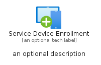
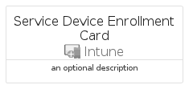
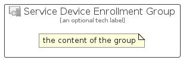

# ServiceDeviceEnrollment


```text
azure-11/Item/Intune/ServiceDeviceEnrollment
```

```text
include('azure-11/Item/Intune/ServiceDeviceEnrollment')
```


| Illustration | ServiceDeviceEnrollment | ServiceDeviceEnrollmentCard | ServiceDeviceEnrollmentGroup |
| :---: | :---: | :---: | :---: |
|  |  |  |  |


## Sprites
The item provides the following sriptes:

- `<$ServiceDeviceEnrollmentXs>`
- `<$ServiceDeviceEnrollmentSm>`
- `<$ServiceDeviceEnrollmentMd>`
- `<$ServiceDeviceEnrollmentLg>`


## ServiceDeviceEnrollment

### Load remotely
```plantuml
@startuml
' configures the library
!global $LIB_BASE_LOCATION="https://raw.githubusercontent.com/tmorin/plantuml-libs/master/distribution"

' loads the library's bootstrap
!include $LIB_BASE_LOCATION/bootstrap.puml

' loads the package bootstrap
include('azure-11/bootstrap')

' loads the Item which embeds the element ServiceDeviceEnrollment
include('azure-11/Item/Intune/ServiceDeviceEnrollment')

' renders the element
ServiceDeviceEnrollment('ServiceDeviceEnrollment', 'Service Device Enrollment', 'an optional tech label', 'an optional description')
@enduml
```

### Load locally
```plantuml
@startuml
' configures the library
!global $INCLUSION_MODE="local"
!global $LIB_BASE_LOCATION="../../.."

' loads the library's bootstrap
!include $LIB_BASE_LOCATION/bootstrap.puml

' loads the package bootstrap
include('azure-11/bootstrap')

' loads the Item which embeds the element ServiceDeviceEnrollment
include('azure-11/Item/Intune/ServiceDeviceEnrollment')

' renders the element
ServiceDeviceEnrollment('ServiceDeviceEnrollment', 'Service Device Enrollment', 'an optional tech label', 'an optional description')
@enduml
```

## ServiceDeviceEnrollmentCard

### Load remotely
```plantuml
@startuml
' configures the library
!global $LIB_BASE_LOCATION="https://raw.githubusercontent.com/tmorin/plantuml-libs/master/distribution"

' loads the library's bootstrap
!include $LIB_BASE_LOCATION/bootstrap.puml

' loads the package bootstrap
include('azure-11/bootstrap')

' loads the Item which embeds the element ServiceDeviceEnrollmentCard
include('azure-11/Item/Intune/ServiceDeviceEnrollment')

' renders the element
ServiceDeviceEnrollmentCard('ServiceDeviceEnrollmentCard', 'Service Device Enrollment Card', 'an optional description')
@enduml
```

### Load locally
```plantuml
@startuml
' configures the library
!global $INCLUSION_MODE="local"
!global $LIB_BASE_LOCATION="../../.."

' loads the library's bootstrap
!include $LIB_BASE_LOCATION/bootstrap.puml

' loads the package bootstrap
include('azure-11/bootstrap')

' loads the Item which embeds the element ServiceDeviceEnrollmentCard
include('azure-11/Item/Intune/ServiceDeviceEnrollment')

' renders the element
ServiceDeviceEnrollmentCard('ServiceDeviceEnrollmentCard', 'Service Device Enrollment Card', 'an optional description')
@enduml
```

## ServiceDeviceEnrollmentGroup

### Load remotely
```plantuml
@startuml
' configures the library
!global $LIB_BASE_LOCATION="https://raw.githubusercontent.com/tmorin/plantuml-libs/master/distribution"

' loads the library's bootstrap
!include $LIB_BASE_LOCATION/bootstrap.puml

' loads the package bootstrap
include('azure-11/bootstrap')

' loads the Item which embeds the element ServiceDeviceEnrollmentGroup
include('azure-11/Item/Intune/ServiceDeviceEnrollment')

' renders the element
ServiceDeviceEnrollmentGroup('ServiceDeviceEnrollmentGroup', 'Service Device Enrollment Group', 'an optional tech label') {
    note as note
        the content of the group
    end note
}
@enduml
```

### Load locally
```plantuml
@startuml
' configures the library
!global $INCLUSION_MODE="local"
!global $LIB_BASE_LOCATION="../../.."

' loads the library's bootstrap
!include $LIB_BASE_LOCATION/bootstrap.puml

' loads the package bootstrap
include('azure-11/bootstrap')

' loads the Item which embeds the element ServiceDeviceEnrollmentGroup
include('azure-11/Item/Intune/ServiceDeviceEnrollment')

' renders the element
ServiceDeviceEnrollmentGroup('ServiceDeviceEnrollmentGroup', 'Service Device Enrollment Group', 'an optional tech label') {
    note as note
        the content of the group
    end note
}
@enduml
```

