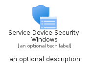
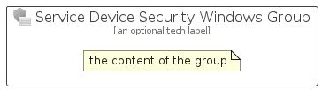

# ServiceDeviceSecurityWindows


```text
azure-11/Item/Intune/ServiceDeviceSecurityWindows
```

```text
include('azure-11/Item/Intune/ServiceDeviceSecurityWindows')
```


| Illustration | ServiceDeviceSecurityWindows | ServiceDeviceSecurityWindowsCard | ServiceDeviceSecurityWindowsGroup |
| :---: | :---: | :---: | :---: |
|  |  |  |  |


## Sprites
The item provides the following sriptes:

- `<$ServiceDeviceSecurityWindowsXs>`
- `<$ServiceDeviceSecurityWindowsSm>`
- `<$ServiceDeviceSecurityWindowsMd>`
- `<$ServiceDeviceSecurityWindowsLg>`


## ServiceDeviceSecurityWindows

### Load remotely
```plantuml
@startuml
' configures the library
!global $LIB_BASE_LOCATION="https://raw.githubusercontent.com/tmorin/plantuml-libs/master/distribution"

' loads the library's bootstrap
!include $LIB_BASE_LOCATION/bootstrap.puml

' loads the package bootstrap
include('azure-11/bootstrap')

' loads the Item which embeds the element ServiceDeviceSecurityWindows
include('azure-11/Item/Intune/ServiceDeviceSecurityWindows')

' renders the element
ServiceDeviceSecurityWindows('ServiceDeviceSecurityWindows', 'Service Device Security Windows', 'an optional tech label', 'an optional description')
@enduml
```

### Load locally
```plantuml
@startuml
' configures the library
!global $INCLUSION_MODE="local"
!global $LIB_BASE_LOCATION="../../.."

' loads the library's bootstrap
!include $LIB_BASE_LOCATION/bootstrap.puml

' loads the package bootstrap
include('azure-11/bootstrap')

' loads the Item which embeds the element ServiceDeviceSecurityWindows
include('azure-11/Item/Intune/ServiceDeviceSecurityWindows')

' renders the element
ServiceDeviceSecurityWindows('ServiceDeviceSecurityWindows', 'Service Device Security Windows', 'an optional tech label', 'an optional description')
@enduml
```

## ServiceDeviceSecurityWindowsCard

### Load remotely
```plantuml
@startuml
' configures the library
!global $LIB_BASE_LOCATION="https://raw.githubusercontent.com/tmorin/plantuml-libs/master/distribution"

' loads the library's bootstrap
!include $LIB_BASE_LOCATION/bootstrap.puml

' loads the package bootstrap
include('azure-11/bootstrap')

' loads the Item which embeds the element ServiceDeviceSecurityWindowsCard
include('azure-11/Item/Intune/ServiceDeviceSecurityWindows')

' renders the element
ServiceDeviceSecurityWindowsCard('ServiceDeviceSecurityWindowsCard', 'Service Device Security Windows Card', 'an optional description')
@enduml
```

### Load locally
```plantuml
@startuml
' configures the library
!global $INCLUSION_MODE="local"
!global $LIB_BASE_LOCATION="../../.."

' loads the library's bootstrap
!include $LIB_BASE_LOCATION/bootstrap.puml

' loads the package bootstrap
include('azure-11/bootstrap')

' loads the Item which embeds the element ServiceDeviceSecurityWindowsCard
include('azure-11/Item/Intune/ServiceDeviceSecurityWindows')

' renders the element
ServiceDeviceSecurityWindowsCard('ServiceDeviceSecurityWindowsCard', 'Service Device Security Windows Card', 'an optional description')
@enduml
```

## ServiceDeviceSecurityWindowsGroup

### Load remotely
```plantuml
@startuml
' configures the library
!global $LIB_BASE_LOCATION="https://raw.githubusercontent.com/tmorin/plantuml-libs/master/distribution"

' loads the library's bootstrap
!include $LIB_BASE_LOCATION/bootstrap.puml

' loads the package bootstrap
include('azure-11/bootstrap')

' loads the Item which embeds the element ServiceDeviceSecurityWindowsGroup
include('azure-11/Item/Intune/ServiceDeviceSecurityWindows')

' renders the element
ServiceDeviceSecurityWindowsGroup('ServiceDeviceSecurityWindowsGroup', 'Service Device Security Windows Group', 'an optional tech label') {
    note as note
        the content of the group
    end note
}
@enduml
```

### Load locally
```plantuml
@startuml
' configures the library
!global $INCLUSION_MODE="local"
!global $LIB_BASE_LOCATION="../../.."

' loads the library's bootstrap
!include $LIB_BASE_LOCATION/bootstrap.puml

' loads the package bootstrap
include('azure-11/bootstrap')

' loads the Item which embeds the element ServiceDeviceSecurityWindowsGroup
include('azure-11/Item/Intune/ServiceDeviceSecurityWindows')

' renders the element
ServiceDeviceSecurityWindowsGroup('ServiceDeviceSecurityWindowsGroup', 'Service Device Security Windows Group', 'an optional tech label') {
    note as note
        the content of the group
    end note
}
@enduml
```

