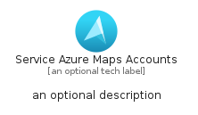
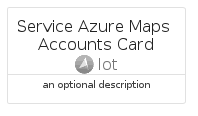

# ServiceAzureMapsAccounts


```text
azure-11/Item/Iot/ServiceAzureMapsAccounts
```

```text
include('azure-11/Item/Iot/ServiceAzureMapsAccounts')
```


| Illustration | ServiceAzureMapsAccounts | ServiceAzureMapsAccountsCard | ServiceAzureMapsAccountsGroup |
| :---: | :---: | :---: | :---: |
|  |  |  |  |


## Sprites
The item provides the following sriptes:

- `<$ServiceAzureMapsAccountsXs>`
- `<$ServiceAzureMapsAccountsSm>`
- `<$ServiceAzureMapsAccountsMd>`
- `<$ServiceAzureMapsAccountsLg>`


## ServiceAzureMapsAccounts

### Load remotely
```plantuml
@startuml
' configures the library
!global $LIB_BASE_LOCATION="https://raw.githubusercontent.com/tmorin/plantuml-libs/master/distribution"

' loads the library's bootstrap
!include $LIB_BASE_LOCATION/bootstrap.puml

' loads the package bootstrap
include('azure-11/bootstrap')

' loads the Item which embeds the element ServiceAzureMapsAccounts
include('azure-11/Item/Iot/ServiceAzureMapsAccounts')

' renders the element
ServiceAzureMapsAccounts('ServiceAzureMapsAccounts', 'Service Azure Maps Accounts', 'an optional tech label', 'an optional description')
@enduml
```

### Load locally
```plantuml
@startuml
' configures the library
!global $INCLUSION_MODE="local"
!global $LIB_BASE_LOCATION="../../.."

' loads the library's bootstrap
!include $LIB_BASE_LOCATION/bootstrap.puml

' loads the package bootstrap
include('azure-11/bootstrap')

' loads the Item which embeds the element ServiceAzureMapsAccounts
include('azure-11/Item/Iot/ServiceAzureMapsAccounts')

' renders the element
ServiceAzureMapsAccounts('ServiceAzureMapsAccounts', 'Service Azure Maps Accounts', 'an optional tech label', 'an optional description')
@enduml
```

## ServiceAzureMapsAccountsCard

### Load remotely
```plantuml
@startuml
' configures the library
!global $LIB_BASE_LOCATION="https://raw.githubusercontent.com/tmorin/plantuml-libs/master/distribution"

' loads the library's bootstrap
!include $LIB_BASE_LOCATION/bootstrap.puml

' loads the package bootstrap
include('azure-11/bootstrap')

' loads the Item which embeds the element ServiceAzureMapsAccountsCard
include('azure-11/Item/Iot/ServiceAzureMapsAccounts')

' renders the element
ServiceAzureMapsAccountsCard('ServiceAzureMapsAccountsCard', 'Service Azure Maps Accounts Card', 'an optional description')
@enduml
```

### Load locally
```plantuml
@startuml
' configures the library
!global $INCLUSION_MODE="local"
!global $LIB_BASE_LOCATION="../../.."

' loads the library's bootstrap
!include $LIB_BASE_LOCATION/bootstrap.puml

' loads the package bootstrap
include('azure-11/bootstrap')

' loads the Item which embeds the element ServiceAzureMapsAccountsCard
include('azure-11/Item/Iot/ServiceAzureMapsAccounts')

' renders the element
ServiceAzureMapsAccountsCard('ServiceAzureMapsAccountsCard', 'Service Azure Maps Accounts Card', 'an optional description')
@enduml
```

## ServiceAzureMapsAccountsGroup

### Load remotely
```plantuml
@startuml
' configures the library
!global $LIB_BASE_LOCATION="https://raw.githubusercontent.com/tmorin/plantuml-libs/master/distribution"

' loads the library's bootstrap
!include $LIB_BASE_LOCATION/bootstrap.puml

' loads the package bootstrap
include('azure-11/bootstrap')

' loads the Item which embeds the element ServiceAzureMapsAccountsGroup
include('azure-11/Item/Iot/ServiceAzureMapsAccounts')

' renders the element
ServiceAzureMapsAccountsGroup('ServiceAzureMapsAccountsGroup', 'Service Azure Maps Accounts Group', 'an optional tech label') {
    note as note
        the content of the group
    end note
}
@enduml
```

### Load locally
```plantuml
@startuml
' configures the library
!global $INCLUSION_MODE="local"
!global $LIB_BASE_LOCATION="../../.."

' loads the library's bootstrap
!include $LIB_BASE_LOCATION/bootstrap.puml

' loads the package bootstrap
include('azure-11/bootstrap')

' loads the Item which embeds the element ServiceAzureMapsAccountsGroup
include('azure-11/Item/Iot/ServiceAzureMapsAccounts')

' renders the element
ServiceAzureMapsAccountsGroup('ServiceAzureMapsAccountsGroup', 'Service Azure Maps Accounts Group', 'an optional tech label') {
    note as note
        the content of the group
    end note
}
@enduml
```

