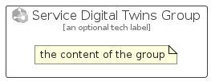

# ServiceDigitalTwins


```text
azure-11/Item/Iot/ServiceDigitalTwins
```

```text
include('azure-11/Item/Iot/ServiceDigitalTwins')
```


| Illustration | ServiceDigitalTwins | ServiceDigitalTwinsCard | ServiceDigitalTwinsGroup |
| :---: | :---: | :---: | :---: |
|  |  |  |  |


## ServiceDigitalTwins

### Load remotely
```plantuml
@startuml
' configures the library
!global $LIB_BASE_LOCATION="https://raw.githubusercontent.com/tmorin/plantuml-libs/master/distribution"

' loads the library's bootstrap
!include $LIB_BASE_LOCATION/bootstrap.puml

' loads the package bootstrap
include('azure-11/bootstrap')

' loads the Item which embeds the element ServiceDigitalTwins
include('azure-11/Item/Iot/ServiceDigitalTwins')

' renders the element
ServiceDigitalTwins('ServiceDigitalTwins', 'Service Digital Twins', 'an optional tech label', 'an optional description')
@enduml
```

### Load locally
```plantuml
@startuml
' configures the library
!global $INCLUSION_MODE="local"
!global $LIB_BASE_LOCATION="../../.."

' loads the library's bootstrap
!include $LIB_BASE_LOCATION/bootstrap.puml

' loads the package bootstrap
include('azure-11/bootstrap')

' loads the Item which embeds the element ServiceDigitalTwins
include('azure-11/Item/Iot/ServiceDigitalTwins')

' renders the element
ServiceDigitalTwins('ServiceDigitalTwins', 'Service Digital Twins', 'an optional tech label', 'an optional description')
@enduml
```

## ServiceDigitalTwinsCard

### Load remotely
```plantuml
@startuml
' configures the library
!global $LIB_BASE_LOCATION="https://raw.githubusercontent.com/tmorin/plantuml-libs/master/distribution"

' loads the library's bootstrap
!include $LIB_BASE_LOCATION/bootstrap.puml

' loads the package bootstrap
include('azure-11/bootstrap')

' loads the Item which embeds the element ServiceDigitalTwinsCard
include('azure-11/Item/Iot/ServiceDigitalTwins')

' renders the element
ServiceDigitalTwinsCard('ServiceDigitalTwinsCard', 'Service Digital Twins Card', 'an optional description')
@enduml
```

### Load locally
```plantuml
@startuml
' configures the library
!global $INCLUSION_MODE="local"
!global $LIB_BASE_LOCATION="../../.."

' loads the library's bootstrap
!include $LIB_BASE_LOCATION/bootstrap.puml

' loads the package bootstrap
include('azure-11/bootstrap')

' loads the Item which embeds the element ServiceDigitalTwinsCard
include('azure-11/Item/Iot/ServiceDigitalTwins')

' renders the element
ServiceDigitalTwinsCard('ServiceDigitalTwinsCard', 'Service Digital Twins Card', 'an optional description')
@enduml
```

## ServiceDigitalTwinsGroup

### Load remotely
```plantuml
@startuml
' configures the library
!global $LIB_BASE_LOCATION="https://raw.githubusercontent.com/tmorin/plantuml-libs/master/distribution"

' loads the library's bootstrap
!include $LIB_BASE_LOCATION/bootstrap.puml

' loads the package bootstrap
include('azure-11/bootstrap')

' loads the Item which embeds the element ServiceDigitalTwinsGroup
include('azure-11/Item/Iot/ServiceDigitalTwins')

' renders the element
ServiceDigitalTwinsGroup('ServiceDigitalTwinsGroup', 'Service Digital Twins Group', 'an optional tech label') {
    note as note
        the content of the group
    end note
}
@enduml
```

### Load locally
```plantuml
@startuml
' configures the library
!global $INCLUSION_MODE="local"
!global $LIB_BASE_LOCATION="../../.."

' loads the library's bootstrap
!include $LIB_BASE_LOCATION/bootstrap.puml

' loads the package bootstrap
include('azure-11/bootstrap')

' loads the Item which embeds the element ServiceDigitalTwinsGroup
include('azure-11/Item/Iot/ServiceDigitalTwins')

' renders the element
ServiceDigitalTwinsGroup('ServiceDigitalTwinsGroup', 'Service Digital Twins Group', 'an optional tech label') {
    note as note
        the content of the group
    end note
}
@enduml
```

