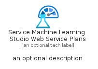
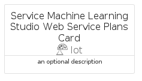

# ServiceMachineLearningStudioWebServicePlans


```text
azure-11/Item/Iot/ServiceMachineLearningStudioWebServicePlans
```

```text
include('azure-11/Item/Iot/ServiceMachineLearningStudioWebServicePlans')
```


| Illustration | ServiceMachineLearningStudioWebServicePlans | ServiceMachineLearningStudioWebServicePlansCard | ServiceMachineLearningStudioWebServicePlansGroup |
| :---: | :---: | :---: | :---: |
|  |  |  |  |


## Sprites
The item provides the following sriptes:

- `<$ServiceMachineLearningStudioWebServicePlansXs>`
- `<$ServiceMachineLearningStudioWebServicePlansSm>`
- `<$ServiceMachineLearningStudioWebServicePlansMd>`
- `<$ServiceMachineLearningStudioWebServicePlansLg>`


## ServiceMachineLearningStudioWebServicePlans

### Load remotely
```plantuml
@startuml
' configures the library
!global $LIB_BASE_LOCATION="https://raw.githubusercontent.com/tmorin/plantuml-libs/master/distribution"

' loads the library's bootstrap
!include $LIB_BASE_LOCATION/bootstrap.puml

' loads the package bootstrap
include('azure-11/bootstrap')

' loads the Item which embeds the element ServiceMachineLearningStudioWebServicePlans
include('azure-11/Item/Iot/ServiceMachineLearningStudioWebServicePlans')

' renders the element
ServiceMachineLearningStudioWebServicePlans('ServiceMachineLearningStudioWebServicePlans', 'Service Machine Learning Studio Web Service Plans', 'an optional tech label', 'an optional description')
@enduml
```

### Load locally
```plantuml
@startuml
' configures the library
!global $INCLUSION_MODE="local"
!global $LIB_BASE_LOCATION="../../.."

' loads the library's bootstrap
!include $LIB_BASE_LOCATION/bootstrap.puml

' loads the package bootstrap
include('azure-11/bootstrap')

' loads the Item which embeds the element ServiceMachineLearningStudioWebServicePlans
include('azure-11/Item/Iot/ServiceMachineLearningStudioWebServicePlans')

' renders the element
ServiceMachineLearningStudioWebServicePlans('ServiceMachineLearningStudioWebServicePlans', 'Service Machine Learning Studio Web Service Plans', 'an optional tech label', 'an optional description')
@enduml
```

## ServiceMachineLearningStudioWebServicePlansCard

### Load remotely
```plantuml
@startuml
' configures the library
!global $LIB_BASE_LOCATION="https://raw.githubusercontent.com/tmorin/plantuml-libs/master/distribution"

' loads the library's bootstrap
!include $LIB_BASE_LOCATION/bootstrap.puml

' loads the package bootstrap
include('azure-11/bootstrap')

' loads the Item which embeds the element ServiceMachineLearningStudioWebServicePlansCard
include('azure-11/Item/Iot/ServiceMachineLearningStudioWebServicePlans')

' renders the element
ServiceMachineLearningStudioWebServicePlansCard('ServiceMachineLearningStudioWebServicePlansCard', 'Service Machine Learning Studio Web Service Plans Card', 'an optional description')
@enduml
```

### Load locally
```plantuml
@startuml
' configures the library
!global $INCLUSION_MODE="local"
!global $LIB_BASE_LOCATION="../../.."

' loads the library's bootstrap
!include $LIB_BASE_LOCATION/bootstrap.puml

' loads the package bootstrap
include('azure-11/bootstrap')

' loads the Item which embeds the element ServiceMachineLearningStudioWebServicePlansCard
include('azure-11/Item/Iot/ServiceMachineLearningStudioWebServicePlans')

' renders the element
ServiceMachineLearningStudioWebServicePlansCard('ServiceMachineLearningStudioWebServicePlansCard', 'Service Machine Learning Studio Web Service Plans Card', 'an optional description')
@enduml
```

## ServiceMachineLearningStudioWebServicePlansGroup

### Load remotely
```plantuml
@startuml
' configures the library
!global $LIB_BASE_LOCATION="https://raw.githubusercontent.com/tmorin/plantuml-libs/master/distribution"

' loads the library's bootstrap
!include $LIB_BASE_LOCATION/bootstrap.puml

' loads the package bootstrap
include('azure-11/bootstrap')

' loads the Item which embeds the element ServiceMachineLearningStudioWebServicePlansGroup
include('azure-11/Item/Iot/ServiceMachineLearningStudioWebServicePlans')

' renders the element
ServiceMachineLearningStudioWebServicePlansGroup('ServiceMachineLearningStudioWebServicePlansGroup', 'Service Machine Learning Studio Web Service Plans Group', 'an optional tech label') {
    note as note
        the content of the group
    end note
}
@enduml
```

### Load locally
```plantuml
@startuml
' configures the library
!global $INCLUSION_MODE="local"
!global $LIB_BASE_LOCATION="../../.."

' loads the library's bootstrap
!include $LIB_BASE_LOCATION/bootstrap.puml

' loads the package bootstrap
include('azure-11/bootstrap')

' loads the Item which embeds the element ServiceMachineLearningStudioWebServicePlansGroup
include('azure-11/Item/Iot/ServiceMachineLearningStudioWebServicePlans')

' renders the element
ServiceMachineLearningStudioWebServicePlansGroup('ServiceMachineLearningStudioWebServicePlansGroup', 'Service Machine Learning Studio Web Service Plans Group', 'an optional tech label') {
    note as note
        the content of the group
    end note
}
@enduml
```

