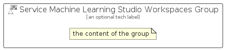

# ServiceMachineLearningStudioWorkspaces


```text
azure-11/Item/Iot/ServiceMachineLearningStudioWorkspaces
```

```text
include('azure-11/Item/Iot/ServiceMachineLearningStudioWorkspaces')
```


| Illustration | ServiceMachineLearningStudioWorkspaces | ServiceMachineLearningStudioWorkspacesCard | ServiceMachineLearningStudioWorkspacesGroup |
| :---: | :---: | :---: | :---: |
|  |  |  |  |


## ServiceMachineLearningStudioWorkspaces

### Load remotely
```plantuml
@startuml
' configures the library
!global $LIB_BASE_LOCATION="https://raw.githubusercontent.com/tmorin/plantuml-libs/master/distribution"

' loads the library's bootstrap
!include $LIB_BASE_LOCATION/bootstrap.puml

' loads the package bootstrap
include('azure-11/bootstrap')

' loads the Item which embeds the element ServiceMachineLearningStudioWorkspaces
include('azure-11/Item/Iot/ServiceMachineLearningStudioWorkspaces')

' renders the element
ServiceMachineLearningStudioWorkspaces('ServiceMachineLearningStudioWorkspaces', 'Service Machine Learning Studio Workspaces', 'an optional tech label', 'an optional description')
@enduml
```

### Load locally
```plantuml
@startuml
' configures the library
!global $INCLUSION_MODE="local"
!global $LIB_BASE_LOCATION="../../.."

' loads the library's bootstrap
!include $LIB_BASE_LOCATION/bootstrap.puml

' loads the package bootstrap
include('azure-11/bootstrap')

' loads the Item which embeds the element ServiceMachineLearningStudioWorkspaces
include('azure-11/Item/Iot/ServiceMachineLearningStudioWorkspaces')

' renders the element
ServiceMachineLearningStudioWorkspaces('ServiceMachineLearningStudioWorkspaces', 'Service Machine Learning Studio Workspaces', 'an optional tech label', 'an optional description')
@enduml
```

## ServiceMachineLearningStudioWorkspacesCard

### Load remotely
```plantuml
@startuml
' configures the library
!global $LIB_BASE_LOCATION="https://raw.githubusercontent.com/tmorin/plantuml-libs/master/distribution"

' loads the library's bootstrap
!include $LIB_BASE_LOCATION/bootstrap.puml

' loads the package bootstrap
include('azure-11/bootstrap')

' loads the Item which embeds the element ServiceMachineLearningStudioWorkspacesCard
include('azure-11/Item/Iot/ServiceMachineLearningStudioWorkspaces')

' renders the element
ServiceMachineLearningStudioWorkspacesCard('ServiceMachineLearningStudioWorkspacesCard', 'Service Machine Learning Studio Workspaces Card', 'an optional description')
@enduml
```

### Load locally
```plantuml
@startuml
' configures the library
!global $INCLUSION_MODE="local"
!global $LIB_BASE_LOCATION="../../.."

' loads the library's bootstrap
!include $LIB_BASE_LOCATION/bootstrap.puml

' loads the package bootstrap
include('azure-11/bootstrap')

' loads the Item which embeds the element ServiceMachineLearningStudioWorkspacesCard
include('azure-11/Item/Iot/ServiceMachineLearningStudioWorkspaces')

' renders the element
ServiceMachineLearningStudioWorkspacesCard('ServiceMachineLearningStudioWorkspacesCard', 'Service Machine Learning Studio Workspaces Card', 'an optional description')
@enduml
```

## ServiceMachineLearningStudioWorkspacesGroup

### Load remotely
```plantuml
@startuml
' configures the library
!global $LIB_BASE_LOCATION="https://raw.githubusercontent.com/tmorin/plantuml-libs/master/distribution"

' loads the library's bootstrap
!include $LIB_BASE_LOCATION/bootstrap.puml

' loads the package bootstrap
include('azure-11/bootstrap')

' loads the Item which embeds the element ServiceMachineLearningStudioWorkspacesGroup
include('azure-11/Item/Iot/ServiceMachineLearningStudioWorkspaces')

' renders the element
ServiceMachineLearningStudioWorkspacesGroup('ServiceMachineLearningStudioWorkspacesGroup', 'Service Machine Learning Studio Workspaces Group', 'an optional tech label') {
    note as note
        the content of the group
    end note
}
@enduml
```

### Load locally
```plantuml
@startuml
' configures the library
!global $INCLUSION_MODE="local"
!global $LIB_BASE_LOCATION="../../.."

' loads the library's bootstrap
!include $LIB_BASE_LOCATION/bootstrap.puml

' loads the package bootstrap
include('azure-11/bootstrap')

' loads the Item which embeds the element ServiceMachineLearningStudioWorkspacesGroup
include('azure-11/Item/Iot/ServiceMachineLearningStudioWorkspaces')

' renders the element
ServiceMachineLearningStudioWorkspacesGroup('ServiceMachineLearningStudioWorkspacesGroup', 'Service Machine Learning Studio Workspaces Group', 'an optional tech label') {
    note as note
        the content of the group
    end note
}
@enduml
```

