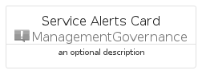
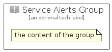

# ServiceAlerts


```text
azure-11/Item/ManagementGovernance/ServiceAlerts
```

```text
include('azure-11/Item/ManagementGovernance/ServiceAlerts')
```


| Illustration | ServiceAlerts | ServiceAlertsCard | ServiceAlertsGroup |
| :---: | :---: | :---: | :---: |
|  |  |  |  |


## Sprites
The item provides the following sriptes:

- `<$ServiceAlertsXs>`
- `<$ServiceAlertsSm>`
- `<$ServiceAlertsMd>`
- `<$ServiceAlertsLg>`


## ServiceAlerts

### Load remotely
```plantuml
@startuml
' configures the library
!global $LIB_BASE_LOCATION="https://raw.githubusercontent.com/tmorin/plantuml-libs/master/distribution"

' loads the library's bootstrap
!include $LIB_BASE_LOCATION/bootstrap.puml

' loads the package bootstrap
include('azure-11/bootstrap')

' loads the Item which embeds the element ServiceAlerts
include('azure-11/Item/ManagementGovernance/ServiceAlerts')

' renders the element
ServiceAlerts('ServiceAlerts', 'Service Alerts', 'an optional tech label', 'an optional description')
@enduml
```

### Load locally
```plantuml
@startuml
' configures the library
!global $INCLUSION_MODE="local"
!global $LIB_BASE_LOCATION="../../.."

' loads the library's bootstrap
!include $LIB_BASE_LOCATION/bootstrap.puml

' loads the package bootstrap
include('azure-11/bootstrap')

' loads the Item which embeds the element ServiceAlerts
include('azure-11/Item/ManagementGovernance/ServiceAlerts')

' renders the element
ServiceAlerts('ServiceAlerts', 'Service Alerts', 'an optional tech label', 'an optional description')
@enduml
```

## ServiceAlertsCard

### Load remotely
```plantuml
@startuml
' configures the library
!global $LIB_BASE_LOCATION="https://raw.githubusercontent.com/tmorin/plantuml-libs/master/distribution"

' loads the library's bootstrap
!include $LIB_BASE_LOCATION/bootstrap.puml

' loads the package bootstrap
include('azure-11/bootstrap')

' loads the Item which embeds the element ServiceAlertsCard
include('azure-11/Item/ManagementGovernance/ServiceAlerts')

' renders the element
ServiceAlertsCard('ServiceAlertsCard', 'Service Alerts Card', 'an optional description')
@enduml
```

### Load locally
```plantuml
@startuml
' configures the library
!global $INCLUSION_MODE="local"
!global $LIB_BASE_LOCATION="../../.."

' loads the library's bootstrap
!include $LIB_BASE_LOCATION/bootstrap.puml

' loads the package bootstrap
include('azure-11/bootstrap')

' loads the Item which embeds the element ServiceAlertsCard
include('azure-11/Item/ManagementGovernance/ServiceAlerts')

' renders the element
ServiceAlertsCard('ServiceAlertsCard', 'Service Alerts Card', 'an optional description')
@enduml
```

## ServiceAlertsGroup

### Load remotely
```plantuml
@startuml
' configures the library
!global $LIB_BASE_LOCATION="https://raw.githubusercontent.com/tmorin/plantuml-libs/master/distribution"

' loads the library's bootstrap
!include $LIB_BASE_LOCATION/bootstrap.puml

' loads the package bootstrap
include('azure-11/bootstrap')

' loads the Item which embeds the element ServiceAlertsGroup
include('azure-11/Item/ManagementGovernance/ServiceAlerts')

' renders the element
ServiceAlertsGroup('ServiceAlertsGroup', 'Service Alerts Group', 'an optional tech label') {
    note as note
        the content of the group
    end note
}
@enduml
```

### Load locally
```plantuml
@startuml
' configures the library
!global $INCLUSION_MODE="local"
!global $LIB_BASE_LOCATION="../../.."

' loads the library's bootstrap
!include $LIB_BASE_LOCATION/bootstrap.puml

' loads the package bootstrap
include('azure-11/bootstrap')

' loads the Item which embeds the element ServiceAlertsGroup
include('azure-11/Item/ManagementGovernance/ServiceAlerts')

' renders the element
ServiceAlertsGroup('ServiceAlertsGroup', 'Service Alerts Group', 'an optional tech label') {
    note as note
        the content of the group
    end note
}
@enduml
```

