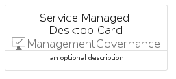
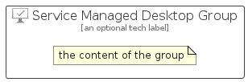

# ServiceManagedDesktop


```text
azure-11/Item/ManagementGovernance/ServiceManagedDesktop
```

```text
include('azure-11/Item/ManagementGovernance/ServiceManagedDesktop')
```


| Illustration | ServiceManagedDesktop | ServiceManagedDesktopCard | ServiceManagedDesktopGroup |
| :---: | :---: | :---: | :---: |
|  |  |  |  |


## Sprites
The item provides the following sriptes:

- `<$ServiceManagedDesktopXs>`
- `<$ServiceManagedDesktopSm>`
- `<$ServiceManagedDesktopMd>`
- `<$ServiceManagedDesktopLg>`


## ServiceManagedDesktop

### Load remotely
```plantuml
@startuml
' configures the library
!global $LIB_BASE_LOCATION="https://raw.githubusercontent.com/tmorin/plantuml-libs/master/distribution"

' loads the library's bootstrap
!include $LIB_BASE_LOCATION/bootstrap.puml

' loads the package bootstrap
include('azure-11/bootstrap')

' loads the Item which embeds the element ServiceManagedDesktop
include('azure-11/Item/ManagementGovernance/ServiceManagedDesktop')

' renders the element
ServiceManagedDesktop('ServiceManagedDesktop', 'Service Managed Desktop', 'an optional tech label', 'an optional description')
@enduml
```

### Load locally
```plantuml
@startuml
' configures the library
!global $INCLUSION_MODE="local"
!global $LIB_BASE_LOCATION="../../.."

' loads the library's bootstrap
!include $LIB_BASE_LOCATION/bootstrap.puml

' loads the package bootstrap
include('azure-11/bootstrap')

' loads the Item which embeds the element ServiceManagedDesktop
include('azure-11/Item/ManagementGovernance/ServiceManagedDesktop')

' renders the element
ServiceManagedDesktop('ServiceManagedDesktop', 'Service Managed Desktop', 'an optional tech label', 'an optional description')
@enduml
```

## ServiceManagedDesktopCard

### Load remotely
```plantuml
@startuml
' configures the library
!global $LIB_BASE_LOCATION="https://raw.githubusercontent.com/tmorin/plantuml-libs/master/distribution"

' loads the library's bootstrap
!include $LIB_BASE_LOCATION/bootstrap.puml

' loads the package bootstrap
include('azure-11/bootstrap')

' loads the Item which embeds the element ServiceManagedDesktopCard
include('azure-11/Item/ManagementGovernance/ServiceManagedDesktop')

' renders the element
ServiceManagedDesktopCard('ServiceManagedDesktopCard', 'Service Managed Desktop Card', 'an optional description')
@enduml
```

### Load locally
```plantuml
@startuml
' configures the library
!global $INCLUSION_MODE="local"
!global $LIB_BASE_LOCATION="../../.."

' loads the library's bootstrap
!include $LIB_BASE_LOCATION/bootstrap.puml

' loads the package bootstrap
include('azure-11/bootstrap')

' loads the Item which embeds the element ServiceManagedDesktopCard
include('azure-11/Item/ManagementGovernance/ServiceManagedDesktop')

' renders the element
ServiceManagedDesktopCard('ServiceManagedDesktopCard', 'Service Managed Desktop Card', 'an optional description')
@enduml
```

## ServiceManagedDesktopGroup

### Load remotely
```plantuml
@startuml
' configures the library
!global $LIB_BASE_LOCATION="https://raw.githubusercontent.com/tmorin/plantuml-libs/master/distribution"

' loads the library's bootstrap
!include $LIB_BASE_LOCATION/bootstrap.puml

' loads the package bootstrap
include('azure-11/bootstrap')

' loads the Item which embeds the element ServiceManagedDesktopGroup
include('azure-11/Item/ManagementGovernance/ServiceManagedDesktop')

' renders the element
ServiceManagedDesktopGroup('ServiceManagedDesktopGroup', 'Service Managed Desktop Group', 'an optional tech label') {
    note as note
        the content of the group
    end note
}
@enduml
```

### Load locally
```plantuml
@startuml
' configures the library
!global $INCLUSION_MODE="local"
!global $LIB_BASE_LOCATION="../../.."

' loads the library's bootstrap
!include $LIB_BASE_LOCATION/bootstrap.puml

' loads the package bootstrap
include('azure-11/bootstrap')

' loads the Item which embeds the element ServiceManagedDesktopGroup
include('azure-11/Item/ManagementGovernance/ServiceManagedDesktop')

' renders the element
ServiceManagedDesktopGroup('ServiceManagedDesktopGroup', 'Service Managed Desktop Group', 'an optional tech label') {
    note as note
        the content of the group
    end note
}
@enduml
```

