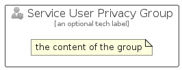

# ServiceUserPrivacy


```text
azure-11/Item/ManagementGovernance/ServiceUserPrivacy
```

```text
include('azure-11/Item/ManagementGovernance/ServiceUserPrivacy')
```


| Illustration | ServiceUserPrivacy | ServiceUserPrivacyCard | ServiceUserPrivacyGroup |
| :---: | :---: | :---: | :---: |
|  |  |  |  |


## Sprites
The item provides the following sriptes:

- `<$ServiceUserPrivacyXs>`
- `<$ServiceUserPrivacySm>`
- `<$ServiceUserPrivacyMd>`
- `<$ServiceUserPrivacyLg>`


## ServiceUserPrivacy

### Load remotely
```plantuml
@startuml
' configures the library
!global $LIB_BASE_LOCATION="https://raw.githubusercontent.com/tmorin/plantuml-libs/master/distribution"

' loads the library's bootstrap
!include $LIB_BASE_LOCATION/bootstrap.puml

' loads the package bootstrap
include('azure-11/bootstrap')

' loads the Item which embeds the element ServiceUserPrivacy
include('azure-11/Item/ManagementGovernance/ServiceUserPrivacy')

' renders the element
ServiceUserPrivacy('ServiceUserPrivacy', 'Service User Privacy', 'an optional tech label', 'an optional description')
@enduml
```

### Load locally
```plantuml
@startuml
' configures the library
!global $INCLUSION_MODE="local"
!global $LIB_BASE_LOCATION="../../.."

' loads the library's bootstrap
!include $LIB_BASE_LOCATION/bootstrap.puml

' loads the package bootstrap
include('azure-11/bootstrap')

' loads the Item which embeds the element ServiceUserPrivacy
include('azure-11/Item/ManagementGovernance/ServiceUserPrivacy')

' renders the element
ServiceUserPrivacy('ServiceUserPrivacy', 'Service User Privacy', 'an optional tech label', 'an optional description')
@enduml
```

## ServiceUserPrivacyCard

### Load remotely
```plantuml
@startuml
' configures the library
!global $LIB_BASE_LOCATION="https://raw.githubusercontent.com/tmorin/plantuml-libs/master/distribution"

' loads the library's bootstrap
!include $LIB_BASE_LOCATION/bootstrap.puml

' loads the package bootstrap
include('azure-11/bootstrap')

' loads the Item which embeds the element ServiceUserPrivacyCard
include('azure-11/Item/ManagementGovernance/ServiceUserPrivacy')

' renders the element
ServiceUserPrivacyCard('ServiceUserPrivacyCard', 'Service User Privacy Card', 'an optional description')
@enduml
```

### Load locally
```plantuml
@startuml
' configures the library
!global $INCLUSION_MODE="local"
!global $LIB_BASE_LOCATION="../../.."

' loads the library's bootstrap
!include $LIB_BASE_LOCATION/bootstrap.puml

' loads the package bootstrap
include('azure-11/bootstrap')

' loads the Item which embeds the element ServiceUserPrivacyCard
include('azure-11/Item/ManagementGovernance/ServiceUserPrivacy')

' renders the element
ServiceUserPrivacyCard('ServiceUserPrivacyCard', 'Service User Privacy Card', 'an optional description')
@enduml
```

## ServiceUserPrivacyGroup

### Load remotely
```plantuml
@startuml
' configures the library
!global $LIB_BASE_LOCATION="https://raw.githubusercontent.com/tmorin/plantuml-libs/master/distribution"

' loads the library's bootstrap
!include $LIB_BASE_LOCATION/bootstrap.puml

' loads the package bootstrap
include('azure-11/bootstrap')

' loads the Item which embeds the element ServiceUserPrivacyGroup
include('azure-11/Item/ManagementGovernance/ServiceUserPrivacy')

' renders the element
ServiceUserPrivacyGroup('ServiceUserPrivacyGroup', 'Service User Privacy Group', 'an optional tech label') {
    note as note
        the content of the group
    end note
}
@enduml
```

### Load locally
```plantuml
@startuml
' configures the library
!global $INCLUSION_MODE="local"
!global $LIB_BASE_LOCATION="../../.."

' loads the library's bootstrap
!include $LIB_BASE_LOCATION/bootstrap.puml

' loads the package bootstrap
include('azure-11/bootstrap')

' loads the Item which embeds the element ServiceUserPrivacyGroup
include('azure-11/Item/ManagementGovernance/ServiceUserPrivacy')

' renders the element
ServiceUserPrivacyGroup('ServiceUserPrivacyGroup', 'Service User Privacy Group', 'an optional tech label') {
    note as note
        the content of the group
    end note
}
@enduml
```

