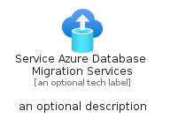

# ServiceAzureDatabaseMigrationServices


```text
azure-11/Item/Migration/ServiceAzureDatabaseMigrationServices
```

```text
include('azure-11/Item/Migration/ServiceAzureDatabaseMigrationServices')
```


| Illustration | ServiceAzureDatabaseMigrationServices | ServiceAzureDatabaseMigrationServicesCard | ServiceAzureDatabaseMigrationServicesGroup |
| :---: | :---: | :---: | :---: |
|  |  |  |  |


## ServiceAzureDatabaseMigrationServices

### Load remotely
```plantuml
@startuml
' configures the library
!global $LIB_BASE_LOCATION="https://raw.githubusercontent.com/tmorin/plantuml-libs/master/distribution"

' loads the library's bootstrap
!include $LIB_BASE_LOCATION/bootstrap.puml

' loads the package bootstrap
include('azure-11/bootstrap')

' loads the Item which embeds the element ServiceAzureDatabaseMigrationServices
include('azure-11/Item/Migration/ServiceAzureDatabaseMigrationServices')

' renders the element
ServiceAzureDatabaseMigrationServices('ServiceAzureDatabaseMigrationServices', 'Service Azure Database Migration Services', 'an optional tech label', 'an optional description')
@enduml
```

### Load locally
```plantuml
@startuml
' configures the library
!global $INCLUSION_MODE="local"
!global $LIB_BASE_LOCATION="../../.."

' loads the library's bootstrap
!include $LIB_BASE_LOCATION/bootstrap.puml

' loads the package bootstrap
include('azure-11/bootstrap')

' loads the Item which embeds the element ServiceAzureDatabaseMigrationServices
include('azure-11/Item/Migration/ServiceAzureDatabaseMigrationServices')

' renders the element
ServiceAzureDatabaseMigrationServices('ServiceAzureDatabaseMigrationServices', 'Service Azure Database Migration Services', 'an optional tech label', 'an optional description')
@enduml
```

## ServiceAzureDatabaseMigrationServicesCard

### Load remotely
```plantuml
@startuml
' configures the library
!global $LIB_BASE_LOCATION="https://raw.githubusercontent.com/tmorin/plantuml-libs/master/distribution"

' loads the library's bootstrap
!include $LIB_BASE_LOCATION/bootstrap.puml

' loads the package bootstrap
include('azure-11/bootstrap')

' loads the Item which embeds the element ServiceAzureDatabaseMigrationServicesCard
include('azure-11/Item/Migration/ServiceAzureDatabaseMigrationServices')

' renders the element
ServiceAzureDatabaseMigrationServicesCard('ServiceAzureDatabaseMigrationServicesCard', 'Service Azure Database Migration Services Card', 'an optional description')
@enduml
```

### Load locally
```plantuml
@startuml
' configures the library
!global $INCLUSION_MODE="local"
!global $LIB_BASE_LOCATION="../../.."

' loads the library's bootstrap
!include $LIB_BASE_LOCATION/bootstrap.puml

' loads the package bootstrap
include('azure-11/bootstrap')

' loads the Item which embeds the element ServiceAzureDatabaseMigrationServicesCard
include('azure-11/Item/Migration/ServiceAzureDatabaseMigrationServices')

' renders the element
ServiceAzureDatabaseMigrationServicesCard('ServiceAzureDatabaseMigrationServicesCard', 'Service Azure Database Migration Services Card', 'an optional description')
@enduml
```

## ServiceAzureDatabaseMigrationServicesGroup

### Load remotely
```plantuml
@startuml
' configures the library
!global $LIB_BASE_LOCATION="https://raw.githubusercontent.com/tmorin/plantuml-libs/master/distribution"

' loads the library's bootstrap
!include $LIB_BASE_LOCATION/bootstrap.puml

' loads the package bootstrap
include('azure-11/bootstrap')

' loads the Item which embeds the element ServiceAzureDatabaseMigrationServicesGroup
include('azure-11/Item/Migration/ServiceAzureDatabaseMigrationServices')

' renders the element
ServiceAzureDatabaseMigrationServicesGroup('ServiceAzureDatabaseMigrationServicesGroup', 'Service Azure Database Migration Services Group', 'an optional tech label') {
    note as note
        the content of the group
    end note
}
@enduml
```

### Load locally
```plantuml
@startuml
' configures the library
!global $INCLUSION_MODE="local"
!global $LIB_BASE_LOCATION="../../.."

' loads the library's bootstrap
!include $LIB_BASE_LOCATION/bootstrap.puml

' loads the package bootstrap
include('azure-11/bootstrap')

' loads the Item which embeds the element ServiceAzureDatabaseMigrationServicesGroup
include('azure-11/Item/Migration/ServiceAzureDatabaseMigrationServices')

' renders the element
ServiceAzureDatabaseMigrationServicesGroup('ServiceAzureDatabaseMigrationServicesGroup', 'Service Azure Database Migration Services Group', 'an optional tech label') {
    note as note
        the content of the group
    end note
}
@enduml
```

