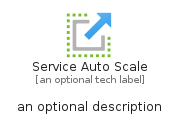
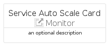
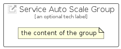

# ServiceAutoScale


```text
azure-11/Item/Monitor/ServiceAutoScale
```

```text
include('azure-11/Item/Monitor/ServiceAutoScale')
```


| Illustration | ServiceAutoScale | ServiceAutoScaleCard | ServiceAutoScaleGroup |
| :---: | :---: | :---: | :---: |
|  |  |  |  |


## Sprites
The item provides the following sriptes:

- `<$ServiceAutoScaleXs>`
- `<$ServiceAutoScaleSm>`
- `<$ServiceAutoScaleMd>`
- `<$ServiceAutoScaleLg>`


## ServiceAutoScale

### Load remotely
```plantuml
@startuml
' configures the library
!global $LIB_BASE_LOCATION="https://raw.githubusercontent.com/tmorin/plantuml-libs/master/distribution"

' loads the library's bootstrap
!include $LIB_BASE_LOCATION/bootstrap.puml

' loads the package bootstrap
include('azure-11/bootstrap')

' loads the Item which embeds the element ServiceAutoScale
include('azure-11/Item/Monitor/ServiceAutoScale')

' renders the element
ServiceAutoScale('ServiceAutoScale', 'Service Auto Scale', 'an optional tech label', 'an optional description')
@enduml
```

### Load locally
```plantuml
@startuml
' configures the library
!global $INCLUSION_MODE="local"
!global $LIB_BASE_LOCATION="../../.."

' loads the library's bootstrap
!include $LIB_BASE_LOCATION/bootstrap.puml

' loads the package bootstrap
include('azure-11/bootstrap')

' loads the Item which embeds the element ServiceAutoScale
include('azure-11/Item/Monitor/ServiceAutoScale')

' renders the element
ServiceAutoScale('ServiceAutoScale', 'Service Auto Scale', 'an optional tech label', 'an optional description')
@enduml
```

## ServiceAutoScaleCard

### Load remotely
```plantuml
@startuml
' configures the library
!global $LIB_BASE_LOCATION="https://raw.githubusercontent.com/tmorin/plantuml-libs/master/distribution"

' loads the library's bootstrap
!include $LIB_BASE_LOCATION/bootstrap.puml

' loads the package bootstrap
include('azure-11/bootstrap')

' loads the Item which embeds the element ServiceAutoScaleCard
include('azure-11/Item/Monitor/ServiceAutoScale')

' renders the element
ServiceAutoScaleCard('ServiceAutoScaleCard', 'Service Auto Scale Card', 'an optional description')
@enduml
```

### Load locally
```plantuml
@startuml
' configures the library
!global $INCLUSION_MODE="local"
!global $LIB_BASE_LOCATION="../../.."

' loads the library's bootstrap
!include $LIB_BASE_LOCATION/bootstrap.puml

' loads the package bootstrap
include('azure-11/bootstrap')

' loads the Item which embeds the element ServiceAutoScaleCard
include('azure-11/Item/Monitor/ServiceAutoScale')

' renders the element
ServiceAutoScaleCard('ServiceAutoScaleCard', 'Service Auto Scale Card', 'an optional description')
@enduml
```

## ServiceAutoScaleGroup

### Load remotely
```plantuml
@startuml
' configures the library
!global $LIB_BASE_LOCATION="https://raw.githubusercontent.com/tmorin/plantuml-libs/master/distribution"

' loads the library's bootstrap
!include $LIB_BASE_LOCATION/bootstrap.puml

' loads the package bootstrap
include('azure-11/bootstrap')

' loads the Item which embeds the element ServiceAutoScaleGroup
include('azure-11/Item/Monitor/ServiceAutoScale')

' renders the element
ServiceAutoScaleGroup('ServiceAutoScaleGroup', 'Service Auto Scale Group', 'an optional tech label') {
    note as note
        the content of the group
    end note
}
@enduml
```

### Load locally
```plantuml
@startuml
' configures the library
!global $INCLUSION_MODE="local"
!global $LIB_BASE_LOCATION="../../.."

' loads the library's bootstrap
!include $LIB_BASE_LOCATION/bootstrap.puml

' loads the package bootstrap
include('azure-11/bootstrap')

' loads the Item which embeds the element ServiceAutoScaleGroup
include('azure-11/Item/Monitor/ServiceAutoScale')

' renders the element
ServiceAutoScaleGroup('ServiceAutoScaleGroup', 'Service Auto Scale Group', 'an optional tech label') {
    note as note
        the content of the group
    end note
}
@enduml
```

