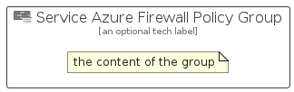

# ServiceAzureFirewallPolicy


```text
azure-11/Item/Networking/ServiceAzureFirewallPolicy
```

```text
include('azure-11/Item/Networking/ServiceAzureFirewallPolicy')
```


| Illustration | ServiceAzureFirewallPolicy | ServiceAzureFirewallPolicyCard | ServiceAzureFirewallPolicyGroup |
| :---: | :---: | :---: | :---: |
|  |  |  |  |


## ServiceAzureFirewallPolicy

### Load remotely
```plantuml
@startuml
' configures the library
!global $LIB_BASE_LOCATION="https://raw.githubusercontent.com/tmorin/plantuml-libs/master/distribution"

' loads the library's bootstrap
!include $LIB_BASE_LOCATION/bootstrap.puml

' loads the package bootstrap
include('azure-11/bootstrap')

' loads the Item which embeds the element ServiceAzureFirewallPolicy
include('azure-11/Item/Networking/ServiceAzureFirewallPolicy')

' renders the element
ServiceAzureFirewallPolicy('ServiceAzureFirewallPolicy', 'Service Azure Firewall Policy', 'an optional tech label', 'an optional description')
@enduml
```

### Load locally
```plantuml
@startuml
' configures the library
!global $INCLUSION_MODE="local"
!global $LIB_BASE_LOCATION="../../.."

' loads the library's bootstrap
!include $LIB_BASE_LOCATION/bootstrap.puml

' loads the package bootstrap
include('azure-11/bootstrap')

' loads the Item which embeds the element ServiceAzureFirewallPolicy
include('azure-11/Item/Networking/ServiceAzureFirewallPolicy')

' renders the element
ServiceAzureFirewallPolicy('ServiceAzureFirewallPolicy', 'Service Azure Firewall Policy', 'an optional tech label', 'an optional description')
@enduml
```

## ServiceAzureFirewallPolicyCard

### Load remotely
```plantuml
@startuml
' configures the library
!global $LIB_BASE_LOCATION="https://raw.githubusercontent.com/tmorin/plantuml-libs/master/distribution"

' loads the library's bootstrap
!include $LIB_BASE_LOCATION/bootstrap.puml

' loads the package bootstrap
include('azure-11/bootstrap')

' loads the Item which embeds the element ServiceAzureFirewallPolicyCard
include('azure-11/Item/Networking/ServiceAzureFirewallPolicy')

' renders the element
ServiceAzureFirewallPolicyCard('ServiceAzureFirewallPolicyCard', 'Service Azure Firewall Policy Card', 'an optional description')
@enduml
```

### Load locally
```plantuml
@startuml
' configures the library
!global $INCLUSION_MODE="local"
!global $LIB_BASE_LOCATION="../../.."

' loads the library's bootstrap
!include $LIB_BASE_LOCATION/bootstrap.puml

' loads the package bootstrap
include('azure-11/bootstrap')

' loads the Item which embeds the element ServiceAzureFirewallPolicyCard
include('azure-11/Item/Networking/ServiceAzureFirewallPolicy')

' renders the element
ServiceAzureFirewallPolicyCard('ServiceAzureFirewallPolicyCard', 'Service Azure Firewall Policy Card', 'an optional description')
@enduml
```

## ServiceAzureFirewallPolicyGroup

### Load remotely
```plantuml
@startuml
' configures the library
!global $LIB_BASE_LOCATION="https://raw.githubusercontent.com/tmorin/plantuml-libs/master/distribution"

' loads the library's bootstrap
!include $LIB_BASE_LOCATION/bootstrap.puml

' loads the package bootstrap
include('azure-11/bootstrap')

' loads the Item which embeds the element ServiceAzureFirewallPolicyGroup
include('azure-11/Item/Networking/ServiceAzureFirewallPolicy')

' renders the element
ServiceAzureFirewallPolicyGroup('ServiceAzureFirewallPolicyGroup', 'Service Azure Firewall Policy Group', 'an optional tech label') {
    note as note
        the content of the group
    end note
}
@enduml
```

### Load locally
```plantuml
@startuml
' configures the library
!global $INCLUSION_MODE="local"
!global $LIB_BASE_LOCATION="../../.."

' loads the library's bootstrap
!include $LIB_BASE_LOCATION/bootstrap.puml

' loads the package bootstrap
include('azure-11/bootstrap')

' loads the Item which embeds the element ServiceAzureFirewallPolicyGroup
include('azure-11/Item/Networking/ServiceAzureFirewallPolicy')

' renders the element
ServiceAzureFirewallPolicyGroup('ServiceAzureFirewallPolicyGroup', 'Service Azure Firewall Policy Group', 'an optional tech label') {
    note as note
        the content of the group
    end note
}
@enduml
```

