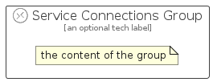

# ServiceConnections


```text
azure-11/Item/Networking/ServiceConnections
```

```text
include('azure-11/Item/Networking/ServiceConnections')
```


| Illustration | ServiceConnections | ServiceConnectionsCard | ServiceConnectionsGroup |
| :---: | :---: | :---: | :---: |
|  |  |  |  |


## Sprites
The item provides the following sriptes:

- `<$ServiceConnectionsXs>`
- `<$ServiceConnectionsSm>`
- `<$ServiceConnectionsMd>`
- `<$ServiceConnectionsLg>`


## ServiceConnections

### Load remotely
```plantuml
@startuml
' configures the library
!global $LIB_BASE_LOCATION="https://raw.githubusercontent.com/tmorin/plantuml-libs/master/distribution"

' loads the library's bootstrap
!include $LIB_BASE_LOCATION/bootstrap.puml

' loads the package bootstrap
include('azure-11/bootstrap')

' loads the Item which embeds the element ServiceConnections
include('azure-11/Item/Networking/ServiceConnections')

' renders the element
ServiceConnections('ServiceConnections', 'Service Connections', 'an optional tech label', 'an optional description')
@enduml
```

### Load locally
```plantuml
@startuml
' configures the library
!global $INCLUSION_MODE="local"
!global $LIB_BASE_LOCATION="../../.."

' loads the library's bootstrap
!include $LIB_BASE_LOCATION/bootstrap.puml

' loads the package bootstrap
include('azure-11/bootstrap')

' loads the Item which embeds the element ServiceConnections
include('azure-11/Item/Networking/ServiceConnections')

' renders the element
ServiceConnections('ServiceConnections', 'Service Connections', 'an optional tech label', 'an optional description')
@enduml
```

## ServiceConnectionsCard

### Load remotely
```plantuml
@startuml
' configures the library
!global $LIB_BASE_LOCATION="https://raw.githubusercontent.com/tmorin/plantuml-libs/master/distribution"

' loads the library's bootstrap
!include $LIB_BASE_LOCATION/bootstrap.puml

' loads the package bootstrap
include('azure-11/bootstrap')

' loads the Item which embeds the element ServiceConnectionsCard
include('azure-11/Item/Networking/ServiceConnections')

' renders the element
ServiceConnectionsCard('ServiceConnectionsCard', 'Service Connections Card', 'an optional description')
@enduml
```

### Load locally
```plantuml
@startuml
' configures the library
!global $INCLUSION_MODE="local"
!global $LIB_BASE_LOCATION="../../.."

' loads the library's bootstrap
!include $LIB_BASE_LOCATION/bootstrap.puml

' loads the package bootstrap
include('azure-11/bootstrap')

' loads the Item which embeds the element ServiceConnectionsCard
include('azure-11/Item/Networking/ServiceConnections')

' renders the element
ServiceConnectionsCard('ServiceConnectionsCard', 'Service Connections Card', 'an optional description')
@enduml
```

## ServiceConnectionsGroup

### Load remotely
```plantuml
@startuml
' configures the library
!global $LIB_BASE_LOCATION="https://raw.githubusercontent.com/tmorin/plantuml-libs/master/distribution"

' loads the library's bootstrap
!include $LIB_BASE_LOCATION/bootstrap.puml

' loads the package bootstrap
include('azure-11/bootstrap')

' loads the Item which embeds the element ServiceConnectionsGroup
include('azure-11/Item/Networking/ServiceConnections')

' renders the element
ServiceConnectionsGroup('ServiceConnectionsGroup', 'Service Connections Group', 'an optional tech label') {
    note as note
        the content of the group
    end note
}
@enduml
```

### Load locally
```plantuml
@startuml
' configures the library
!global $INCLUSION_MODE="local"
!global $LIB_BASE_LOCATION="../../.."

' loads the library's bootstrap
!include $LIB_BASE_LOCATION/bootstrap.puml

' loads the package bootstrap
include('azure-11/bootstrap')

' loads the Item which embeds the element ServiceConnectionsGroup
include('azure-11/Item/Networking/ServiceConnections')

' renders the element
ServiceConnectionsGroup('ServiceConnectionsGroup', 'Service Connections Group', 'an optional tech label') {
    note as note
        the content of the group
    end note
}
@enduml
```

