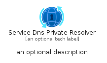
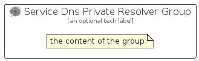

# ServiceDnsPrivateResolver


```text
azure-11/Item/Networking/ServiceDnsPrivateResolver
```

```text
include('azure-11/Item/Networking/ServiceDnsPrivateResolver')
```


| Illustration | ServiceDnsPrivateResolver | ServiceDnsPrivateResolverCard | ServiceDnsPrivateResolverGroup |
| :---: | :---: | :---: | :---: |
|  |  |  |  |


## ServiceDnsPrivateResolver

### Load remotely
```plantuml
@startuml
' configures the library
!global $LIB_BASE_LOCATION="https://raw.githubusercontent.com/tmorin/plantuml-libs/master/distribution"

' loads the library's bootstrap
!include $LIB_BASE_LOCATION/bootstrap.puml

' loads the package bootstrap
include('azure-11/bootstrap')

' loads the Item which embeds the element ServiceDnsPrivateResolver
include('azure-11/Item/Networking/ServiceDnsPrivateResolver')

' renders the element
ServiceDnsPrivateResolver('ServiceDnsPrivateResolver', 'Service Dns Private Resolver', 'an optional tech label', 'an optional description')
@enduml
```

### Load locally
```plantuml
@startuml
' configures the library
!global $INCLUSION_MODE="local"
!global $LIB_BASE_LOCATION="../../.."

' loads the library's bootstrap
!include $LIB_BASE_LOCATION/bootstrap.puml

' loads the package bootstrap
include('azure-11/bootstrap')

' loads the Item which embeds the element ServiceDnsPrivateResolver
include('azure-11/Item/Networking/ServiceDnsPrivateResolver')

' renders the element
ServiceDnsPrivateResolver('ServiceDnsPrivateResolver', 'Service Dns Private Resolver', 'an optional tech label', 'an optional description')
@enduml
```

## ServiceDnsPrivateResolverCard

### Load remotely
```plantuml
@startuml
' configures the library
!global $LIB_BASE_LOCATION="https://raw.githubusercontent.com/tmorin/plantuml-libs/master/distribution"

' loads the library's bootstrap
!include $LIB_BASE_LOCATION/bootstrap.puml

' loads the package bootstrap
include('azure-11/bootstrap')

' loads the Item which embeds the element ServiceDnsPrivateResolverCard
include('azure-11/Item/Networking/ServiceDnsPrivateResolver')

' renders the element
ServiceDnsPrivateResolverCard('ServiceDnsPrivateResolverCard', 'Service Dns Private Resolver Card', 'an optional description')
@enduml
```

### Load locally
```plantuml
@startuml
' configures the library
!global $INCLUSION_MODE="local"
!global $LIB_BASE_LOCATION="../../.."

' loads the library's bootstrap
!include $LIB_BASE_LOCATION/bootstrap.puml

' loads the package bootstrap
include('azure-11/bootstrap')

' loads the Item which embeds the element ServiceDnsPrivateResolverCard
include('azure-11/Item/Networking/ServiceDnsPrivateResolver')

' renders the element
ServiceDnsPrivateResolverCard('ServiceDnsPrivateResolverCard', 'Service Dns Private Resolver Card', 'an optional description')
@enduml
```

## ServiceDnsPrivateResolverGroup

### Load remotely
```plantuml
@startuml
' configures the library
!global $LIB_BASE_LOCATION="https://raw.githubusercontent.com/tmorin/plantuml-libs/master/distribution"

' loads the library's bootstrap
!include $LIB_BASE_LOCATION/bootstrap.puml

' loads the package bootstrap
include('azure-11/bootstrap')

' loads the Item which embeds the element ServiceDnsPrivateResolverGroup
include('azure-11/Item/Networking/ServiceDnsPrivateResolver')

' renders the element
ServiceDnsPrivateResolverGroup('ServiceDnsPrivateResolverGroup', 'Service Dns Private Resolver Group', 'an optional tech label') {
    note as note
        the content of the group
    end note
}
@enduml
```

### Load locally
```plantuml
@startuml
' configures the library
!global $INCLUSION_MODE="local"
!global $LIB_BASE_LOCATION="../../.."

' loads the library's bootstrap
!include $LIB_BASE_LOCATION/bootstrap.puml

' loads the package bootstrap
include('azure-11/bootstrap')

' loads the Item which embeds the element ServiceDnsPrivateResolverGroup
include('azure-11/Item/Networking/ServiceDnsPrivateResolver')

' renders the element
ServiceDnsPrivateResolverGroup('ServiceDnsPrivateResolverGroup', 'Service Dns Private Resolver Group', 'an optional tech label') {
    note as note
        the content of the group
    end note
}
@enduml
```

